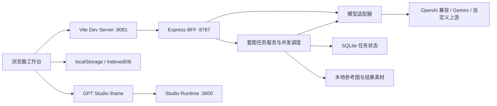

# api2img

<p align="center">
  
  
  
  
  
</p>

api2img 是一个面向创作者、运营和开发者的 AI 图片生成与编辑工作台。它把模型选择、提示词、参考图、生成参数、cURL 请求、结果预览、一致性套图、历史记录、素材模板、模型对比、图片识别和推理测试收在同一个本地 Web 应用里，方便快速验证 `gpt-image-2`、Gemini、Flux、SeeDream 等图像模型的真实调用效果。

项目使用 React + TypeScript + Vite 构建前端工作台，使用 Express 提供本地 BFF；套图任务通过 SQLite 和本地素材目录持久化，并内嵌迁移版 `GPT-Image2-Studio` 作为高级创作模式参考运行时。

## 功能亮点

| 模块 | 能力 |
| --- | --- |
| 生成图片 | 文生图、参考图编辑、多图融合、比例/分辨率/质量/输出格式/背景等参数配置 |
| 一致性套图 | 先生成并确认主视觉锚点，再批量扩展同主体场景；支持通用 4 张和电商 5 张预设、共享视觉规范、候选图、并发控制、取消、失败重试和实时进度 |
| 模型配置 | 内置多模型清单，支持展示名、真实请求模型名、baseUrl 前缀、编辑端点和模型级 API Key 覆盖 |
| cURL 面板 | 根据当前表单实时生成请求示例，默认使用占位 Key，可显式切换真实 Key 展示 |
| 结果工作台 | 生成中状态、图片预览、缩放、适配、拖拽平移、详情弹窗、单图下载和 ZIP 打包 |
| 历史记录 | 本地记录成功、失败和部分成功请求，支持查看详情和复用参数 |
| 素材模板 | 保存常用提示词、标签和参考图数量，支持一键回填到生成页 |
| 模型对比 | 左右模型并行生成，复用同一提示词和共同尺寸参数，避免重复触发运行中的模型 |
| 图片识别 | 上传图片后通过视觉模型生成结构化识别请求和结果 |
| 推理测试 | 支持 OpenAI、Anthropic、Google 等多平台推理请求预览和真实调用 |
| GPT Studio | 通过 iframe 承载迁移版 Studio，覆盖风格迁移、图片编辑、图片压缩、电商套图、写真、文章插图、PPT 生成和记录页 |

## 快速开始

### 环境要求

- Node.js 20 或更高版本
- npm 10 或更高版本
- 可访问目标上游模型服务的 API Key

### 安装与启动

```bash
git clone git@github.com:githubshansheng/api2img.git
cd api2img
npm ci
npm run dev
```

启动后会同时运行三个本地服务：

| 服务 | 地址 | 用途 |
| --- | --- | --- |
| Vite 前端 | http://127.0.0.1:8081/ | 主工作台入口 |
| Express BFF | http://127.0.0.1:8787/api/health | 本地 API、上游代理与健康检查 |
| GPT Studio | http://127.0.0.1:3600/ | 迁移版 Studio 原生运行时 |

打开 `http://127.0.0.1:8081/` 后，在“设置中心 -> API 与模型”中填入 API Key、baseUrl 前缀和真实请求模型名，即可开始生成。

## 一致性套图

生成页顶部可切换到“一致性套图”。套图流程会先生成主视觉候选图，再把已确认的主视觉作为后续每个场景的第一张参考图，以尽量稳定主体身份、产品结构、材质、色彩和镜头语言。

1. 选择“通用同主体 4 张”或“电商产品 5 张”预设。
2. 填写主体、风格、配色、光线、镜头、构图和跨图一致性规则。
3. 按主体、风格、Logo、构图或背景角色上传参考图，并调整每个场景的提示词与候选数量。
4. 创建草稿并开始生成；人工确认主视觉后，系统并发生成其余场景。也可启用自动选择第一张主视觉。
5. 在历史区查看实时进度、下载单张结果、取消任务、重试失败场景或删除整套记录。

| 限制 | 当前值 |
| --- | --- |
| 场景槽位 | 2-12 个，首个槽位固定为主视觉锚点 |
| 单槽候选 | 1-4 张 |
| 单套候选总数 | 最多 24 张 |
| 单套并发 | 1-4，默认 2 |
| BFF 全局并发 | 4 |
| 参考图 | 最多 12 张，并受当前模型能力上限约束 |

套图任务、场景状态和生成尝试写入 SQLite；参考图与可归档的生成结果写入本地素材目录。BFF 异常退出后，未完成任务会在下次启动时标记为 `interrupted`，重新提交运行配置后可继续生成。API Key 只保存在运行内存和浏览器设置中，不写入套图数据库。

## 上游配置

默认内置配置面向 OpenAI 兼容图片接口，默认模型为 `gpt-image-2`，默认 baseUrl 前缀为 `https://ai.heigh.vip`。你可以在设置中心改为自己的代理或官方端点。

| 配置项 | 说明 |
| --- | --- |
| 主 API Key | 作为默认鉴权 Key，存储在浏览器本地设置中 |
| 模型级 API Key | 覆盖某个模型的 Key，适合多供应商或多账户测试 |
| baseUrl 前缀 | 只填写域名和版本前缀，应用会按模型拼接 `/v1/images/generations`、`/v1/images/edits`、`/v1/responses` 或 Gemini `generateContent` 路径 |
| 请求模型名 | 真正提交给上游的 `model` 值，可与页面展示名不同 |
| OpenAI 端点变体 | 可在 Images API 与 Responses API 图像生成流程之间切换 |

本地开发不需要把真实 Key 写进 `.env` 或代码。仓库 `.gitignore` 已忽略 `.env`、证书、私钥、本地日志和平台状态目录。

### BFF 环境变量

| 环境变量 | 默认值 | 说明 |
| --- | --- | --- |
| `PORT` | `8787` | Express BFF 监听端口 |
| `API2IMG_DATA_DIR` | `.data/suites` | 套图 SQLite 与素材目录的持久化根路径，生产环境应指向有写权限且会备份的目录 |
| `API2IMG_ARCHIVE_REMOTE_IMAGES` | `true` | 是否把远程参考图和上游 URL 图片下载到本地素材目录；设置为 `false` 或归档失败时，仅保留无账号、无查询参数、无片段且解析到公网地址的 HTTP(S) URL，签名 URL 不会写入数据库 |
| `API2IMG_REMOTE_IMAGE_HOSTS` | 空 | 逗号分隔的远程图片归档域名白名单；为空时仍会执行协议、DNS 和公网地址校验 |

默认数据文件为 `.data/suites/generation-suites.sqlite`，素材目录为 `.data/suites/assets`。`.data/` 已被 Git 忽略。

## 常用脚本

| 命令 | 说明 |
| --- | --- |
| `npm run dev` | 同时启动前端、BFF 和 GPT Studio |
| `npm run dev:client` | 仅启动 Vite 前端 |
| `npm run dev:server` | 仅启动 Express BFF |
| `npm run studio-ref` | 仅启动迁移版 GPT Studio |
| `npm run typecheck` | TypeScript 类型检查 |
| `npm run test -- --pool=threads --maxWorkers=1` | 运行单元测试 |
| `npm run build` | 类型检查并构建前端产物 |
| `npm run audit:studio-vendor` | 检查 vendored Studio 文件完整性 |

## 本地 API

| 路由 | 方法 | 用途 |
| --- | --- | --- |
| `/api/health` | `GET` | BFF 健康检查 |
| `/api/config/bootstrap` | `GET` | 获取模型、导航、功能开关和公告配置 |
| `/api/generations` | `POST` | 创建图片生成或编辑请求 |
| `/api/recognition/analyze` | `POST` | 调用视觉模型执行图片识别 |
| `/api/reasoning/test` | `POST` | 调用推理模型执行测试请求 |
| `/api/generation-suites/templates` | `GET` | 获取一致性套图预设 |
| `/api/generation-suites` | `GET` | 获取套图历史，支持 `limit` 查询参数 |
| `/api/generation-suites` | `POST` | 创建套图草稿并持久化参考图 |
| `/api/generation-suites/:id` | `GET` | 获取套图详情、槽位、候选图和进度 |
| `/api/generation-suites/:id` | `PATCH` | 修改可编辑状态下的共享规范、选项和场景 |
| `/api/generation-suites/:id/events` | `GET` | 通过 SSE 订阅快照、槽位进度、锚点确认和完成事件 |
| `/api/generation-suites/:id/start` | `POST` | 启动或继续未完成的套图 |
| `/api/generation-suites/:id/anchor` | `POST` | 确认主视觉候选并启动其余场景 |
| `/api/generation-suites/:id/slots/:slotId/retry` | `POST` | 重试失败或中断的场景 |
| `/api/generation-suites/:id/cancel` | `POST` | 取消排队和运行中的任务 |
| `/api/generation-suites/:id` | `DELETE` | 删除套图记录及其本地素材 |
| `/api/generation-suites/assets/:filename` | `GET` | 读取已归档的参考图或生成结果 |

## 项目结构

```text
api2img/
├─ docs/                         # PRD、SRS、详细设计、AI 开发指导书和进度台账
├─ scripts/                      # 工程检查脚本
├─ server/                       # Express BFF、上游请求转发和统一生成执行器
│  └─ suite/                     # 套图路由、服务、调度器、SQLite Store 与素材归档
├─ src/
│  ├─ adapters/                  # OpenAI、Gemini、Generic 等模型适配器
│  ├─ components/                # 一致性套图等独立工作台组件
│  ├─ config/                    # 模型、设计 token、识图/推理和 Studio 路由配置
│  ├─ domain/                    # 前后端共享领域类型
│  ├─ services/                  # 表单、套图、历史、下载、设置、错误、cURL、识图和推理服务
│  └─ tests/                     # Vitest 单元测试
└─ vendor/gpt-image2-studio/     # 迁移版 GPT-Image2-Studio 运行时
```

## 架构概览



前端负责交互、表单校验、参数联动、cURL 预览、本地历史、素材模板和套图 SSE 状态同步；BFF 负责统一生成请求、执行上游调用、套图调度、持久化、归一化错误和返回结构化结果。模型能力通过配置驱动，页面只展示当前模型支持的比例、分辨率、质量和参考图能力。

## 安全与隐私

- API Key 默认只在浏览器本地保存，不进入 Git 仓库。
- cURL 预览默认使用 `sk-YOUR_API_KEY` 占位符，只有用户显式选择时才展示真实 Key。
- 错误映射、历史记录和埋点逻辑避免记录完整 API Key、完整提示词、完整图片 URL 和未脱敏错误详情。
- 套图记录持久化前会移除 API Key、认证 Header、URL 用户信息和敏感查询参数；服务重启后必须重新提交运行凭据。
- 远程图片归档仅允许 HTTP/HTTPS 公网地址，逐次校验 DNS 与重定向，固定已校验的解析地址，并校验大小、内容类型和 PNG/JPEG/WebP 文件签名，降低 SSRF 与 DNS 重绑定风险。
- 生成结果中的临时 URL 可能过期，重要图片请及时下载或归档。
- 提交代码前建议运行 `rg -n "sk-|api[_-]?key|secret|token|password|BEGIN .*PRIVATE KEY" . -S` 进行敏感信息复查。

## 文档索引

| 文档 | 内容 |
| --- | --- |
| [PRD](docs/ai-image-master-prd.md) | 产品目标、用户角色、信息架构和功能需求 |
| [SRS](docs/ai-image-master-srs.md) | 软件需求规格说明 |
| [字段级详细设计](docs/ai-image-master-detailed-design.md) | 前后端模块、接口、字段、状态和验收口径 |
| [AI 程序员开发指导书](docs/ai-image-master-ai-dev-guide.md) | 面向 AI 程序员的实现任务、字段级说明和测试要求 |
| [GPT Studio 迁移矩阵](docs/gpt-image2-studio-migration.md) | vendored Studio 的迁移范围、功能覆盖和验收口径 |
| [开发进度](docs/development-progress.md) | 已完成任务、验证命令和后续计划 |

## 开发约定

1. 修改模型能力时，优先更新 `src/config/models.ts`，再补齐服务和测试。
2. 修改请求结构时，同时检查适配器、cURL 预览、BFF 摘要、错误详情和历史记录。
3. 修改 UI 时，遵循 `src/config/design-tokens.ts` 和 `src/styles.css` 中的设计 token。
4. 提交前至少运行 `npm run typecheck`、`npm run test -- --pool=threads --maxWorkers=1` 和 `npm run build`。
5. 进度完成后同步更新 `docs/development-progress.md`。

## 开源状态

当前仓库尚未添加开源许可证文件。正式公开前请根据分发目标补充 `LICENSE`，并确认 vendored 依赖、静态素材和上游服务调用方式符合对应许可证与服务条款。
