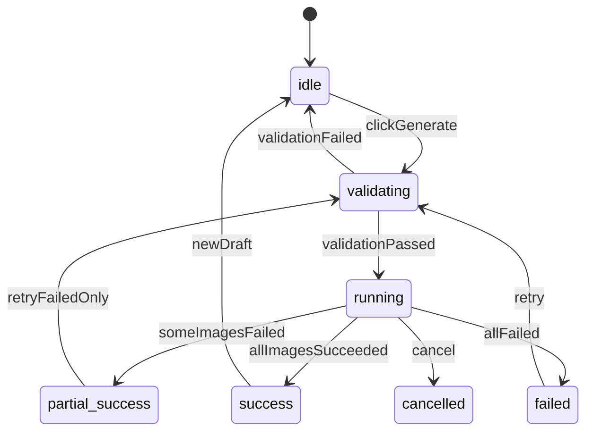
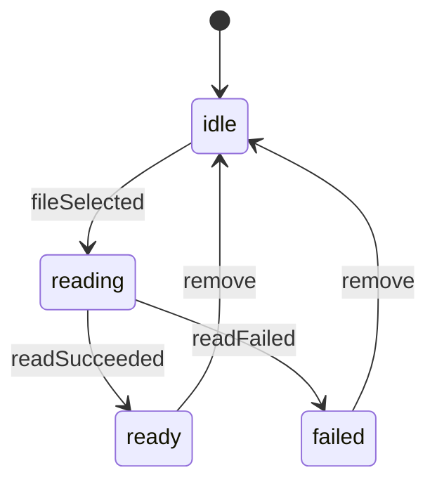
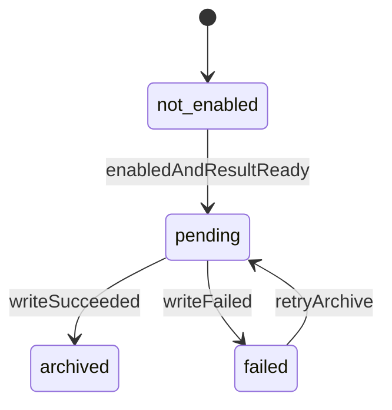

# AI 图片生成与编辑工作台 AI 程序员开发指导书

## 1. 文档定位

| 项目 | 内容 |
| --- | --- |
| 文档名称 | AI 图片生成与编辑工作台 AI 程序员开发指导书 |
| 输入依据 | `docs/ai-image-master-prd.md`、`docs/ai-image-master-srs.md` |
| 目标读者 | 使用 AI 编程工具的前端、全栈、测试、架构与项目负责人 |
| 核心目标 | 将需求规格拆成可直接编码的模块、字段、状态、接口、校验和验收标准 |
| 推荐交付方式 | 先实现 P0 闭环，再按模块灰度 P1/P2 |
| 默认假设 | 首期以 Web 工作台为主；模型、价格、限制、端点、模板均配置驱动 |

本指导书不是 PRD 的重复描述，而是给 AI 程序员的落地材料。AI 程序员应优先依据本文件生成代码、测试用例、Mock 数据和配置文件；遇到业务范围争议时，以 SRS 为准；遇到字段、状态和接口细节时，以本文为准。

## 2. 开发总原则

1. 模型能力必须配置化，页面不得硬编码某个模型是否支持尺寸、质量、参考图或多图输出。
2. 表单状态、请求草稿、上游请求体、历史记录是四个不同对象，不允许混用。
3. API Key 默认脱敏，cURL 默认使用占位 Key，日志不得输出完整 Key。
4. 所有可能失败的异步动作必须有 `idle`、`validating`、`running`、`success`、`failed` 或等价状态。
5. 图片链接可能短期失效，生成成功后必须立即提供下载、归档或保存提示。
6. 上游错误必须映射成用户能理解的标题、摘要、建议和可重试状态。
7. P0 功能必须可在未登录状态下完成基础生成；登录只增强云同步、模板同步和账号能力。
8. 所有字段新增都要同步更新类型、默认值、Mock、校验、持久化迁移和埋点。

## 3. 推荐工程结构

如果从零创建 Web 项目，建议按以下目录组织。若已有项目，按同等模块边界映射即可。

```text
src/
  app/                         # 路由、页面骨架、全局 Provider
  config/
    models.ts                  # 16 个模型初始化配置
    prompt-templates.zh-CN.ts  # 提示词模板
    feature-flags.ts           # 灰度与功能开关
    design-tokens.ts           # 颜色、字号、间距、圆角、阴影、动效 Token
  domain/
    model.ts                   # 模型字段、能力解析
    generation.ts              # 生成表单、请求、结果、历史
    template.ts                # 提示词模板、素材模板
    settings.ts                # Key、存储、账号设置
    error.ts                   # 错误类型和映射
    analytics.ts               # 埋点类型
  adapters/
    image-adapter.ts           # 统一图片模型适配器接口
    openai-image-adapter.ts    # GPT Image 类请求构造
    gemini-image-adapter.ts    # Gemini 原生请求构造
    generic-image-adapter.ts   # Flux、Seedream 等配置型适配
  services/
    generation-service.ts      # 生成编排
    curl-service.ts            # cURL 生成
    upload-service.ts          # 上传、压缩、base64/url 转换
    history-service.ts         # 本地历史、云同步
    storage-service.ts         # 默认存储、R2、OSS、本地目录
    settings-service.ts        # API Key 和用户设置
    error-service.ts           # 错误归一化
  state/
    generation-store.ts        # 生成页状态
    batch-store.ts             # 批量页状态
    settings-store.ts          # 设置状态
  pages/
    generation/
    batch/
    compare/
    history/
    assets/
    recognition/
    reasoning/
  components/
    layout/                    # AppShell、Sidebar、TopNotice、PageHeader
    ui/                        # Button、Input、Tabs、Dialog、Tooltip、Toast
    model-selector/
    prompt-editor/
    reference-uploader/
    parameter-panel/
    cost-preview/
    result-gallery/
    curl-panel/
    error-panel/
  storage/
    indexeddb.ts
    local-storage.ts
  tests/
    unit/
    integration/
    e2e/
```

## 4. 开发里程碑

| 里程碑 | 目标 | 必交模块 | 不包含 |
| --- | --- | --- | --- |
| M1 P0 生成闭环 | 用户可配置 Key、选模型、填提示词、上传参考图、生成、下载 | 模型配置、生成页、上传校验、接口适配、结果展示、错误映射、基础历史 | 云同步、素材冲突、高级统计 |
| M2 P0/P1 效率能力 | 批量抽卡、cURL、模板库、费用展示完善 | 批量生成、cURL 面板、提示词模板、zip 下载、埋点 | 推理测试、高级存储 |
| M3 P1 资产复用 | 历史、素材模板、模型对比、识图 | 历史记录、素材模板、模型对比、图片识别 | 素材云冲突完整策略 |
| M4 P2 灰度能力 | 高级设置、推理测试、统计和运营入口 | 推理测试、自定义 R2/OSS、本地归档、活动入口 | 企业管理后台 |

## 5. 全局枚举

AI 程序员必须先实现这些枚举或等价字面量类型，后续字段都引用它们。

```ts
export type LangCode = "zh-CN" | "en-US" | "zh-TW" | "ru-RU";

export type PageKey =
  | "generation"
  | "batch"
  | "compare"
  | "history"
  | "assets"
  | "recognition"
  | "reasoning";

export type ApiType =
  | "openai-image"
  | "openai-image-edit"
  | "gemini-native"
  | "flux-kontext"
  | "flux-2"
  | "seedream"
  | "generic-image";

export type EndpointType =
  | "images-generations"
  | "images-edits"
  | "gemini-generate-content"
  | "custom";

export type Provider =
  | "google"
  | "openai"
  | "flux"
  | "bytedance"
  | "apiyi"
  | "custom";

export type PriceMode = "fixed" | "range" | "token" | "custom";
export type RatioKey =
  | "auto"
  | "1:1"
  | "16:9"
  | "9:16"
  | "4:3"
  | "3:4"
  | "3:2"
  | "2:3"
  | "21:9"
  | "5:4"
  | "4:5"
  | "4:1"
  | "1:4"
  | "8:1"
  | "1:8";
export type ResolutionKey = "auto" | "0.5K" | "1K" | "2K" | "4K";
export type QualityKey = "auto" | "low" | "medium" | "high";
export type ImageFormat = "jpg" | "jpeg" | "png" | "gif" | "webp";
export type OutputFormat = "png" | "jpg" | "webp";
export type ResponseFormat = "url" | "b64_json" | "json";
export type RequestStatus = "idle" | "validating" | "running" | "success" | "partial_success" | "failed" | "cancelled";
export type StorageType = "default-cloud" | "r2" | "oss" | "local-directory";
export type SyncStatus = "local" | "syncing" | "synced" | "failed";
export type ErrorType =
  | "validation"
  | "auth"
  | "permission"
  | "quota"
  | "rate_limit"
  | "safety"
  | "network"
  | "upstream"
  | "storage"
  | "unknown";
```

## 6. 模型配置字段级规格

### 6.1 ModelConfig

`ModelConfig` 是整个系统最关键的数据结构。模型选择器、参数面板、费用区、请求适配、cURL、错误提示都必须从它读取能力。

```ts
export interface ModelConfig {
  id: string;
  apiModelName: string;
  displayName: string;
  provider: Provider;
  apiType: ApiType;
  endpointType: EndpointType;
  baseURL: string;
  editURL?: string;
  docURL?: string;
  enabled: boolean;
  isDefault: boolean;
  sortOrder: number;
  tags: ModelTag[];
  timeLabel?: string;
  description?: string;
  price: PriceConfig;
  capabilities: ModelCapabilities;
  request: RequestPolicy;
  response: ResponsePolicy;
  featureFlags: ModelFeatureFlags;
  temporaryRestrictions: TemporaryRestriction[];
  notice?: ModelNotice;
  ui: ModelUIHints;
  updatedAt: string;
}
```

| 字段 | 类型 | 必填 | 默认值 | 规则 |
| --- | --- | --- | --- | --- |
| id | string | 是 | 无 | 前端内部唯一 Key，稳定不可随展示名变化；建议用小写短横线，如 `gpt-image-2-vip` |
| apiModelName | string | 是 | 等于 id | 实际提交给上游的 `model` 字段；支持与内部 id 不同 |
| displayName | string | 是 | 无 | 用户可见名称，如 `GPT Image 2 VIP` |
| provider | Provider | 是 | `custom` | 用于分组、图标、适配策略和统计 |
| apiType | ApiType | 是 | 无 | 决定请求构造器，不得在页面组件判断 |
| endpointType | EndpointType | 是 | 无 | 决定 cURL 端点说明和请求分类 |
| baseURL | string | 是 | 无 | 生成接口 URL；可被设置中的自定义根域名覆盖 |
| editURL | string | 否 | 无 | 参考图编辑接口；不存在时走 `baseURL` 或适配器策略 |
| docURL | string | 否 | 无 | 当前模型文档链接 |
| enabled | boolean | 是 | true | false 时不出现在普通模型列表，可在历史详情保留展示 |
| isDefault | boolean | 是 | false | 只能有一个默认模型；本地模型失效时回退到该模型 |
| sortOrder | number | 是 | 0 | 模型选择器排序，越小越靠前 |
| tags | ModelTag[] | 是 | [] | 支持 `new`、`hot`、`fast`、`vip`、`legacy`、`restricted` |
| timeLabel | string | 否 | 无 | 如 `约 10-20 秒`，仅展示用 |
| description | string | 否 | 无 | 模型能力摘要 |
| price | PriceConfig | 是 | 无 | 费用展示和预估总价来源 |
| capabilities | ModelCapabilities | 是 | 无 | 尺寸、质量、数量、参考图、输出格式能力 |
| request | RequestPolicy | 是 | 无 | 请求字段、鉴权、图片输入策略 |
| response | ResponsePolicy | 是 | 无 | 响应解析、图片字段、错误字段 |
| featureFlags | ModelFeatureFlags | 是 | 全 false | 兼容旧模型名、preview、移除字段等 |
| temporaryRestrictions | TemporaryRestriction[] | 是 | [] | 临时限制；可配置打开或关闭 |
| notice | ModelNotice | 否 | 无 | 模型公告，优先级低于临时限制 |
| ui | ModelUIHints | 是 | 默认空对象 | 展示提示、徽标、参数说明 |
| updatedAt | string | 是 | 当前日期 | ISO 日期，用于配置版本排查 |

### 6.2 ModelTag

```ts
export type ModelTag = "new" | "hot" | "fast" | "vip" | "legacy" | "restricted" | "recommended";
```

| 值 | 展示规则 |
| --- | --- |
| new | 模型名称旁展示“新”标签 |
| hot | 展示“热门”标签 |
| fast | 可用于排序和速度提示 |
| vip | 可展示会员或高阶标识 |
| legacy | 默认不优先推荐，只有兼容模式显示 |
| restricted | 当前存在临时限制，参数区和公告条必须同步提示 |
| recommended | 默认推荐模型，可作为首屏初始模型 |

### 6.3 PriceConfig

```ts
export interface PriceConfig {
  mode: PriceMode;
  unitLabel: string;
  basePriceText: string;
  basePriceValue?: number;
  currency?: "CNY" | "USD" | "POINT" | "TOKEN";
  minPriceValue?: number;
  maxPriceValue?: number;
  multiplierFields: Array<"count" | "quality" | "resolution" | "token" | "custom">;
  qualityMultiplier?: Partial<Record<QualityKey, number>>;
  resolutionMultiplier?: Partial<Record<ResolutionKey, number>>;
  pricingNote?: string;
  chargeOnFailureRisk: boolean;
}
```

| 字段 | 类型 | 必填 | 默认值 | 规则 |
| --- | --- | --- | --- | --- |
| mode | PriceMode | 是 | 无 | `fixed` 固定单价；`range` 区间；`token` 按 token；`custom` 自定义 |
| unitLabel | string | 是 | `张` | 费用单位，如 `张`、`次`、`token` |
| basePriceText | string | 是 | 无 | 用户可见价格，如 `0.03 元/张`、`按 token 计费` |
| basePriceValue | number | 否 | 无 | 可计算单价；未知时只展示文本 |
| currency | enum | 否 | `CNY` | 仅用于格式化，不等同真实支付币种 |
| minPriceValue | number | 否 | 无 | 区间最小值 |
| maxPriceValue | number | 否 | 无 | 区间最大值 |
| multiplierFields | array | 是 | [] | 影响预估费用的字段 |
| qualityMultiplier | object | 否 | 无 | 质量影响价格时配置 |
| resolutionMultiplier | object | 否 | 无 | 分辨率影响价格时配置 |
| pricingNote | string | 否 | 无 | 价格解释，必须展示在费用区 tooltip 或说明 |
| chargeOnFailureRisk | boolean | 是 | false | 上游失败仍可能扣费时为 true |

费用计算规则：

```ts
estimatedCost =
  basePriceValue
  * count
  * (qualityMultiplier[quality] ?? 1)
  * (resolutionMultiplier[resolution] ?? 1);
```

当 `basePriceValue` 为空或 `mode` 为 `token/custom` 时，只展示 `basePriceText` 和 `pricingNote`，不要显示伪精确总价。

### 6.4 ModelCapabilities

```ts
export interface ModelCapabilities {
  ratios: RatioOption[];
  resolutions: ResolutionOption[];
  qualities: QualityOption[];
  maxOutputs: number;
  defaultOutputCount: number;
  maxReferenceImages: number;
  minReferenceImages: number;
  supportedReferenceFormats: ImageFormat[];
  maxReferenceImageSizeMB: number;
  supportsTextToImage: boolean;
  supportsImageToImage: boolean;
  supportsMultiImageFusion: boolean;
  supportsGifReference: boolean;
  outputFormats: OutputFormat[];
  responseFormats: ResponseFormat[];
  supportsSeed: boolean;
  supportsNegativePrompt: boolean;
  supportsStylePreset: boolean;
}
```

| 字段 | 类型 | 必填 | 默认值 | 规则 |
| --- | --- | --- | --- | --- |
| ratios | RatioOption[] | 是 | 至少 `auto` | 参数面板按 `enabled` 和限制过滤 |
| resolutions | ResolutionOption[] | 是 | 至少 `1K` | 若仅估算，`isEstimated` 为 true |
| qualities | QualityOption[] | 是 | `auto` | 不支持质量时仅保留 `auto` 并隐藏选择器 |
| maxOutputs | number | 是 | 1 | 单次最大输出数；不支持多图时为 1 |
| defaultOutputCount | number | 是 | 1 | 进入页面默认数量，不得超过 `maxOutputs` |
| maxReferenceImages | number | 是 | 0 | 模型级参考图上限；生成页全局上限为 12 |
| minReferenceImages | number | 是 | 0 | 需要图生图时可设为 1 |
| supportedReferenceFormats | ImageFormat[] | 是 | ["jpg","png"] | 生成页 P0 至少 JPG/PNG |
| maxReferenceImageSizeMB | number | 是 | 20 | 单图大小限制 |
| supportsTextToImage | boolean | 是 | true | false 时提示必须上传参考图 |
| supportsImageToImage | boolean | 是 | false | true 时存在参考图可走编辑或融合 |
| supportsMultiImageFusion | boolean | 是 | false | true 时上传多图不提示仅首张有效 |
| supportsGifReference | boolean | 是 | false | 模型对比可按能力支持 GIF |
| outputFormats | OutputFormat[] | 是 | ["png"] | 结果保存格式 |
| responseFormats | ResponseFormat[] | 是 | ["url"] | 决定解析 URL 或 base64 |
| supportsSeed | boolean | 是 | false | false 时不展示 seed |
| supportsNegativePrompt | boolean | 是 | false | false 时不展示反向提示词 |
| supportsStylePreset | boolean | 是 | false | false 时不展示风格预设 |

### 6.5 RatioOption、ResolutionOption、QualityOption

```ts
export interface RatioOption {
  key: RatioKey;
  label: string;
  widthRatio?: number;
  heightRatio?: number;
  enabled: boolean;
  disabledReason?: string;
}

export interface ResolutionOption {
  key: ResolutionKey;
  label: string;
  width?: number;
  height?: number;
  isEstimated: boolean;
  enabled: boolean;
  disabledReason?: string;
}

export interface QualityOption {
  key: QualityKey;
  label: string;
  enabled: boolean;
  disabledReason?: string;
  priceMultiplier?: number;
}
```

| 字段 | 规则 |
| --- | --- |
| key | 请求和持久化使用，不随语言变化 |
| label | UI 展示，可国际化 |
| enabled | 由模型配置和临时限制共同决定 |
| disabledReason | `enabled=false` 时必须有值 |
| isEstimated | GPT Image 2 All 等通过提示词引导尺寸时为 true |
| width/height | 有精确像素时填写，用于展示最终分辨率 |
| priceMultiplier | 费用区实时计算使用 |

### 6.6 RequestPolicy

```ts
export interface RequestPolicy {
  authHeaderName: string;
  authScheme: "Bearer" | "Key" | "None";
  contentType: "application/json" | "multipart/form-data";
  imageInputMode: "none" | "base64" | "url" | "multipart" | "auto";
  preferEditEndpointWhenHasReference: boolean;
  includeFields: string[];
  omitFields: string[];
  removeResponseFormatWhenUnsupported: boolean;
  modelNameMode: "current" | "legacy-preview" | "custom";
  timeoutMs: number;
  retry: RetryPolicy;
}
```

| 字段 | 类型 | 必填 | 默认值 | 规则 |
| --- | --- | --- | --- | --- |
| authHeaderName | string | 是 | `Authorization` | 大多数模型使用 Authorization |
| authScheme | enum | 是 | `Bearer` | 最终请求头如 `Authorization: Bearer sk-example` |
| contentType | enum | 是 | `application/json` | 上传 multipart 时由浏览器自动设置边界 |
| imageInputMode | enum | 是 | `auto` | 决定参考图如何进入请求 |
| preferEditEndpointWhenHasReference | boolean | 是 | false | GPT Image 编辑类模型可设 true |
| includeFields | string[] | 是 | [] | 强制包含字段，例如 `model`、`prompt` |
| omitFields | string[] | 是 | [] | 强制移除字段，例如不接受 `response_format` 的端点 |
| removeResponseFormatWhenUnsupported | boolean | 是 | false | OpenAI 官转类模型必须支持此开关 |
| modelNameMode | enum | 是 | `current` | 兼容 `-preview` 旧模型名 |
| timeoutMs | number | 是 | 120000 | 请求超时时间 |
| retry | RetryPolicy | 是 | 默认不自动重试 | 网络失败可允许用户手动重试 |

```ts
export interface RetryPolicy {
  autoRetry: boolean;
  maxAttempts: number;
  retryableStatusCodes: number[];
  backoffMs: number;
}
```

### 6.7 ResponsePolicy

```ts
export interface ResponsePolicy {
  imageUrlPaths: string[];
  imageBase64Paths: string[];
  errorCodePaths: string[];
  errorMessagePaths: string[];
  finishReasonPaths: string[];
  tokenCountPaths: string[];
  temporaryUrlTTLSeconds?: number;
  resultRequiresImmediateSave: boolean;
}
```

| 字段 | 规则 |
| --- | --- |
| imageUrlPaths | 从响应里提取图片 URL 的路径，如 `data[].url` |
| imageBase64Paths | 提取 base64 的路径，如 `data[].b64_json` |
| errorCodePaths | 提取错误码，优先 `error.code` |
| errorMessagePaths | 提取错误消息，优先 `error.message` |
| finishReasonPaths | Google 类响应需读取 `finishReason` |
| tokenCountPaths | Google 类响应需读取 `candidatesTokenCount` |
| temporaryUrlTTLSeconds | 临时链接有效期，未知但可能短期失效时填 600 |
| resultRequiresImmediateSave | true 时结果区必须展示及时保存提示 |

### 6.8 TemporaryRestriction

```ts
export interface TemporaryRestriction {
  id: string;
  enabled: boolean;
  type: "size_disabled" | "resolution_locked" | "quality_disabled" | "rate_limited" | "model_degraded" | "custom";
  title: string;
  description: string;
  affectedFields: Array<"ratio" | "resolution" | "quality" | "count" | "referenceImages" | "responseFormat">;
  forcedValues?: Partial<GenerationParams>;
  disabledOptions?: string[];
  startedAt?: string;
  expectedEndAt?: string;
  priority: number;
}
```

| 字段 | 规则 |
| --- | --- |
| id | 稳定 ID，用于埋点和排查 |
| enabled | false 时完全不生效，但配置可保留 |
| type | 用于公告图标和处理逻辑 |
| affectedFields | 参数面板和 cURL 生成器都要读取 |
| forcedValues | 如 `gpt-image-2-vip` 可固定 `{ ratio: "auto", resolution: "1K" }` |
| disabledOptions | 被置灰的具体选项 Key |
| priority | 多个限制同时存在时，数字越大越优先 |

### 6.9 ModelNotice、ModelUIHints、ModelFeatureFlags

```ts
export interface ModelNotice {
  level: "info" | "warning" | "error";
  title: string;
  content: string;
  linkText?: string;
  linkURL?: string;
}

export interface ModelUIHints {
  badgeText?: string;
  colorToken?: string;
  parameterHelpText?: string;
  costHelpText?: string;
  referenceHelpText?: string;
  resultHelpText?: string;
}

export interface ModelFeatureFlags {
  allowLegacyModelName: boolean;
  isPreviewModel: boolean;
  sizeByPromptOnly: boolean;
  supportsHighResolution: boolean;
  allowChatCompletionsFallback: boolean;
  requiresEnterpriseGroupOnRateLimit: boolean;
}
```

## 7. 16 个模型初始化配置

首期必须至少覆盖下列模型。`apiModelName`、价格、速度和精确能力以供应商实际配置为准，但字段必须完整，不允许缺字段导致页面分支判断。

| id | displayName | apiType | endpointType | 默认参考图上限 | 默认输出上限 | 关键规则 |
| --- | --- | --- | --- | --- | --- | --- |
| nano-banana-pro | Nano Banana Pro | gemini-native | gemini-generate-content | 12 | 1 | 适合高质量生成与编辑；图片输入走 `contents.parts` |
| nano-banana-2 | Nano Banana 2 | gemini-native | gemini-generate-content | 12 | 1 | 与 Gemini 原生适配器一致 |
| nano-banana-lite | Nano Banana Lite | gemini-native | gemini-generate-content | 12 | 1 | 速度优先，价格按配置展示 |
| gpt-image-2-all | GPT Image 2 All | openai-image | images-generations | 12 | 1 | 可能无原生 size，比例可通过提示词引导；默认返回 `b64_json` |
| gpt-image-2-vip | GPT Image 2 VIP | openai-image | images-generations | 12 | 1 | 支持临时限制：size 参数失效时固定自适应 1K |
| gpt-image-2 | GPT Image 2 | openai-image | images-generations | 12 | 1 | 429 时提示可能需要 `image2Enterprise` |
| nano-banana | Nano Banana | gemini-native | gemini-generate-content | 12 | 1 | 保留为兼容或基础模型 |
| seedream-5 | SeeDream 5.0 | seedream | custom | 12 | 1 | 支持 URL 与 Base64 输出时按配置解析 |
| seedream-4-5 | SeeDream 4.5 | seedream | custom | 12 | 1 | 与 SeeDream 适配器一致 |
| flux-kontext-pro | Flux Kontext Pro | flux-kontext | custom | 4 | 1 | 强调图像编辑，提示词语言差异按配置提示 |
| flux-kontext-max | Flux Kontext Max | flux-kontext | custom | 4 | 1 | 高质量模式，费用和耗时按配置 |
| flux-2-pro | Flux 2 Pro | flux-2 | custom | 4 | 1 | 多图融合能力按配置开启 |
| flux-2-max | Flux 2 Max | flux-2 | custom | 8 | 1 | 高质量多图融合，参考图上限可设 8 |
| flux-2-flex | Flux 2 Flex | flux-2 | custom | 4 | 1 | 平衡速度与质量 |
| flux-2-klein-9b | Flux 2 Klein 9B | flux-2 | custom | 4 | 1 | 轻量模型 |
| gpt-image-1-5 | GPT Image 1.5 | openai-image | images-generations | 12 | 4 | 可作为旧模型或高兼容模型 |

建议初始化配置模板：

```ts
export const modelTemplate: ModelConfig = {
  id: "gpt-image-2-vip",
  apiModelName: "gpt-image-2-vip",
  displayName: "GPT Image 2 VIP",
  provider: "openai",
  apiType: "openai-image",
  endpointType: "images-generations",
  baseURL: "https://api.apiyi.com/v1/images/generations",
  editURL: "https://api.apiyi.com/v1/images/edits",
  docURL: "https://api.apiyi.com/",
  enabled: true,
  isDefault: false,
  sortOrder: 50,
  tags: ["vip", "restricted"],
  timeLabel: "按上游响应",
  description: "GPT Image 2 高阶图像生成模型",
  price: {
    mode: "custom",
    unitLabel: "张",
    basePriceText: "按当前配置计费",
    currency: "CNY",
    multiplierFields: ["count", "resolution", "quality"],
    pricingNote: "最终费用以上游和账户扣费为准",
    chargeOnFailureRisk: true
  },
  capabilities: {
    ratios: [
      { key: "auto", label: "自适应", enabled: true },
      { key: "1:1", label: "1:1", widthRatio: 1, heightRatio: 1, enabled: false, disabledReason: "上游暂时仅支持自适应" }
    ],
    resolutions: [
      { key: "1K", label: "1K", isEstimated: false, enabled: true },
      { key: "2K", label: "2K", isEstimated: false, enabled: false, disabledReason: "上游暂时关闭高分辨率" },
      { key: "4K", label: "4K", isEstimated: false, enabled: false, disabledReason: "上游暂时关闭高分辨率" }
    ],
    qualities: [{ key: "auto", label: "自动", enabled: true }],
    maxOutputs: 1,
    defaultOutputCount: 1,
    maxReferenceImages: 12,
    minReferenceImages: 0,
    supportedReferenceFormats: ["jpg", "jpeg", "png"],
    maxReferenceImageSizeMB: 20,
    supportsTextToImage: true,
    supportsImageToImage: true,
    supportsMultiImageFusion: true,
    supportsGifReference: false,
    outputFormats: ["png"],
    responseFormats: ["b64_json"],
    supportsSeed: false,
    supportsNegativePrompt: false,
    supportsStylePreset: false
  },
  request: {
    authHeaderName: "Authorization",
    authScheme: "Bearer",
    contentType: "application/json",
    imageInputMode: "base64",
    preferEditEndpointWhenHasReference: true,
    includeFields: ["model", "prompt", "n"],
    omitFields: ["response_format"],
    removeResponseFormatWhenUnsupported: true,
    modelNameMode: "current",
    timeoutMs: 180000,
    retry: {
      autoRetry: false,
      maxAttempts: 1,
      retryableStatusCodes: [502, 503, 504],
      backoffMs: 1000
    }
  },
  response: {
    imageUrlPaths: ["data[].url"],
    imageBase64Paths: ["data[].b64_json"],
    errorCodePaths: ["error.code"],
    errorMessagePaths: ["error.message"],
    finishReasonPaths: [],
    tokenCountPaths: [],
    temporaryUrlTTLSeconds: 600,
    resultRequiresImmediateSave: true
  },
  featureFlags: {
    allowLegacyModelName: false,
    isPreviewModel: false,
    sizeByPromptOnly: false,
    supportsHighResolution: false,
    allowChatCompletionsFallback: false,
    requiresEnterpriseGroupOnRateLimit: true
  },
  temporaryRestrictions: [
    {
      id: "gpt-image-2-vip-size-disabled-20260706",
      enabled: true,
      type: "size_disabled",
      title: "尺寸参数暂不可用",
      description: "因上游调整，当前仅支持自适应 1K 出图。",
      affectedFields: ["ratio", "resolution"],
      forcedValues: { ratio: "auto", resolution: "1K" },
      disabledOptions: ["1:1", "16:9", "9:16", "2K", "4K"],
      priority: 100
    }
  ],
  notice: {
    level: "warning",
    title: "模型临时限制",
    content: "当前模型尺寸能力以后端配置为准。"
  },
  ui: {
    badgeText: "VIP",
    parameterHelpText: "不可用参数已按上游限制置灰。",
    costHelpText: "多张和高分辨率可能影响消耗。",
    resultHelpText: "图片链接可能短期失效，请及时保存。"
  },
  updatedAt: "2026-07-06"
};
```

## 8. 生成表单字段级规格

### 8.1 GenerationFormState

```ts
export interface GenerationFormState {
  page: "generation";
  modelId: string;
  prompt: string;
  negativePrompt?: string;
  referenceImages: ReferenceImage[];
  params: GenerationParams;
  options: GenerationRuntimeOptions;
  validation: ValidationState;
  requestStatus: RequestStatus;
  activeRequestId?: string;
  draftUpdatedAt: number;
}
```

| 字段 | 类型 | 必填 | 默认值 | 规则 |
| --- | --- | --- | --- | --- |
| page | string | 是 | `generation` | 用于埋点区分页面 |
| modelId | string | 是 | 默认模型 id | 从模型配置读取，失效时回退默认模型 |
| prompt | string | 是 | 空字符串 | 允许多行；提交前 trim；为空且无参考图时阻止 |
| negativePrompt | string | 否 | 空 | 仅模型支持时展示和提交 |
| referenceImages | ReferenceImage[] | 是 | [] | 按模型上限过滤，最多 12 |
| params | GenerationParams | 是 | 无 | 参数字段见 8.3 |
| options | GenerationRuntimeOptions | 是 | 默认值 | 是否保存历史、归档、显示真实 Key 等 |
| validation | ValidationState | 是 | 无错误 | 每次提交前刷新 |
| requestStatus | RequestStatus | 是 | `idle` | 控制按钮、加载和重试 |
| activeRequestId | string | 否 | 无 | 请求中生成 UUID，用于取消或防重复 |
| draftUpdatedAt | number | 是 | Date.now() | 本地草稿保存和恢复使用 |

### 8.2 ReferenceImage

```ts
export interface ReferenceImage {
  id: string;
  source: "local-file" | "remote-url" | "history" | "asset-template";
  file?: File;
  name: string;
  mimeType: string;
  format: ImageFormat;
  sizeBytes?: number;
  width?: number;
  height?: number;
  previewURL: string;
  remoteURL?: string;
  base64?: string;
  objectKey?: string;
  order: number;
  uploadStatus: "idle" | "reading" | "ready" | "failed";
  errorMessage?: string;
  createdAt: number;
}
```

| 字段 | 类型 | 必填 | 默认值 | 规则 |
| --- | --- | --- | --- | --- |
| id | string | 是 | UUID | 用于删除、排序、请求映射 |
| source | enum | 是 | `local-file` | 表示来源 |
| file | File | 条件 | 无 | 本地上传时存在；不要持久化到 localStorage |
| name | string | 是 | 文件名或生成名 | 展示和错误提示使用 |
| mimeType | string | 是 | 无 | 如 `image/png` |
| format | ImageFormat | 是 | 无 | 从 MIME 或扩展名解析 |
| sizeBytes | number | 否 | 无 | 校验 20 MB 使用 |
| width/height | number | 否 | 无 | 可异步解析，非阻塞 |
| previewURL | string | 是 | 无 | `URL.createObjectURL` 或远程 URL；组件卸载时释放本地 URL |
| remoteURL | string | 否 | 无 | 历史或素材复用时可存在 |
| base64 | string | 否 | 无 | 需要 base64 请求时生成；不得长期持久化大图 |
| objectKey | string | 否 | 无 | 云存储对象 Key |
| order | number | 是 | 上传顺序 | 多图融合按此排序 |
| uploadStatus | enum | 是 | `idle` | 读取失败时置 `failed` |
| errorMessage | string | 否 | 无 | 失败原因 |
| createdAt | number | 是 | Date.now() | 排序和排查使用 |

### 8.3 GenerationParams

```ts
export interface GenerationParams {
  ratio: RatioKey;
  resolution: ResolutionKey;
  quality: QualityKey;
  count: number;
  outputFormat?: OutputFormat;
  responseFormat?: ResponseFormat;
  seed?: number;
  stylePreset?: string;
  customParams?: Record<string, unknown>;
}
```

| 字段 | 类型 | 必填 | 默认值 | 规则 |
| --- | --- | --- | --- | --- |
| ratio | RatioKey | 是 | 模型第一个 enabled ratio | 被临时限制强制时以 `forcedValues` 为准 |
| resolution | ResolutionKey | 是 | 模型第一个 enabled resolution | 被锁定时不可提交其它值 |
| quality | QualityKey | 是 | `auto` | 模型不支持时隐藏但字段保留为 `auto` |
| count | number | 是 | `defaultOutputCount` | 1 到 `maxOutputs` 的整数 |
| outputFormat | OutputFormat | 否 | 模型第一个 outputFormats | 不支持时不提交 |
| responseFormat | ResponseFormat | 否 | 模型第一个 responseFormats | `omitFields` 包含时移除 |
| seed | number | 否 | 无 | 仅模型支持时展示，整数 |
| stylePreset | string | 否 | 无 | 仅模型支持时展示 |
| customParams | object | 否 | {} | 为未来模型扩展，提交前需白名单过滤 |

### 8.4 GenerationRuntimeOptions

```ts
export interface GenerationRuntimeOptions {
  saveToHistory: boolean;
  autoArchiveToLocalDirectory: boolean;
  useRealKeyInCurl: boolean;
  useCustomEndpoint: boolean;
  streamProgress: boolean;
}
```

| 字段 | 默认值 | 规则 |
| --- | --- | --- |
| saveToHistory | true | 成功、失败、部分成功均写历史摘要 |
| autoArchiveToLocalDirectory | false | 仅浏览器支持且用户授权目录时可开启 |
| useRealKeyInCurl | false | 仅影响当前 cURL 展示，不影响持久化 |
| useCustomEndpoint | false | 开启后读取设置中的模型级覆盖 |
| streamProgress | false | 首期可不实现，保留字段 |

### 8.5 ValidationState

```ts
export interface ValidationState {
  isValid: boolean;
  errors: ValidationIssue[];
  warnings: ValidationIssue[];
}

export interface ValidationIssue {
  field: string;
  code: string;
  message: string;
  blocking: boolean;
}
```

| 字段 | 规则 |
| --- | --- |
| field | 使用对象路径，如 `prompt`、`referenceImages[0].sizeBytes`、`params.ratio` |
| code | 稳定错误码，如 `PROMPT_REQUIRED`、`FILE_TOO_LARGE` |
| message | 用户可见文案 |
| blocking | true 时阻止提交；false 仅提示 |

## 9. 请求与响应字段级规格

### 9.1 GenerationRequestDraft

这是内部统一请求草稿，所有适配器都以它作为输入。

```ts
export interface GenerationRequestDraft {
  requestId: string;
  mode: "single" | "batch" | "compare" | "retry";
  model: ModelConfig;
  prompt: string;
  negativePrompt?: string;
  referenceImages: PreparedReferenceImage[];
  params: GenerationParams;
  apiKey: string;
  endpointOverride?: EndpointOverride;
  createdAt: number;
}

export interface PreparedReferenceImage {
  id: string;
  name: string;
  mimeType: string;
  format: ImageFormat;
  sizeBytes?: number;
  width?: number;
  height?: number;
  base64?: string;
  remoteURL?: string;
  order: number;
}

export interface EndpointOverride {
  baseURL?: string;
  editURL?: string;
  apiKey?: string;
  headers?: Record<string, string>;
}
```

| 字段 | 规则 |
| --- | --- |
| requestId | 每次点击生成创建，历史、日志、埋点共用 |
| mode | 批量、对比、重试场景必须区分 |
| model | 使用已解析临时限制后的模型配置 |
| referenceImages | 已完成 base64 或 URL 准备，不直接传 File |
| apiKey | 仅存在内存，不写入日志和历史 |
| endpointOverride | 自定义根域名或模型级 URL 覆盖 |

### 9.2 AdapterResult

```ts
export interface AdapterResult {
  requestId: string;
  status: RequestStatus;
  images: GeneratedImage[];
  rawResponseSummary?: unknown;
  usage?: UsageInfo;
  durationMs: number;
  error?: GenerationError;
}

export interface GeneratedImage {
  id: string;
  sourceType: "url" | "base64" | "blob" | "storage";
  url?: string;
  base64?: string;
  blobURL?: string;
  storageKey?: string;
  mimeType?: string;
  width?: number;
  height?: number;
  format?: OutputFormat;
  index: number;
  temporary: boolean;
  expiresAt?: number;
  downloadStatus: "idle" | "downloading" | "downloaded" | "failed";
  archiveStatus: "not_enabled" | "pending" | "archived" | "failed";
  error?: GenerationError;
}

export interface UsageInfo {
  promptTokens?: number;
  completionTokens?: number;
  totalTokens?: number;
  imageCount: number;
  chargedAmountText?: string;
  estimatedCostText?: string;
}
```

| 字段 | 规则 |
| --- | --- |
| status | 单图成功为 `success`；多图部分失败为 `partial_success` |
| rawResponseSummary | 只能保存摘要，不保存完整敏感响应 |
| images[].temporary | URL 可能 10 分钟失效时为 true |
| images[].expiresAt | `Date.now() + temporaryUrlTTLSeconds * 1000` |
| images[].index | 从 0 开始，对应请求数量 |
| images[].error | 部分失败时绑定到失败项 |

### 9.3 GenerationError

```ts
export interface GenerationError {
  id: string;
  type: ErrorType;
  statusCode?: number;
  upstreamCode?: string;
  finishReason?: string;
  title: string;
  message: string;
  suggestion: string;
  retryable: boolean;
  mayHaveCharged: boolean;
  safeDetails?: string;
  rawExcerpt?: string;
  createdAt: number;
}
```

| 字段 | 规则 |
| --- | --- |
| id | UUID，用于日志定位 |
| type | 归一化错误类型 |
| statusCode | HTTP 状态码，无 HTTP 响应时为空 |
| upstreamCode | 上游错误码，需脱敏 |
| finishReason | Google 等模型返回的拒绝原因 |
| title | 用户可见短标题 |
| message | 一句话解释 |
| suggestion | 下一步建议 |
| retryable | 控制重试按钮 |
| mayHaveCharged | 失败是否可能扣费 |
| safeDetails | 展开详情，必须脱敏 |
| rawExcerpt | 原始响应摘要，不超过安全策略长度 |

## 10. 上游适配器开发规格

### 10.1 统一接口

```ts
export interface ImageAdapter {
  supports(model: ModelConfig): boolean;
  buildRequest(draft: GenerationRequestDraft): AdapterHttpRequest;
  parseResponse(response: AdapterHttpResponse, draft: GenerationRequestDraft): AdapterResult;
  buildCurl(draft: GenerationRequestDraft, options: CurlBuildOptions): string;
}

export interface AdapterHttpRequest {
  method: "POST";
  url: string;
  headers: Record<string, string>;
  body: unknown;
  contentType: "application/json" | "multipart/form-data";
  timeoutMs: number;
}

export interface AdapterHttpResponse {
  statusCode: number;
  headers: Record<string, string>;
  body: unknown;
  durationMs: number;
}

export interface CurlBuildOptions {
  showRealKey: boolean;
  placeholderKey: string;
  pretty: boolean;
}
```

### 10.2 OpenAI Images 生成适配

请求构造规则：

| 内部字段 | 上游字段 | 条件 |
| --- | --- | --- |
| `model.apiModelName` | `model` | 必传 |
| `prompt` | `prompt` | 必传；若 `sizeByPromptOnly=true`，追加比例/分辨率提示 |
| `params.count` | `n` | `count > 1` 且模型支持多图 |
| `params.ratio` | `size` | 模型支持原生 size 且未被限制 |
| `params.quality` | `quality` | 模型支持 quality 且不是 `auto` |
| `params.responseFormat` | `response_format` | 模型允许该字段时才提交 |
| `referenceImages` | 编辑端点文件或 base64 | 存在参考图且 `preferEditEndpointWhenHasReference=true` |

实现要求：

1. `removeResponseFormatWhenUnsupported=true` 时，最终请求体不得包含 `response_format`。
2. 参考图存在时优先使用 `editURL`；不存在 `editURL` 时按 `baseURL` 和模型配置处理。
3. `gpt-image-2` 返回 429 时，错误建议必须包含“可能需要 image2Enterprise 企业分组”。
4. `b64_json` 结果要转换为可预览的 `data:image/png;base64,...` 或 Blob URL。

### 10.3 Gemini 原生 generateContent 适配

请求结构建议：

```ts
{
  contents: [
    {
      role: "user",
      parts: [
        { text: "用户提示词，以及必要的尺寸/质量引导" },
        {
          inlineData: {
            mimeType: "image/png",
            data: "base64_without_prefix"
          }
        }
      ]
    }
  ],
  generationConfig: {
    responseModalities: ["TEXT", "IMAGE"]
  },
  imageConfig: {
    aspectRatio: "1:1",
    resolution: "1K"
  }
}
```

字段映射：

| 内部字段 | Gemini 字段 | 条件 |
| --- | --- | --- |
| `prompt` | `contents[0].parts[].text` | 必传 |
| `referenceImages[].base64` | `contents[0].parts[].inlineData.data` | 有参考图时 |
| `mimeType` | `inlineData.mimeType` | 有参考图时 |
| `params.ratio` | `imageConfig.aspectRatio` | 模型支持时 |
| `params.resolution` | `imageConfig.resolution` | 模型支持时 |

错误处理：

| 上游信号 | 归一化错误 |
| --- | --- |
| `candidatesTokenCount = 0` | `type=safety`，标题“谷歌拒绝出图” |
| `finishReason=PROHIBITED_CONTENT` | `type=safety`，标题“违禁内容” |
| `finishReason=SAFETY` | `type=safety`，标题“安全过滤” |
| `finishReason=NO_IMAGE` | `type=upstream`，提示明确图片生成或编辑意图 |
| `finishReason=RECITATION` | `type=safety`，提示避免受保护内容 |
| `finishReason=MAX_TOKENS` | `type=upstream`，提示缩短输入或降低复杂度 |

### 10.4 Flux、Seedream、其它模型适配

这类模型先走 `generic-image` 适配器，具体请求体由 `ModelConfig.request.includeFields`、`omitFields` 和 `customParams` 控制。

要求：

1. 不在页面组件里写 `if modelId startsWith("flux")`。
2. 每个模型可声明 `apiType`，适配器按 `apiType` 接管。
3. 图片输入优先遵循 `imageInputMode`：`base64`、`url`、`multipart`、`auto`。
4. 解析响应优先使用 `response.imageUrlPaths` 和 `response.imageBase64Paths`。
5. 未能解析图片时返回 `NO_IMAGE` 类错误，不要把空结果当成功。

## 11. cURL 生成规格

### 11.1 CurlState

```ts
export interface CurlState {
  code: string;
  endpoint: string;
  method: "POST";
  showRealKey: boolean;
  copiedAt?: number;
  copyStatus: "idle" | "success" | "failed";
  warning?: string;
}
```

| 字段 | 规则 |
| --- | --- |
| code | 根据当前表单实时生成 |
| endpoint | 当前请求 URL，受模型和自定义配置影响 |
| showRealKey | 默认 false |
| copiedAt | 复制成功时间 |
| warning | 如“当前端点不接受 response_format，已自动移除” |

### 11.2 cURL 安全规则

1. 默认 Key 使用 `sk-YOUR_API_KEY`。
2. 用户勾选显示真实 Key 后，才将内存中的 Key 放入 cURL。
3. 复制真实 Key 前建议二次确认或显示明确安全提示。
4. 任何错误日志、埋点、历史记录都不得保存完整 cURL。
5. cURL 必须同步临时限制，例如 size 失效时不得继续生成 `size` 参数。

## 12. 历史记录字段级规格

```ts
export interface GenerationHistoryRecord {
  id: string;
  requestId: string;
  createdAt: number;
  updatedAt: number;
  modelId: string;
  modelDisplayName: string;
  mode: "single" | "batch" | "compare" | "recognition" | "reasoning";
  prompt?: string;
  promptHash?: string;
  referenceImages: HistoryReferenceImage[];
  params: GenerationParams;
  status: RequestStatus;
  resultImages: HistoryResultImage[];
  cost?: CostSnapshot;
  durationMs?: number;
  error?: GenerationError;
  archived: boolean;
  localArchivePath?: string;
  syncStatus: SyncStatus;
  storageType?: StorageType;
  expiresAt?: number;
}

export interface HistoryReferenceImage {
  id: string;
  name: string;
  mimeType: string;
  width?: number;
  height?: number;
  sizeBytes?: number;
  thumbnailURL?: string;
  remoteURL?: string;
  objectKey?: string;
  order: number;
}

export interface HistoryResultImage {
  id: string;
  url?: string;
  base64?: string;
  storageKey?: string;
  localPath?: string;
  width?: number;
  height?: number;
  index: number;
  temporary: boolean;
  expiresAt?: number;
  downloadStatus: "idle" | "downloaded" | "failed";
}

export interface CostSnapshot {
  mode: PriceMode;
  unitPriceText: string;
  estimatedTotalText?: string;
  chargedAmountText?: string;
  currency?: string;
}
```

| 字段 | 规则 |
| --- | --- |
| prompt | 可保存原文，但需受隐私策略控制 |
| promptHash | 用于去重和统计，不替代原文 |
| referenceImages | 不保存本地 `File` 对象 |
| resultImages | 临时 URL 必须保存 `expiresAt` |
| archived | 本地目录或云存储保存成功后为 true |
| syncStatus | 未登录为 `local`；登录后同步中为 `syncing` |
| error | 失败和部分成功都可保存 |

历史写入规则：

1. 请求开始时可写入 `pending` 记录。
2. 成功后更新为 `success`。
3. 多图部分失败更新为 `partial_success`。
4. 完全失败更新为 `failed`，保留错误摘要。
5. 临时 URL 失效后不删除记录，只提示重新生成、查看归档或重新保存。

## 13. 提示词模板字段级规格

```ts
export interface PromptTemplateCategory {
  id: string;
  lang: LangCode;
  name: string;
  description?: string;
  sortOrder: number;
  templates: PromptTemplate[];
}

export interface PromptTemplate {
  id: string;
  categoryId: string;
  lang: LangCode;
  title: string;
  summary?: string;
  prompt: string;
  tags: string[];
  recommendedModels?: string[];
  defaultParams?: Partial<GenerationParams>;
  useMode: "replace" | "append" | "ask";
  sortOrder: number;
  enabled: boolean;
  createdAt?: number;
  updatedAt?: number;
}
```

| 字段 | 规则 |
| --- | --- |
| categoryId | 首期 8 类：热门、电商、漫剧、娱乐、游戏、摄影、艺术插画、海报设计 |
| templates | 每类 12 个，合计 96 个 |
| prompt | 模板正文，点击使用后进入提示词输入框 |
| useMode | `replace` 直接替换；`append` 追加；`ask` 使用前询问 |
| defaultParams | 模板可推荐画幅、分辨率、质量，但必须经过当前模型能力过滤 |
| enabled | false 时不展示，但保留配置 |

加载规则：

1. 按当前语言加载，如 `zh-CN`。
2. 失败时回退 `zh-CN`。
3. 再失败时展示内置最小模板集。
4. 加载结果埋点 `prompt_templates_loaded`。

## 14. 素材模板字段级规格

```ts
export interface AssetTemplate {
  id: string;
  ownerId?: string;
  scope: "local" | "cloud" | "public";
  name: string;
  prompt?: string;
  tags: string[];
  referenceImages: AssetTemplateImage[];
  defaultParams?: Partial<GenerationParams>;
  sortOrder: number;
  syncStatus: SyncStatus;
  conflictStatus?: "none" | "local_newer" | "cloud_newer" | "conflict";
  createdAt: number;
  updatedAt: number;
  deletedAt?: number;
}

export interface AssetTemplateImage {
  id: string;
  name: string;
  thumbnailURL?: string;
  remoteURL?: string;
  objectKey?: string;
  mimeType: string;
  width?: number;
  height?: number;
  order: number;
}
```

| 字段 | 规则 |
| --- | --- |
| name | 不超过 10 个中文字符或 20 个英文字符 |
| prompt | 可以为空，允许纯参考图模板 |
| referenceImages | 按模型使用时再次校验上限和格式 |
| scope | 未登录只能 `local`；登录后可 `cloud` |
| conflictStatus | P2 冲突处理使用 |
| deletedAt | 软删除，便于云端同步删除对象 |

删除规则：

1. 删除模板元数据前确认是否删除云端参考图对象。
2. 云端对象删除失败时，模板可标记 `deletedAt`，但要记录清理失败状态。
3. 删除本地模板不应影响历史记录中已引用的图片元数据。

## 15. 设置、账号和存储字段级规格

### 15.1 UserSettings

```ts
export interface UserSettings {
  userId?: string;
  lang: LangCode;
  theme: "light" | "dark" | "system";
  apiKeys: ApiKeySettings;
  endpoint: EndpointSettings;
  storage: StorageSettings;
  localArchive: LocalArchiveSettings;
  safety: SafetySettings;
  updatedAt: number;
}
```

### 15.2 ApiKeySettings

```ts
export interface ApiKeySettings {
  main?: ApiKeyRecord;
  vision?: ApiKeyRecord;
  customByModelId: Record<string, ApiKeyRecord>;
}

export interface ApiKeyRecord {
  id: string;
  label: string;
  maskedValue: string;
  encryptedValue?: string;
  weakEncodedValue?: string;
  storageMode: "memory" | "local-weak" | "local-encrypted" | "server";
  lastFour?: string;
  createdAt: number;
  updatedAt: number;
}
```

| 字段 | 规则 |
| --- | --- |
| maskedValue | 展示用，如 `sk-****abcd` |
| encryptedValue | 真加密方案才可写入 |
| weakEncodedValue | Base64 等弱编码，不得宣称强加密 |
| storageMode | 影响安全提示文案 |
| customByModelId | 模型级 Key 覆盖，不能误用于其它模型 |

### 15.3 EndpointSettings

```ts
export interface EndpointSettings {
  customRootURL?: string;
  modelOverrides: Record<string, EndpointOverride>;
  useProxy: boolean;
}
```

| 字段 | 规则 |
| --- | --- |
| customRootURL | 开启后覆盖同域根路径，不直接拼接不可信 URL |
| modelOverrides | 可覆盖 `baseURL`、`editURL`、`apiKey`、headers |
| useProxy | 后端代理模式时为 true，前端不直接暴露上游 Key |

### 15.4 StorageSettings

```ts
export interface StorageSettings {
  activeType: StorageType;
  defaultCloud: DefaultCloudStorageConfig;
  r2?: R2StorageConfig;
  oss?: OSSStorageConfig;
  lastTestResult?: StorageTestResult;
}

export interface DefaultCloudStorageConfig {
  enabled: boolean;
  baseURL?: string;
}

export interface R2StorageConfig {
  enabled: boolean;
  workerURL: string;
  bucketName?: string;
  accessKeyMasked?: string;
  secretKeyMasked?: string;
}

export interface OSSStorageConfig {
  enabled: boolean;
  region: string;
  bucket: string;
  endpoint: string;
  accessKeyMasked?: string;
  secretKeyMasked?: string;
}

export interface StorageTestResult {
  storageType: StorageType;
  success: boolean;
  message: string;
  testedAt: number;
}
```

### 15.5 LocalArchiveSettings

```ts
export interface LocalArchiveSettings {
  enabled: boolean;
  supported: boolean;
  permissionState: "unknown" | "granted" | "denied" | "prompt";
  directoryName?: string;
  directoryHandleId?: string;
  filenamePattern: string;
}
```

| 字段 | 默认值 | 规则 |
| --- | --- | --- |
| enabled | false | 用户手动开启 |
| supported | 运行时检测 | 仅 Chromium 安全上下文为 true |
| permissionState | unknown | 权限撤销后降级 |
| directoryName | 无 | UI 展示 |
| filenamePattern | `{date}_{model}_{prompt}_{index}_{recordId}` | 文件名需过滤非法字符 |

## 16. 批量生成字段级规格

```ts
export interface BatchJob {
  id: string;
  mode: "card-draw" | "multi-prompt";
  modelId: string;
  prompts: string[];
  sharedReferenceImages: ReferenceImage[];
  params: GenerationParams;
  totalTasks: number;
  completedTasks: number;
  failedTasks: number;
  estimatedCostText?: string;
  status: RequestStatus;
  tasks: BatchTask[];
  createdAt: number;
  updatedAt: number;
}

export interface BatchTask {
  id: string;
  index: number;
  prompt: string;
  status: RequestStatus;
  resultImages: GeneratedImage[];
  error?: GenerationError;
  retryOfTaskId?: string;
}
```

规则：

1. 抽卡模式 `mode=card-draw`，`prompts` 只有一条，`totalTasks=count`。
2. 多提示词模式按换行拆分，空行忽略。
3. 失败重试只提交失败 `BatchTask`，不得重复成功任务。
4. 批量清空前必须二次确认。
5. 批量下载 zip 只打包成功图片，失败项生成 `errors.json` 说明。

## 17. 模型对比字段级规格

```ts
export interface CompareJob {
  id: string;
  leftModelId: string;
  rightModelId: string;
  prompt: string;
  referenceImages: ReferenceImage[];
  commonRatioOptions: RatioOption[];
  leftParams: GenerationParams;
  rightParams: GenerationParams;
  leftResult?: AdapterResult;
  rightResult?: AdapterResult;
  status: RequestStatus;
  createdAt: number;
}
```

规则：

1. `commonRatioOptions` 取左右模型均 enabled 的比例交集。
2. 左右分辨率分别按各自模型能力展示。
3. 参考图最多 3 张，格式 JPG/PNG/GIF 按模型能力过滤。
4. 左右任意一侧失败不影响另一侧结果展示。

## 18. 图片识别字段级规格

```ts
export interface RecognitionRequest {
  id: string;
  modelId: string;
  presetRole: "object" | "product_title" | "bullet_points" | "attributes" | "ocr" | "custom";
  question: string;
  images: ReferenceImage[];
  apiKeySource: "vision" | "main" | "custom";
  status: RequestStatus;
  result?: RecognitionResult;
  error?: GenerationError;
  createdAt: number;
}

export interface RecognitionResult {
  text: string;
  structured?: Record<string, unknown>;
  rawSummary?: unknown;
}
```

规则：

1. 图像理解 Key 优先使用 `apiKeys.vision`。
2. 未配置 vision Key 时可按产品策略回退 main Key，并提示用户。
3. 单图 20 MB，格式 JPG/PNG。
4. 预设角色必须可被自定义问题覆盖或补充。

## 19. 推理测试字段级规格

```ts
export interface ReasoningRequest {
  id: string;
  platform: "Anthropic" | "OpenAI" | "Google";
  model: string;
  effort: "low" | "medium" | "high" | "xhigh" | "max";
  timeoutMs: number;
  maxTokens: number;
  includeThinkingSummary: boolean;
  prompt: string;
  referenceImages: ReferenceImage[];
  status: RequestStatus;
  result?: ReasoningResult;
  error?: GenerationError;
  createdAt: number;
}

export interface ReasoningResult {
  answer: string;
  thinkingSummary?: string;
  usage?: UsageInfo;
  rawSummary?: unknown;
}
```

规则：

1. 默认 `effort=high`。
2. `timeoutMs` 和 `maxTokens` 必须为正整数。
3. 参考图最多 12 张，JPG/PNG，单图 20 MB。
4. P2 模块，首期可隐藏入口或展示未开放状态。

## 20. 校验规则清单

| 场景 | 字段 | 阻塞 | 错误码 | 处理 |
| --- | --- | --- | --- | --- |
| 提示词为空且无参考图 | `prompt`、`referenceImages` | 是 | `PROMPT_OR_IMAGE_REQUIRED` | 提示输入提示词或上传参考图 |
| API Key 缺失 | `apiKeys.main` | 是 | `API_KEY_REQUIRED` | 打开设置弹窗 |
| 文件格式不支持 | `referenceImages[].format` | 是 | `FILE_FORMAT_UNSUPPORTED` | 阻止加入队列 |
| 文件超过 20 MB | `referenceImages[].sizeBytes` | 是 | `FILE_TOO_LARGE` | 提示文件名和限制 |
| 参考图数量超限 | `referenceImages.length` | 是 | `REFERENCE_LIMIT_EXCEEDED` | 阻止继续添加 |
| 模型不支持参数 | `params.*` | 是 | `MODEL_PARAM_UNSUPPORTED` | 禁用选项并回退默认值 |
| 临时限制强制参数 | `params.*` | 是 | `MODEL_TEMP_RESTRICTED` | 使用 `forcedValues` |
| 余额不足 | account balance | 是 | `BALANCE_NOT_ENOUGH` | 引导充值 |
| 自定义存储失败 | `storage.*` | 否 | `STORAGE_TEST_FAILED` | 回退默认存储 |
| 下载跨域失败 | `resultImages[].url` | 否 | `DOWNLOAD_FAILED` | 提示新标签页打开或右键保存 |

校验执行顺序：

1. 读取当前 `ModelConfig` 并应用临时限制。
2. 校验 API Key。
3. 校验提示词和参考图最低要求。
4. 校验参考图格式、大小、数量。
5. 校验参数是否在 enabled 选项内。
6. 校验余额或账户状态。
7. 生成 `GenerationRequestDraft`。

## 21. 状态机

### 21.1 单次生成状态机



### 21.2 上传状态机



### 21.3 本地归档状态机



## 22. 错误映射实现表

| 输入 | type | title | retryable | mayHaveCharged | suggestion |
| --- | --- | --- | --- | --- | --- |
| HTTP 400 | validation | 请求参数错误 | 否 | 否 | 检查提示词、图片和参数 |
| HTTP 401 | auth | API Key 认证失败 | 否 | 否 | 检查 Key 是否正确或过期 |
| HTTP 403 | permission | 访问权限不足 | 否 | 可能 | 检查权限、余额或模型开通状态 |
| HTTP 429 + gpt-image-2 | rate_limit | 出图失败异常 | 是 | 可能 | 可能需要切换到 image2Enterprise 企业分组 |
| HTTP 429 其它模型 | rate_limit | 请求过于频繁 | 是 | 可能 | 稍后重试或降低并发 |
| HTTP 500 | upstream | 服务器内部错误 | 是 | 可能 | 稍后重试 |
| HTTP 502/503/504 | upstream | 服务暂时不可用 | 是 | 否 | 稍后重试 |
| Failed to fetch | network | 连接中断 | 是 | 否 | 切换网络、减少参考图后重试 |
| candidatesTokenCount=0 | safety | 谷歌拒绝出图 | 否 | 可能 | 修改提示词或参考图 |
| PROHIBITED_CONTENT | safety | 违禁内容 | 否 | 可能 | 调整内容，避免违规 |
| SAFETY | safety | 安全过滤 | 否 | 可能 | 降低敏感描述 |
| NO_IMAGE | upstream | 未生成图片 | 是 | 可能 | 明确图片生成或编辑意图 |
| RECITATION | safety | 引用限制 | 否 | 可能 | 避免受保护内容 |
| MAX_TOKENS | upstream | Token 超限 | 是 | 可能 | 缩短输入或降低复杂度 |
| 临时 URL 失效 | storage | 图片链接已失效 | 否 | 否 | 重新生成、查看归档或及时保存 |

脱敏规则：

```ts
export function maskApiKey(value: string): string {
  if (!value) return "";
  if (value.length <= 8) return "****";
  return `${value.slice(0, 3)}****${value.slice(-4)}`;
}
```

所有错误详情调用前必须经过脱敏函数，且移除 `Authorization`、`apiKey`、`accessKeySecret` 等字段。

## 23. 本地持久化 Key

| Key | 存储 | 内容 | 生命周期 |
| --- | --- | --- | --- |
| `ai-image-master:settings:v1` | localStorage 或 IndexedDB | `UserSettings` 去除敏感明文 | 用户清除设置 |
| `ai-image-master:draft:generation:v1` | localStorage | `GenerationFormState` 去除 File/base64 | 草稿更新 |
| `ai-image-master:history:v1` | IndexedDB | `GenerationHistoryRecord[]` | 用户清空历史 |
| `ai-image-master:asset-templates:v1` | IndexedDB | `AssetTemplate[]` | 用户删除模板 |
| `ai-image-master:model-cache:v1` | localStorage | 模型配置缓存摘要 | 配置更新 |
| `ai-image-master:prompt-template-cache:v1` | localStorage | 模板缓存摘要 | 模板更新 |

禁止持久化：

1. 完整 API Key 明文。
2. 完整上游请求头。
3. 大体积 base64 参考图和结果图，除非用户明确选择本地保存。
4. 未脱敏的错误原文。

## 24. 文件名生成规则

```ts
export interface FilenameContext {
  date: string;
  modelId: string;
  prompt: string;
  index: number;
  recordId: string;
  extension: OutputFormat;
}
```

默认格式：

```text
{yyyyMMdd_HHmmss}_{modelId}_{promptSummary}_{index}_{recordTail}.{extension}
```

规则：

1. `promptSummary` 取 trim 后前 12 个中英文字符。
2. 过滤 Windows 非法字符：`< > : " / \ | ? *`。
3. 空提示词时使用 `image`.
4. `recordTail` 取历史记录 ID 后 6 位。
5. 同名文件追加 `_2`、`_3`。

## 25. 埋点字段级规格

```ts
export interface AnalyticsEventBase {
  event: string;
  timestamp: number;
  page: PageKey;
  sessionId: string;
  userId?: string;
}
```

| 事件 | 触发时机 | 必传属性 |
| --- | --- | --- |
| model_selected | 切换模型 | `model_id`、`source_page` |
| prompt_templates_loaded | 模板加载完成 | `lang`、`category_count`、`template_count`、`fallback_used` |
| prompt_template_opened | 打开模板库 | `category`、`template_id` 可空 |
| prompt_template_used | 使用模板 | `category`、`template_id` |
| generation_started | 请求发送前 | `model_id`、`mode`、`ratio`、`resolution`、`quality`、`count`、`has_reference` |
| generation_finished | 请求完成 | `model_id`、`success_count`、`fail_count`、`duration`、`cost` |
| generation_error_shown | 展示错误 | `model_id`、`status_code`、`error_type`、`retryable` |
| curl_copied | 复制 cURL | `model_id`、`endpoint_type`、`show_real_key` |
| batch_started | 批量开始 | `mode`、`count`、`estimated_cost` |
| compare_started | 对比开始 | `left_model`、`right_model`、`ratio` |
| asset_template_created | 创建素材模板 | `tag_count`、`has_reference` |
| image_recognition_started | 开始识图 | `model_id`、`preset_role`、`image_count` |
| reasoning_request_started | 开始推理 | `platform`、`model`、`effort`、`has_reference` |
| image_download_started | 开始下载 | `model_id`、`image_count`、`download_type` |
| local_archive_enabled | 开启本地归档 | `browser`、`permission_state` |
| storage_config_saved | 保存存储配置 | `storage_type`、`test_result` |

埋点不得包含：

1. API Key。
2. 完整提示词。
3. 完整图片 URL。
4. 未脱敏错误详情。

## 26. UI 页面开发要点

### 26.0 本轮核对补充结论

当前文档已覆盖字段、接口、状态机、错误映射和任务拆分，但原版本对前端体验描述不足。AI 程序员开发前必须补齐以下前端约束：

1. 需要明确整体视觉定位：专业、科技感、生产力工具，而不是营销落地页。
2. 需要明确桌面端工作台布局：左导航、顶部公告、左侧输入参数、右侧结果预览。
3. 需要明确深浅色主题、配色 Token、字号层级、间距、圆角、阴影和动效。
4. 需要明确表单、按钮、上传区、结果卡片、错误面板、cURL 面板、模板弹窗的状态样式。
5. 需要明确响应式规则，保证移动端不挤压、不重叠、不丢核心操作。
6. 需要明确视觉验收标准，避免页面虽然功能可用但不美观、不像 AI 工具。

### 26.1 视觉定位

| 项目 | 规范 |
| --- | --- |
| 产品气质 | 智能、克制、高效、可信、有科技感 |
| 视觉关键词 | 深色工作台、发光强调色、清晰层级、精密参数面板、专业结果画廊 |
| 禁止方向 | 营销首页、过度卡片堆叠、纯紫蓝渐变铺满、低对比灰字、装饰大于功能 |
| 首屏重点 | 让用户立即看到模型选择、提示词、参考图、参数、开始生成和结果区 |
| 信息密度 | 桌面端偏生产力工具密度；移动端按步骤折叠，优先保留核心操作 |
| 科技感来源 | Token 化色彩、细边框、局部辉光、精细图标、状态反馈、结果图展示 |

设计目标不是“炫”，而是让用户感觉这是一个稳定、先进、适合反复工作的 AI 创作控制台。

### 26.2 DesignToken 字段级规格

AI 程序员应先定义设计 Token，再实现组件。所有颜色、字号、圆角、阴影和动效都从 Token 读取，避免页面中散落魔法值。

```ts
export interface DesignTokens {
  color: ColorTokens;
  typography: TypographyTokens;
  spacing: SpacingTokens;
  radius: RadiusTokens;
  shadow: ShadowTokens;
  motion: MotionTokens;
  layout: LayoutTokens;
}

export interface ColorTokens {
  bgApp: string;
  bgPanel: string;
  bgPanelElevated: string;
  bgInput: string;
  bgHover: string;
  borderSubtle: string;
  borderStrong: string;
  textPrimary: string;
  textSecondary: string;
  textMuted: string;
  accentCyan: string;
  accentViolet: string;
  accentEmerald: string;
  accentAmber: string;
  danger: string;
  warning: string;
  success: string;
  focusRing: string;
  overlay: string;
}

export interface TypographyTokens {
  fontFamily: string;
  monoFontFamily: string;
  pageTitle: TextStyleToken;
  sectionTitle: TextStyleToken;
  body: TextStyleToken;
  small: TextStyleToken;
  code: TextStyleToken;
}

export interface TextStyleToken {
  fontSize: number;
  lineHeight: number;
  fontWeight: number;
}

export interface SpacingTokens {
  xs: number;
  sm: number;
  md: number;
  lg: number;
  xl: number;
  xxl: number;
}

export interface RadiusTokens {
  xs: number;
  sm: number;
  md: number;
  lg: number;
  pill: number;
}

export interface ShadowTokens {
  panel: string;
  popover: string;
  glowCyan: string;
  glowViolet: string;
}

export interface MotionTokens {
  fastMs: number;
  normalMs: number;
  slowMs: number;
  easing: string;
}

export interface LayoutTokens {
  sidebarWidth: number;
  topNoticeHeight: number;
  inputPanelMinWidth: number;
  inputPanelMaxWidth: number;
  resultPanelMinWidth: number;
  contentMaxWidth: number;
}
```

推荐默认 Token：

| Token | 推荐值 | 用途 |
| --- | --- | --- |
| `bgApp` | `#090D14` | 应用深色背景 |
| `bgPanel` | `#101722` | 左侧参数区、右侧结果区 |
| `bgPanelElevated` | `#151F2E` | 弹窗、下拉、浮层 |
| `bgInput` | `#0C121B` | 输入框、代码块 |
| `bgHover` | `#1A2636` | 悬停态 |
| `borderSubtle` | `rgba(148, 163, 184, 0.18)` | 默认细边框 |
| `borderStrong` | `rgba(125, 211, 252, 0.42)` | 选中和强调边框 |
| `textPrimary` | `#F8FAFC` | 主文字 |
| `textSecondary` | `#CBD5E1` | 次级文字 |
| `textMuted` | `#7B8AA0` | 辅助文字 |
| `accentCyan` | `#22D3EE` | 主行动、聚焦和生成态 |
| `accentViolet` | `#8B5CF6` | 模型、AI、模板强调 |
| `accentEmerald` | `#34D399` | 成功、可用、已保存 |
| `accentAmber` | `#FBBF24` | 费用、提醒、临时限制 |
| `danger` | `#FB7185` | 错误、删除、失败 |
| `focusRing` | `rgba(34, 211, 238, 0.32)` | 键盘聚焦 |
| `radius.md` | `8` | 面板、输入框、按钮上限圆角 |
| `shadow.glowCyan` | `0 0 24px rgba(34, 211, 238, 0.18)` | 生成按钮和激活态 |

配色要求：

1. 页面可以使用深色科技风，但不得只靠单一蓝紫色堆叠；必须有中性背景、青色主强调、紫色 AI 辅助强调、绿色成功、琥珀提醒、红色错误。
2. 主按钮使用青色或青色到紫色的小范围渐变；危险按钮使用红色；费用提示使用琥珀色。
3. 背景允许有极轻微网格或噪点纹理，但不可影响文字可读性。
4. 不使用大面积纯渐变背景，不使用大量装饰光球，不让视觉装饰抢过输入和结果。

### 26.3 桌面端布局规格

桌面端宽度 `>= 1200px` 时采用稳定三段式工作台：

```text
┌───────────────────────────────────────────────────────────────┐
│ TopNotice / Version / Account / Settings                      │
├──────────────┬────────────────────────┬───────────────────────┤
│ Sidebar      │ Input & Parameter      │ Result Preview         │
│ 72-240px     │ 420-520px              │ minmax(520px, 1fr)     │
│              │                        │                       │
└──────────────┴────────────────────────┴───────────────────────┘
```

| 区域 | 尺寸 | 规则 |
| --- | --- | --- |
| 左侧导航 | 收起 72px，展开 220-240px | 图标+文字；当前页高亮；底部放设置/日志 |
| 顶部公告 | 40-48px | 展示模型限制、版本更新、活动；不能遮挡主操作 |
| 输入参数区 | 420-520px | 固定宽度，内部可滚动；开始生成按钮吸底或保持可见 |
| 结果区 | 最小 520px，自适应 | 空态、生成中、结果网格、错误详情 |
| 页面间距 | 16-24px | 面板之间至少 16px，避免拥挤 |
| 面板高度 | `calc(100vh - topNoticeHeight)` | 内部滚动，整页避免双滚动条 |

生成图片页布局细节：

1. 输入参数区顺序固定为：模型选择、参考图、提示词、模板/优化工具、参数配置、费用、开始生成、cURL。
2. 结果区顶部展示当前任务状态和操作按钮；主体展示图片网格。
3. cURL 面板默认折叠，展开后高度不超过结果区或输入区的 40%，内部滚动。
4. 开始生成按钮必须始终容易触达；当左侧内容很长时可做 sticky footer。
5. 不把每个小控件都做成大卡片；用分组标题、细分隔线和紧凑控件保持专业密度。

### 26.4 响应式布局规格

| 断点 | 布局 | 规则 |
| --- | --- | --- |
| `>=1440px` | 宽屏三栏 | 导航展开，输入区 480-520px，结果区大画廊 |
| `1200-1439px` | 标准三栏 | 导航可收起，输入区 420-480px |
| `768-1199px` | 双栏或上下分区 | 导航收起为图标栏；输入区与结果区可 45/55 分布 |
| `<768px` | 单列工作流 | 顶部 tab 切换“输入/结果/历史”；按钮固定底部 |
| `<480px` | 紧凑单列 | 参数使用抽屉或折叠面板；图片结果单列 |

移动端要求：

1. 不允许横向滚动。
2. 模型选择、提示词、开始生成必须在前两个屏幕内可触达。
3. 参考图缩略图横向滚动，单个缩略图固定 72x72。
4. 结果图按单列展示，操作按钮使用图标按钮加 tooltip 或底部操作条。
5. cURL 默认折叠，移动端用全屏抽屉展示。

### 26.5 核心组件视觉规格

| 组件 | 视觉要求 | 状态要求 |
| --- | --- | --- |
| `AppShell` | 深色背景、细边框面板、顶部公告不抢焦点 | 加载、离线、版本更新 |
| `Sidebar` | 图标清晰，当前项有左侧高亮线或发光边框 | 默认、悬停、选中、禁用 |
| `TopNotice` | 琥珀或青色细条提示，支持关闭/切换 | 信息、警告、错误 |
| `ModelSelector` | 展示模型名、标签、价格、速度、能力摘要 | 默认、展开、搜索、选中、受限 |
| `ReferenceUploader` | 虚线边框上传区，拖拽时高亮青色边框 | 空态、拖拽中、读取中、失败、达到上限 |
| `PromptEditor` | 深色大输入框，右上角工具按钮紧凑排列 | 聚焦、错误、全屏、优化中 |
| `ParameterPanel` | 分段控件、单选按钮、禁用态原因 tooltip | 可选、选中、禁用、受限 |
| `CostPreview` | 小型信息条，费用数字突出但不刺眼 | 正常、区间、不可计算、扣费风险 |
| `PrimaryButton` | 青色主按钮，生成中有轻微流光或进度 | 默认、悬停、按下、加载、禁用 |
| `CurlPanel` | 等宽字体、深色代码块、复制按钮固定右上 | 折叠、展开、复制成功、复制失败 |
| `ResultGallery` | 图片为主角，卡片边框克制，悬停显示操作 | 空态、生成中、成功、部分成功、失败 |
| `ErrorPanel` | 错误标题清晰，详情折叠，建议操作明显 | 可重试、不可重试、已脱敏详情 |
| `Dialog/Drawer` | 背景遮罩、内容紧凑、主次操作明确 | 打开、关闭、提交中、错误 |
| `Toast` | 右上角或底部，自动消失但错误可停留 | 成功、提示、警告、错误 |

按钮规则：

1. 主要动作只保留一个高亮按钮，如“开始生成”。
2. 次要动作使用描边或幽灵按钮，如“清空”“复制 cURL”。
3. 图标按钮必须有 tooltip。
4. 禁用按钮必须解释原因，尤其是模型参数限制。

### 26.6 图片结果区视觉规格

| 状态 | 视觉要求 |
| --- | --- |
| 空态 | 居中展示精致占位，不使用大段说明文；可展示淡色网格和图片图标 |
| 生成中 | 展示模型名、等待文案、进度骨架屏；图片位用 shimmer 占位 |
| 成功 | 图片占据主要面积；操作按钮悬浮于图片底部或右上角 |
| 多图成功 | 使用自适应网格，桌面 2-4 列，移动 1 列 |
| 部分成功 | 成功图正常展示，失败项用错误占位卡片 |
| 失败 | 错误面板居中或贴近结果区顶部，提供重试和查看详情 |
| 临时链接 | 图片卡片显示“请及时保存”提示，不遮挡图片主体 |

结果图卡片字段：

```ts
export interface ResultCardViewModel {
  imageId: string;
  title: string;
  subtitle?: string;
  status: "loading" | "success" | "failed" | "expired";
  thumbnailURL?: string;
  fullURL?: string;
  actions: ResultCardAction[];
  badges: ResultCardBadge[];
}

export interface ResultCardAction {
  key: "download" | "open" | "copy_url" | "regenerate" | "archive" | "retry";
  label: string;
  icon: string;
  disabled: boolean;
  disabledReason?: string;
}

export interface ResultCardBadge {
  type: "model" | "temporary" | "archived" | "failed";
  text: string;
}
```

### 26.7 前端动效与质感

| 场景 | 动效 | 时长 |
| --- | --- | --- |
| 按钮悬停 | 亮度提升、边框变亮、轻微上移 1px | 120-160ms |
| 面板出现 | 透明度 0 到 1，位移 4px 到 0 | 160-220ms |
| 下拉/弹窗 | 缩放 0.98 到 1，透明度渐入 | 160-200ms |
| 生成中 | 进度条或 shimmer，循环但低干扰 | 1200-1800ms |
| 成功出图 | 图片淡入，避免夸张弹跳 | 200-280ms |
| 错误提示 | 边框或图标颜色切换，不抖动页面 | 120-180ms |

动效边界：

1. 不使用频繁闪烁、旋转大图标或满屏粒子。
2. 动效不得造成布局位移。
3. 用户开启系统减少动态效果时，应关闭非必要动画。
4. 长任务反馈要稳定，不用制造“即将完成”的假进度。

### 26.8 字体、图标和可访问性

| 项目 | 规范 |
| --- | --- |
| 中文字体 | 系统默认优先：`Inter, ui-sans-serif, system-ui, -apple-system, BlinkMacSystemFont, "Segoe UI", "Microsoft YaHei"` |
| 代码字体 | `JetBrains Mono, SFMono-Regular, Consolas, monospace` |
| 页面标题 | 20-24px，600-700 |
| 分组标题 | 14-16px，600 |
| 正文 | 14px，line-height 1.5 |
| 辅助文字 | 12-13px，颜色不低于可读对比 |
| 图标 | 优先使用 lucide 或现有图标库；按钮图标尺寸 16-18px |
| 圆角 | 常规面板和按钮不超过 8px；胶囊标签可使用 pill |
| 对比度 | 正文和背景建议达到 WCAG AA |
| 键盘 | 输入、按钮、下拉、弹窗必须可键盘访问 |
| Focus | 使用 `focusRing`，不可移除焦点样式 |

### 26.9 前端实现 CSS 变量建议

```css
:root {
  --color-bg-app: #090d14;
  --color-bg-panel: #101722;
  --color-bg-panel-elevated: #151f2e;
  --color-bg-input: #0c121b;
  --color-bg-hover: #1a2636;
  --color-border-subtle: rgba(148, 163, 184, 0.18);
  --color-border-strong: rgba(125, 211, 252, 0.42);
  --color-text-primary: #f8fafc;
  --color-text-secondary: #cbd5e1;
  --color-text-muted: #7b8aa0;
  --color-accent-cyan: #22d3ee;
  --color-accent-violet: #8b5cf6;
  --color-accent-emerald: #34d399;
  --color-accent-amber: #fbbf24;
  --color-danger: #fb7185;
  --focus-ring: 0 0 0 3px rgba(34, 211, 238, 0.32);
  --radius-sm: 6px;
  --radius-md: 8px;
  --space-sm: 8px;
  --space-md: 12px;
  --space-lg: 16px;
  --space-xl: 24px;
  --shadow-panel: 0 18px 48px rgba(0, 0, 0, 0.28);
  --shadow-glow-cyan: 0 0 24px rgba(34, 211, 238, 0.18);
}
```

浅色主题可作为 P1，但字段必须预留：

```ts
export type ThemeMode = "dark" | "light" | "system";
```

首期默认深色主题，原因是 AI 图片工作台需要突出结果图和参数控制，深色界面更适合长时间创作。

### 26.10 前端视觉验收标准

| 验收项 | 标准 |
| --- | --- |
| 首屏完整性 | 1440px 宽度下，导航、公告、输入区、结果区同时可见 |
| 科技感 | 深色工作台、细边框、局部辉光、清晰图标、专业信息密度 |
| 可读性 | 所有正文、按钮、标签在深色背景上清晰可读 |
| 不重叠 | 375px、768px、1440px、1920px 下无文字/按钮/图片重叠 |
| 操作可达 | 开始生成、模型选择、提示词、结果下载在对应场景可快速触达 |
| 状态完整 | 空态、加载、成功、部分成功、失败、禁用都有视觉区分 |
| 参数限制 | 禁用参数有原因说明，不只变灰 |
| 图片优先 | 结果图展示面积足够，不被说明文字和按钮遮挡 |
| cURL 可用 | 代码块可横向滚动或自动换行，复制按钮固定可见 |
| 移动端 | 单列布局无横向滚动，底部主按钮不遮挡输入 |
| 可访问性 | 键盘可操作，focus 样式可见，弹窗焦点不泄露 |

AI 程序员完成前端后，必须至少截取并检查这些视口：

1. `375x812` 移动端。
2. `768x1024` 平板。
3. `1440x900` 标准桌面。
4. `1920x1080` 宽屏桌面。

### 26.11 生成图片页

组件拆分：

| 组件 | 输入 | 输出/事件 |
| --- | --- | --- |
| `ModelSelector` | `models`、`selectedModelId` | `onSelect(modelId)` |
| `ReferenceUploader` | `model.capabilities`、`referenceImages` | `onAdd(images)`、`onRemove(id)` |
| `PromptEditor` | `prompt`、`templates` | `onChange(prompt)`、`onUseTemplate(template)` |
| `ParameterPanel` | `model`、`params` | `onChange(params)` |
| `CostPreview` | `model.price`、`params` | 无 |
| `CurlPanel` | `draft`、`settings` | `onCopy()` |
| `ResultGallery` | `AdapterResult` | `onDownload()`、`onRetry()`、`onArchive()` |
| `ErrorPanel` | `GenerationError` | `onRetry()`、`onOpenSettings()` |

页面联动：

1. 切换模型后立即调用 `resolveModelCapabilities(model, restrictions)`。
2. 当前参数不再可用时自动回退到第一个 enabled 选项，并提示用户。
3. 费用区和 cURL 面板订阅同一份 `GenerationFormState`。
4. 生成中禁用开始按钮，允许取消或等待。
5. 成功后结果区优先展示图片，再异步写历史和归档。

### 26.12 批量生成页

1. 抽卡模式默认生成 5 张，可选 2、5、10。
2. 如果当前模型 `maxOutputs=1`，批量任务应拆成多次请求。
3. 批量进度显示 `completedTasks / totalTasks`。
4. 失败项显示错误摘要和单独重试按钮。
5. 打包下载时展示 zip 生成进度。

### 26.13 历史记录页

1. 空态展示 0 条。
2. 记录卡片展示模型、时间、状态、缩略图、消耗。
3. 详情展示提示词、参数、参考图、结果图、错误摘要。
4. 一键复用时回填生成页；若当前模型不存在，回退默认模型并提示。
5. 临时 URL 过期时，保留元数据并提示重新生成或查看归档。

### 26.14 设置页

1. 主 Key、图像理解 Key、自定义模型 Key 分区展示。
2. Key 默认脱敏，显示需要用户主动点击。
3. 自定义端点保存前校验 URL 格式。
4. R2/OSS 保存前先测试连接。
5. 本地归档只在支持浏览器展示开启按钮。

## 27. AI 程序员任务拆分

### 27.1 P0 任务

| 任务 ID | 任务 | 产物 | 验收 |
| --- | --- | --- | --- |
| DEV-P0-001 | 搭建项目和路由 | 基础页面和导航 | 7 个导航项可见 |
| DEV-P0-002 | 实现领域类型 | `domain/*.ts` | TypeScript 无类型错误 |
| DEV-P0-003 | 实现模型配置 | `config/models.ts` | 16 个模型可选择 |
| DEV-P0-004 | 实现能力解析 | `resolveModelCapabilities` | 临时限制能置灰参数 |
| DEV-P0-005 | 实现设置与 Key 管理 | 设置弹窗/页 | Key 默认脱敏 |
| DEV-P0-006 | 实现上传组件 | 点击/拖拽上传 | JPG/PNG、20 MB、数量限制生效 |
| DEV-P0-007 | 实现生成表单 | 提示词、参数、费用 | 参数联动正确 |
| DEV-P0-008 | 实现 OpenAI/Gemini 适配器 | 请求构造和响应解析 | Mock 响应可出图 |
| DEV-P0-009 | 实现 cURL 面板 | 实时代码和复制 | 默认占位 Key |
| DEV-P0-010 | 实现结果区 | 空态、成功、失败、部分成功 | 多图结果可区分 |
| DEV-P0-011 | 实现错误映射 | `error-service.ts` | 400/401/429/Google finishReason 映射正确 |
| DEV-P0-012 | 实现基础历史 | IndexedDB/localStorage | 成功失败均记录 |
| DEV-P0-013 | 实现视觉设计系统 | `design-tokens.ts`、基础 UI 组件、响应式布局 | 深色科技风、布局稳定、移动端无重叠 |

### 27.2 P1 任务

| 任务 ID | 任务 | 产物 | 验收 |
| --- | --- | --- | --- |
| DEV-P1-001 | 提示词模板库 | 8 类 96 模板 | 加载失败可回退 |
| DEV-P1-002 | 批量抽卡 | 批量页 | 2/5/10 张可生成 |
| DEV-P1-003 | zip 下载 | 下载服务 | 多图可打包 |
| DEV-P1-004 | 模型对比 | 对比页 | 左右结果并排 |
| DEV-P1-005 | 素材模板 | 创建/复用 | 可回填提示词和参考图 |
| DEV-P1-006 | 图片识别 | 识图页 | 预设角色可用 |
| DEV-P1-007 | 本地归档 | File System Access | Chrome/Edge 可授权目录 |
| DEV-P1-008 | 自定义存储 | R2/OSS 设置 | 可测试连接 |

### 27.3 P2 任务

| 任务 ID | 任务 | 产物 | 验收 |
| --- | --- | --- | --- |
| DEV-P2-001 | 推理测试 | 推理页 | 平台、模型、effort、Max Tokens 可配置 |
| DEV-P2-002 | 高级统计 | 历史统计 | 成功率、失败数、总消耗可见 |
| DEV-P2-003 | 素材冲突处理 | 冲突弹窗 | 可选择云端或本地覆盖 |
| DEV-P2-004 | 运营入口 | 活动、规则、客服 | 可配置展示 |

## 28. 测试用例纲要

| 用例 ID | 场景 | 步骤 | 预期 |
| --- | --- | --- | --- |
| TC-P0-001 | 空输入提交 | 不填提示词、不上传图，点击生成 | 阻止提交，提示输入提示词或上传参考图 |
| TC-P0-002 | 缺少 API Key | 清空 Key 后点击生成 | 打开设置或提示配置 Key |
| TC-P0-003 | 文件格式错误 | 上传 PDF | 阻止上传，提示支持 JPG/PNG |
| TC-P0-004 | 文件超限 | 上传大于 20 MB 图片 | 阻止上传，提示单图 20 MB |
| TC-P0-005 | 参考图超限 | 上传超过模型上限 | 超出部分不加入队列 |
| TC-P0-006 | 模型临时限制 | 选择 gpt-image-2-vip | ratio 固定 auto，resolution 固定 1K |
| TC-P0-007 | cURL 脱敏 | 未勾选真实 Key 查看 cURL | 显示 `sk-YOUR_API_KEY` |
| TC-P0-008 | 移除 response_format | 选择不支持字段的模型 | cURL 和请求体均无 `response_format` |
| TC-P0-009 | 生成成功 | Mock 返回 URL 或 b64 | 结果区展示图片，历史写 success |
| TC-P0-010 | 部分成功 | Mock 返回 1 成功 1 失败 | 结果区成功失败分开，历史 partial_success |
| TC-P0-011 | gpt-image-2 429 | Mock 429 | 提示 image2Enterprise 企业分组 |
| TC-P0-012 | Google 拒绝 | Mock candidatesTokenCount=0 | 标题“谷歌拒绝出图” |
| TC-P1-001 | 模板回退 | 当前语言模板加载失败 | 回退 zh-CN 或默认模板 |
| TC-P1-002 | 批量失败重试 | 批量 5 张中 2 张失败 | 重试只提交失败任务 |
| TC-P1-003 | 临时 URL 过期 | 模拟 expiresAt 已过 | 历史保留，提示重新生成或归档 |
| TC-P1-004 | 本地归档不可用 | Safari/Firefox | 不报错，入口隐藏或降级说明 |
| TC-UI-001 | 桌面首屏布局 | 1440x900 打开生成页 | 导航、公告、输入区、结果区同时可见 |
| TC-UI-002 | 移动端布局 | 375x812 打开生成页 | 单列无横向滚动，主按钮可触达 |
| TC-UI-003 | 参数禁用说明 | 选择受限模型 | 禁用选项有原因 tooltip 或说明 |
| TC-UI-004 | 深色可读性 | 检查主要页面 | 文字、按钮、标签对比清晰 |
| TC-UI-005 | 结果区状态 | 模拟空态、生成中、成功、失败 | 状态视觉区分明显，无布局跳动 |

## 29. 给 AI 程序员的主提示词

可以将下面这段作为 AI 编程工具的系统/任务提示词使用：

```text
你是一名资深前端/全栈工程师，请基于 docs/ai-image-master-prd.md、docs/ai-image-master-srs.md 和 docs/ai-image-master-ai-dev-guide.md 开发 AI 图片生成与编辑工作台。

开发原则：
1. 模型能力、价格、端点、临时限制、响应解析全部配置驱动，不允许在页面组件硬编码模型特例。
2. 先实现 P0 生成闭环：设置 API Key、模型选择、提示词、参考图上传、参数配置、费用展示、cURL、生成请求、结果展示、错误映射、基础历史。
3. 所有领域对象必须按 ai-dev-guide 中的字段级 TypeScript 接口实现；新增字段必须同步默认值、校验、Mock 和测试。
4. API Key 默认脱敏；cURL 默认使用 sk-YOUR_API_KEY；日志、历史、埋点不得保存完整 Key。
5. 生成请求必须先构造 GenerationRequestDraft，再交给对应 ImageAdapter，不允许组件直接拼上游请求。
6. 结果 URL 可能短期失效，必须展示及时保存提示，并保留历史元数据。
7. 错误必须通过 error-service 统一归一化，覆盖 HTTP 400/401/403/429/5xx、Google finishReason、Failed to fetch 和临时链接失效。
8. 前端必须遵循第 26 章视觉与交互规范，先实现设计 Token、深色科技风工作台布局、响应式规则和完整组件状态。
9. 完成每个 P0 任务后，补充单元测试、集成测试或截图验收；至少覆盖字段校验、临时限制、cURL 脱敏、请求体生成、响应解析、错误映射和 375/768/1440/1920 视口布局。

请按 DEV-P0-001 到 DEV-P0-012 顺序实现，每完成一个任务提交可运行代码和测试结果。
```

## 30. Definition of Done

P0 交付必须同时满足：

1. 16 个模型均可在模型选择器中展示，切换后参数、费用和 cURL 联动。
2. 上传校验覆盖 JPG/PNG、单图 20 MB、模型参考图上限。
3. 提示词为空且无参考图时不能提交。
4. API Key 缺失时能引导设置，Key 默认脱敏。
5. cURL 默认使用占位 Key，且不会生成模型不支持的字段。
6. `gpt-image-2-vip` 这类临时限制可由配置开启/关闭，不需要改页面代码。
7. 成功、失败、部分成功都有明确结果状态。
8. Google 拒绝、finishReason、HTTP 429、网络中断都有用户可理解提示。
9. 生成结果可单张下载，多图结果预留 zip 下载或明确状态。
10. 历史记录保留模型、提示词、参数、结果、错误、时间和归档状态。
11. 日志、埋点、历史不泄露完整 API Key。
12. 主要字段、适配器和错误映射有自动化测试或 Mock 验证。
13. 深色科技风视觉系统已落地，使用统一 Design Token，不在组件中散落颜色和尺寸魔法值。
14. 1440px 桌面首屏可同时看到导航、公告、输入参数区和结果区。
15. 375px 移动端无横向滚动、无文字重叠，主操作按钮可触达。
16. 空态、加载、成功、部分成功、失败、禁用、受限参数均有明确视觉状态。

## 31. 版本记录

| 版本 | 日期 | 说明 |
| --- | --- | --- |
| v0.1 | 2026-07-06 | 基于 PRD 和 SRS 产出面向 AI 程序员的字段级开发指导书 |
| v0.2 | 2026-07-06 | 补充前端视觉设计、布局、配色、响应式、组件状态和视觉验收规范 |
