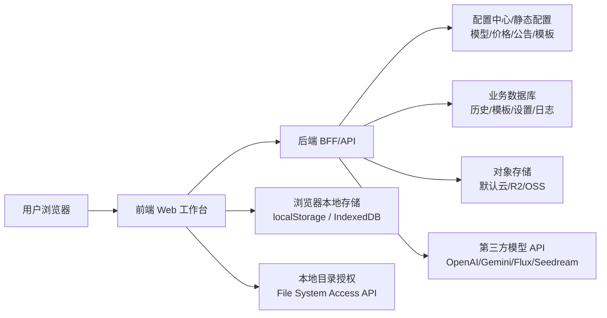
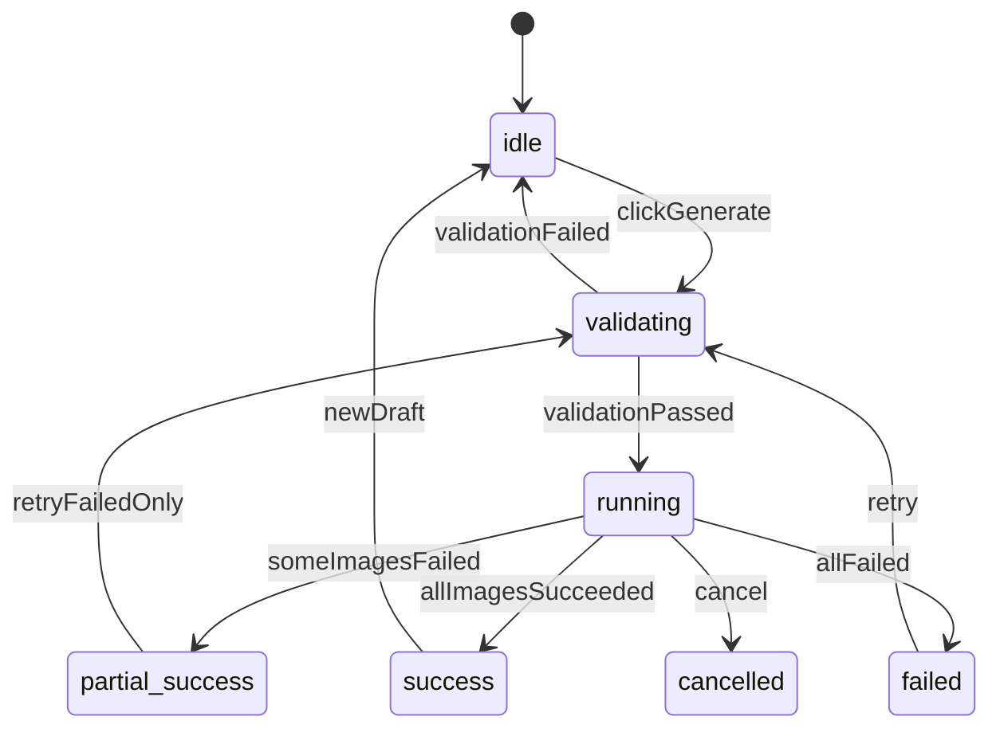
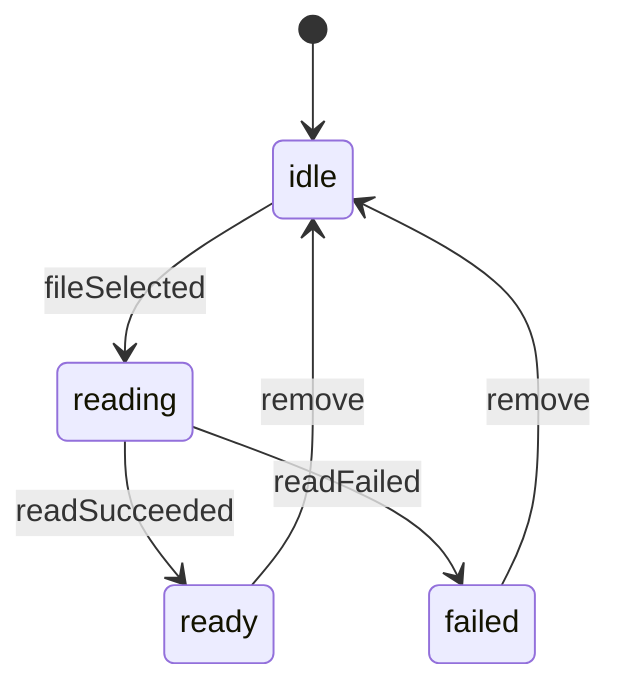
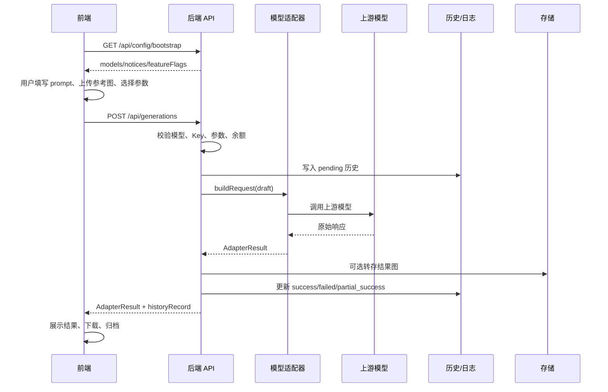

# AI 图片生成与编辑工作台前后端字段级软件开发详细设计文档

## 1. 文档信息

| 项目 | 内容 |
| --- | --- |
| 文档名称 | AI 图片生成与编辑工作台前后端字段级软件开发详细设计文档 |
| 文档类型 | Detailed Software Design，简称 DSD |
| 项目名称 | AI 图片生成与编辑工作台 |
| 版本 | v0.1 |
| 日期 | 2026-07-06 |
| 输入文档 | `docs/ai-image-master-prd.md`、`docs/ai-image-master-srs.md`、`docs/ai-image-master-ai-dev-guide.md` |
| 目标读者 | 前端工程师、后端工程师、全栈工程师、测试工程师、架构负责人、AI 编程助手 |
| 设计目标 | 将项目需求转换为可编码、可联调、可测试的前后端模块、接口、字段、状态和验收口径 |

## 目录

1. [文档信息](#1-文档信息)
2. [设计范围](#2-设计范围)
3. [总体架构](#3-总体架构)
4. [全局枚举与状态](#4-全局枚举与状态)
5. [模型配置字段级设计](#5-模型配置字段级设计)
6. [前端详细设计](#6-前端详细设计)
7. [前端请求与响应字段](#7-前端请求与响应字段)
8. [后端详细设计](#8-后端详细设计)
9. [上游适配器设计](#9-上游适配器设计)
10. [数据库与持久化设计](#10-数据库与持久化设计)
11. [设置、账号与存储字段](#11-设置账号与存储字段)
12. [错误映射与安全脱敏](#12-错误映射与安全脱敏)
13. [埋点字段级设计](#13-埋点字段级设计)
14. [前后端联调契约](#14-前后端联调契约)
15. [文件名与下载设计](#15-文件名与下载设计)
16. [UI 视觉与响应式设计](#16-ui-视觉与响应式设计)
17. [测试设计](#17-测试设计)
18. [P0 开发任务拆分](#18-p0-开发任务拆分)
19. [Definition of Done](#19-definition-of-done)
20. [待确认事项](#20-待确认事项)
21. [版本记录](#21-版本记录)

## 2. 设计范围

### 2.1 覆盖范围

本文档覆盖以下软件开发产出：

1. 前端页面、组件、状态、事件、ViewModel 和本地持久化字段。
2. 后端 BFF/API、领域实体、数据表、任务状态、上游适配器、存储和日志字段。
3. 前后端接口契约、错误映射、权限脱敏、埋点字段和测试验收口径。
4. P0 生成闭环、批量生成基础能力、模型配置、cURL、历史记录、设置与下载。
5. P1/P2 模型对比、素材模板、图片识别、推理测试和高级存储的字段预留。

### 2.2 不覆盖范围

| 范围 | 说明 |
| --- | --- |
| 支付系统 | 本期仅保留充值入口、余额不足提示和消耗展示，不设计完整支付闭环 |
| 企业后台 | 模型、公告、价格、模板可先走配置文件；运营后台另行设计 |
| 人工审核系统 | 本期仅做合规提示和上游错误映射，前置审核另行评审 |
| 完整资产管理 | 不实现团队空间、复杂标签检索、权限组和审计流 |

### 2.3 关键设计假设

| 编号 | 假设 | 影响 |
| --- | --- | --- |
| DSD-A-001 | 正式交付推荐采用前端 + 后端代理/BFF 架构 | 后端可统一处理 Key、安全、日志、存储和上游兼容 |
| DSD-A-002 | 若首期为了快速验证采用前端直连，上层字段契约保持不变 | `useProxy=false` 时由前端适配器直接构造请求 |
| DSD-A-003 | 模型、价格、参数、临时限制、响应解析全部配置驱动 | 前后端不得在页面或控制器中硬编码模型特例 |
| DSD-A-004 | P0 必须允许未登录用户完成基础生成 | 登录只增强云同步、素材模板和账号能力 |
| DSD-A-005 | 图片链接可能短期失效 | 结果字段必须包含 `temporary`、`expiresAt` 和保存提示 |
| DSD-A-006 | API Key、提示词、图片可能包含敏感信息 | 日志、历史、埋点必须脱敏和最小化保存 |

## 3. 总体架构

### 3.1 分层架构



### 3.2 前端模块划分

| 模块 | 推荐目录 | 职责 | P0 |
| --- | --- | --- | --- |
| 应用壳 | `src/app`、`src/components/layout` | 路由、导航、公告、设置入口、全局状态 | 是 |
| 模型配置 | `src/config`、`src/domain/model.ts` | 模型字段、能力解析、临时限制、价格计算 | 是 |
| 生成工作台 | `src/pages/generation`、`src/state/generation-store.ts` | 单次生成表单、上传、参数、结果、cURL | 是 |
| 上游适配 | `src/adapters`、`src/services/generation-service.ts` | 请求草稿、请求体、响应解析、错误归一化 | 是 |
| 设置与 Key | `src/pages/settings`、`src/services/settings-service.ts` | API Key、端点覆盖、存储配置、本地归档 | 是 |
| 历史记录 | `src/pages/history`、`src/services/history-service.ts` | 本地历史、详情、复用、过期处理 | 是 |
| 批量生成 | `src/pages/batch`、`src/state/batch-store.ts` | 抽卡、多提示词、任务进度、zip 下载 | P0/P1 |
| 模板能力 | `src/pages/assets`、`src/domain/template.ts` | 提示词模板、素材模板、复用、同步 | P1 |
| 识图与推理 | `src/pages/recognition`、`src/pages/reasoning` | 图像理解、推理测试、结果展示 | P1/P2 |
| 设计系统 | `src/config/design-tokens.ts`、`src/components/ui` | Token、按钮、输入、弹窗、Toast、响应式 | 是 |

### 3.3 后端模块划分

| 模块 | 推荐目录 | 职责 | P0 |
| --- | --- | --- | --- |
| 配置服务 | `server/modules/config` | 输出模型、公告、模板、功能开关 | 是 |
| 生成服务 | `server/modules/generation` | 生成请求校验、任务创建、上游调用、结果归一化 | 是 |
| 模型适配器 | `server/modules/adapters` | OpenAI/Gemini/Flux/Seedream 请求响应适配 | 是 |
| 用户设置 | `server/modules/settings` | API Key 存取策略、端点覆盖、存储配置 | 是 |
| 历史记录 | `server/modules/history` | 生成记录落库、查询、复用、过期状态 | 是 |
| 存储服务 | `server/modules/storage` | 默认云存储、R2、OSS、临时链接、连接测试 | P0/P1 |
| 批量任务 | `server/modules/batch` | 批量拆分、进度、失败重试、打包下载 | P0/P1 |
| 素材模板 | `server/modules/assets` | 模板 CRUD、同步、软删除、冲突预留 | P1 |
| 图像理解 | `server/modules/recognition` | 视觉模型请求、预设角色、结果归一化 | P1 |
| 推理测试 | `server/modules/reasoning` | 推理请求构造、effort、thinking 摘要 | P2 |
| 观测审计 | `server/modules/analytics`、`server/modules/logging` | 埋点、错误摘要、脱敏日志 | 是 |

## 4. 全局枚举与状态

### 4.1 前后端共享枚举

| 枚举 | 取值 |
| --- | --- |
| `LangCode` | `zh-CN`、`en-US`、`zh-TW`、`ru-RU` |
| `PageKey` | `generation`、`batch`、`compare`、`history`、`assets`、`recognition`、`reasoning` |
| `ApiType` | `openai-image`、`openai-image-edit`、`gemini-native`、`flux-kontext`、`flux-2`、`seedream`、`generic-image` |
| `EndpointType` | `images-generations`、`images-edits`、`gemini-generate-content`、`custom` |
| `Provider` | `google`、`openai`、`flux`、`bytedance`、`apiyi`、`custom` |
| `PriceMode` | `fixed`、`range`、`token`、`custom` |
| `RatioKey` | `auto`、`1:1`、`16:9`、`9:16`、`4:3`、`3:4`、`3:2`、`2:3`、`21:9`、`5:4`、`4:5`、`4:1`、`1:4`、`8:1`、`1:8` |
| `ResolutionKey` | `auto`、`0.5K`、`1K`、`2K`、`4K` |
| `QualityKey` | `auto`、`low`、`medium`、`high` |
| `ImageFormat` | `jpg`、`jpeg`、`png`、`gif`、`webp` |
| `OutputFormat` | `png`、`jpg`、`webp` |
| `ResponseFormat` | `url`、`b64_json`、`json` |
| `RequestStatus` | `idle`、`validating`、`running`、`success`、`partial_success`、`failed`、`cancelled` |
| `StorageType` | `default-cloud`、`r2`、`oss`、`local-directory` |
| `SyncStatus` | `local`、`syncing`、`synced`、`failed` |
| `ErrorType` | `validation`、`auth`、`permission`、`quota`、`rate_limit`、`safety`、`network`、`upstream`、`storage`、`unknown` |
| `ModelTag` | `new`、`hot`、`fast`、`vip`、`legacy`、`restricted`、`recommended` |

### 4.2 生成状态机



### 4.3 上传状态机



## 5. 模型配置字段级设计

### 5.1 ModelConfig

`ModelConfig` 是前后端共用的核心配置。前端的模型选择器、参数面板、费用区、cURL 和结果提示都读取它；后端的请求适配、上游响应解析、错误映射和临时限制也读取它。

| 字段 | 类型 | 必填 | 默认值 | 前端用途 | 后端用途 |
| --- | --- | --- | --- | --- | --- |
| `id` | string | 是 | 无 | 模型选中值、路由/历史引用 | 配置主键、请求关联 |
| `apiModelName` | string | 是 | 等于 `id` | cURL 展示 | 提交给上游的 `model` |
| `displayName` | string | 是 | 无 | 模型名称 | 日志和历史展示 |
| `provider` | `Provider` | 是 | `custom` | 分组、图标、筛选 | 适配器选择、统计 |
| `apiType` | `ApiType` | 是 | 无 | 参数提示和 cURL 分类 | 请求构造器选择 |
| `endpointType` | `EndpointType` | 是 | 无 | 端点文档跳转 | API 路由与响应解析 |
| `baseURL` | string | 是 | 无 | cURL 端点 | 生成请求端点 |
| `editURL` | string | 否 | 无 | 编辑端点提示 | 有参考图时可切换 |
| `docURL` | string | 否 | 无 | 文档链接 | 无 |
| `enabled` | boolean | 是 | true | 控制是否在列表展示 | 禁止新请求，保留历史 |
| `isDefault` | boolean | 是 | false | 默认选中模型 | 失效回退模型 |
| `sortOrder` | number | 是 | 0 | 模型排序 | 配置输出排序 |
| `tags` | `ModelTag[]` | 是 | [] | 新、热门、受限标签 | 运营统计 |
| `timeLabel` | string | 否 | 无 | 速度文案 | 无 |
| `description` | string | 否 | 无 | 能力摘要 | 无 |
| `price` | `PriceConfig` | 是 | 无 | 费用展示 | 费用快照 |
| `capabilities` | `ModelCapabilities` | 是 | 无 | 参数选项、上传限制 | 校验与请求限制 |
| `request` | `RequestPolicy` | 是 | 无 | cURL 生成 | 请求头、请求体和重试 |
| `response` | `ResponsePolicy` | 是 | 无 | 临时链接提示 | 响应解析 |
| `featureFlags` | `ModelFeatureFlags` | 是 | 全 false | UI 开关 | 特殊错误建议和字段移除 |
| `temporaryRestrictions` | `TemporaryRestriction[]` | 是 | [] | 公告、参数置灰 | 强制值、请求字段过滤 |
| `notice` | `ModelNotice` | 否 | 无 | 模型公告 | 无 |
| `ui` | `ModelUIHints` | 是 | 空对象 | 帮助文案 | 无 |
| `updatedAt` | string | 是 | 当前日期 | 配置版本提示 | 配置排查 |

### 5.2 PriceConfig

| 字段 | 类型 | 必填 | 规则 |
| --- | --- | --- | --- |
| `mode` | `PriceMode` | 是 | `fixed` 固定单价；`range` 区间；`token` 按 token；`custom` 自定义 |
| `unitLabel` | string | 是 | 如 `张`、`次`、`token` |
| `basePriceText` | string | 是 | 用户可见价格文案 |
| `basePriceValue` | number | 否 | 可计算单价；未知时不展示伪精确总价 |
| `currency` | enum | 否 | `CNY`、`USD`、`POINT`、`TOKEN` |
| `minPriceValue` | number | 否 | 区间最小值 |
| `maxPriceValue` | number | 否 | 区间最大值 |
| `multiplierFields` | string[] | 是 | 可包含 `count`、`quality`、`resolution`、`token`、`custom` |
| `qualityMultiplier` | object | 否 | 质量影响价格时配置 |
| `resolutionMultiplier` | object | 否 | 分辨率影响价格时配置 |
| `pricingNote` | string | 否 | tooltip 或费用说明 |
| `chargeOnFailureRisk` | boolean | 是 | 上游失败仍可能扣费时为 true |

费用计算：

```ts
estimatedCost =
  basePriceValue
  * count
  * (qualityMultiplier[quality] ?? 1)
  * (resolutionMultiplier[resolution] ?? 1);
```

### 5.3 ModelCapabilities

| 字段 | 类型 | 必填 | 默认值 | 规则 |
| --- | --- | --- | --- | --- |
| `ratios` | `RatioOption[]` | 是 | 至少 `auto` | 参数面板按 `enabled` 展示 |
| `resolutions` | `ResolutionOption[]` | 是 | 至少 `1K` | 估算分辨率需 `isEstimated=true` |
| `qualities` | `QualityOption[]` | 是 | `auto` | 不支持质量时隐藏选择器但保留字段 |
| `maxOutputs` | number | 是 | 1 | 单次最大输出数 |
| `defaultOutputCount` | number | 是 | 1 | 不得超过 `maxOutputs` |
| `maxReferenceImages` | number | 是 | 0 | 模型上限；页面全局上限 12 |
| `minReferenceImages` | number | 是 | 0 | 必须图生图时设 1 |
| `supportedReferenceFormats` | `ImageFormat[]` | 是 | `["jpg","png"]` | 上传格式校验 |
| `maxReferenceImageSizeMB` | number | 是 | 20 | 单图大小限制 |
| `supportsTextToImage` | boolean | 是 | true | false 时必须上传参考图 |
| `supportsImageToImage` | boolean | 是 | false | true 时有参考图走编辑/融合 |
| `supportsMultiImageFusion` | boolean | 是 | false | true 时多图顺序有意义 |
| `supportsGifReference` | boolean | 是 | false | 对比页可按能力支持 GIF |
| `outputFormats` | `OutputFormat[]` | 是 | `["png"]` | 结果保存格式 |
| `responseFormats` | `ResponseFormat[]` | 是 | `["url"]` | 响应解析方式 |
| `supportsSeed` | boolean | 是 | false | 控制 seed 参数展示 |
| `supportsNegativePrompt` | boolean | 是 | false | 控制反向提示词展示 |
| `supportsStylePreset` | boolean | 是 | false | 控制风格预设展示 |

### 5.4 RequestPolicy

| 字段 | 类型 | 必填 | 默认值 | 规则 |
| --- | --- | --- | --- | --- |
| `authHeaderName` | string | 是 | `Authorization` | 多数模型使用 Authorization |
| `authScheme` | enum | 是 | `Bearer` | 最终如 `Authorization: Bearer sk-example` |
| `contentType` | enum | 是 | `application/json` | multipart 时由浏览器或后端设置边界 |
| `imageInputMode` | enum | 是 | `auto` | `none`、`base64`、`url`、`multipart`、`auto` |
| `preferEditEndpointWhenHasReference` | boolean | 是 | false | GPT Image 编辑类模型可设 true |
| `includeFields` | string[] | 是 | [] | 强制包含字段 |
| `omitFields` | string[] | 是 | [] | 强制移除字段 |
| `removeResponseFormatWhenUnsupported` | boolean | 是 | false | 不接受 `response_format` 时自动移除 |
| `modelNameMode` | enum | 是 | `current` | 支持 `legacy-preview` |
| `timeoutMs` | number | 是 | 120000 | 请求超时 |
| `retry` | `RetryPolicy` | 是 | 不自动重试 | 网络或 5xx 可重试策略 |

#### 5.4.1 RetryPolicy

| 字段 | 类型 | 必填 | 默认值 | 规则 |
| --- | --- | --- | --- | --- |
| `autoRetry` | boolean | 是 | false | 是否自动重试 |
| `maxAttempts` | number | 是 | 1 | 最大尝试次数 |
| `retryableStatusCodes` | number[] | 是 | [] | 可重试 HTTP 状态码 |
| `backoffMs` | number | 是 | 1000 | 重试间隔 |

### 5.5 ResponsePolicy

| 字段 | 类型 | 必填 | 规则 |
| --- | --- | --- | --- |
| `imageUrlPaths` | string[] | 是 | 如 `data[].url` |
| `imageBase64Paths` | string[] | 是 | 如 `data[].b64_json` |
| `errorCodePaths` | string[] | 是 | 如 `error.code` |
| `errorMessagePaths` | string[] | 是 | 如 `error.message` |
| `finishReasonPaths` | string[] | 是 | Google 类响应需读取 |
| `tokenCountPaths` | string[] | 是 | Google 类响应需读取 |
| `temporaryUrlTTLSeconds` | number | 否 | 可能短期失效时填 600 |
| `resultRequiresImmediateSave` | boolean | 是 | true 时结果区必须提示及时保存 |

### 5.6 参数选项字段

#### 5.6.1 RatioOption

| 字段 | 类型 | 必填 | 规则 |
| --- | --- | --- | --- |
| `key` | `RatioKey` | 是 | 请求和持久化使用，不随语言变化 |
| `label` | string | 是 | UI 展示，可国际化 |
| `widthRatio` | number | 否 | 宽比例 |
| `heightRatio` | number | 否 | 高比例 |
| `enabled` | boolean | 是 | 模型配置和临时限制共同决定 |
| `disabledReason` | string | 否 | `enabled=false` 时必须有值 |

#### 5.6.2 ResolutionOption

| 字段 | 类型 | 必填 | 规则 |
| --- | --- | --- | --- |
| `key` | `ResolutionKey` | 是 | 请求和持久化使用 |
| `label` | string | 是 | UI 展示 |
| `width` | number | 否 | 精确像素宽 |
| `height` | number | 否 | 精确像素高 |
| `isEstimated` | boolean | 是 | 提示词引导尺寸时为 true |
| `enabled` | boolean | 是 | 是否可选 |
| `disabledReason` | string | 否 | 禁用原因 |

#### 5.6.3 QualityOption

| 字段 | 类型 | 必填 | 规则 |
| --- | --- | --- | --- |
| `key` | `QualityKey` | 是 | 请求和持久化使用 |
| `label` | string | 是 | UI 展示 |
| `enabled` | boolean | 是 | 是否可选 |
| `disabledReason` | string | 否 | 禁用原因 |
| `priceMultiplier` | number | 否 | 费用实时计算使用 |

### 5.7 TemporaryRestriction

| 字段 | 类型 | 必填 | 规则 |
| --- | --- | --- | --- |
| `id` | string | 是 | 稳定 ID，用于埋点和排查 |
| `enabled` | boolean | 是 | false 时不生效 |
| `type` | enum | 是 | `size_disabled`、`resolution_locked`、`quality_disabled`、`rate_limited`、`model_degraded`、`custom` |
| `title` | string | 是 | 用户可见标题 |
| `description` | string | 是 | 限制说明 |
| `affectedFields` | string[] | 是 | 参数面板和 cURL 生成器都读取 |
| `forcedValues` | `Partial<GenerationParams>` | 否 | 如 `{ ratio: "auto", resolution: "1K" }` |
| `disabledOptions` | string[] | 否 | 被置灰的选项 Key |
| `startedAt` | string | 否 | 开始时间 |
| `expectedEndAt` | string | 否 | 预计结束时间 |
| `priority` | number | 是 | 数字越大越优先 |

### 5.8 模型辅助字段

#### 5.8.1 ModelNotice

| 字段 | 类型 | 必填 | 规则 |
| --- | --- | --- | --- |
| `level` | enum | 是 | `info`、`warning`、`error` |
| `title` | string | 是 | 标题 |
| `content` | string | 是 | 内容 |
| `linkText` | string | 否 | 链接文案 |
| `linkURL` | string | 否 | 链接地址 |

#### 5.8.2 ModelUIHints

| 字段 | 类型 | 规则 |
| --- | --- | --- |
| `badgeText` | string | 模型徽标 |
| `colorToken` | string | 展示色 Token |
| `parameterHelpText` | string | 参数帮助 |
| `costHelpText` | string | 费用帮助 |
| `referenceHelpText` | string | 参考图帮助 |
| `resultHelpText` | string | 结果帮助 |

#### 5.8.3 ModelFeatureFlags

| 字段 | 类型 | 默认值 | 规则 |
| --- | --- | --- | --- |
| `allowLegacyModelName` | boolean | false | 是否允许旧模型名 |
| `isPreviewModel` | boolean | false | 是否 preview |
| `sizeByPromptOnly` | boolean | false | 尺寸只能通过提示词引导 |
| `supportsHighResolution` | boolean | false | 是否支持高分辨率 |
| `allowChatCompletionsFallback` | boolean | false | 是否允许回退到 chat/completions |
| `requiresEnterpriseGroupOnRateLimit` | boolean | false | 429 时是否提示企业分组 |

### 5.9 首期模型清单

| id | displayName | apiType | endpointType | 默认参考图上限 | 默认输出上限 | 关键规则 |
| --- | --- | --- | --- | --- | --- | --- |
| `nano-banana-pro` | Nano Banana Pro | `gemini-native` | `gemini-generate-content` | 12 | 1 | 图片输入走 `contents.parts` |
| `nano-banana-2` | Nano Banana 2 | `gemini-native` | `gemini-generate-content` | 12 | 1 | 与 Gemini 原生适配器一致 |
| `nano-banana-lite` | Nano Banana Lite | `gemini-native` | `gemini-generate-content` | 12 | 1 | 速度优先 |
| `gpt-image-2-all` | GPT Image 2 All | `openai-image` | `images-generations` | 12 | 1 | 可能无原生 size，默认可返回 `b64_json` |
| `gpt-image-2-vip` | GPT Image 2 VIP | `openai-image` | `images-generations` | 12 | 1 | 临时限制可固定自适应 1K |
| `gpt-image-2` | GPT Image 2 | `openai-image` | `images-generations` | 12 | 1 | 429 提示 `image2Enterprise` |
| `nano-banana` | Nano Banana | `gemini-native` | `gemini-generate-content` | 12 | 1 | 兼容或基础模型 |
| `seedream-5` | SeeDream 5.0 | `seedream` | `custom` | 12 | 1 | URL/Base64 输出按配置解析 |
| `seedream-4-5` | SeeDream 4.5 | `seedream` | `custom` | 12 | 1 | 与 SeeDream 适配器一致 |
| `flux-kontext-pro` | Flux Kontext Pro | `flux-kontext` | `custom` | 4 | 1 | 图像编辑，语言提示按配置 |
| `flux-kontext-max` | Flux Kontext Max | `flux-kontext` | `custom` | 4 | 1 | 高质量模式 |
| `flux-2-pro` | Flux 2 Pro | `flux-2` | `custom` | 4 | 1 | 多图融合按配置 |
| `flux-2-max` | Flux 2 Max | `flux-2` | `custom` | 8 | 1 | 高质量多图融合 |
| `flux-2-flex` | Flux 2 Flex | `flux-2` | `custom` | 4 | 1 | 平衡速度与质量 |
| `flux-2-klein-9b` | Flux 2 Klein 9B | `flux-2` | `custom` | 4 | 1 | 轻量模型 |
| `gpt-image-1-5` | GPT Image 1.5 | `openai-image` | `images-generations` | 12 | 4 | 旧模型或高兼容模型 |

## 6. 前端详细设计

### 6.1 前端产物清单

| 产物 | 文件/目录 | 产出内容 | 验收 |
| --- | --- | --- | --- |
| 领域类型 | `src/domain/*.ts` | 所有共享接口、枚举、状态类型 | TypeScript 无类型错误 |
| 模型配置 | `src/config/models.ts` | 16 个模型配置 | 参数、费用、cURL 联动 |
| 设计 Token | `src/config/design-tokens.ts` | 颜色、字号、间距、圆角、阴影、动效 | UI 不散落魔法值 |
| 应用壳 | `src/app`、`src/components/layout` | `AppShell`、`Sidebar`、`TopNotice` | 7 个页面入口可见 |
| 生成页 | `src/pages/generation` | 单次生成闭环 | 可上传、生成、展示、下载 |
| 批量页 | `src/pages/batch` | 抽卡和多提示词任务 | 进度、失败、重试 |
| 对比页 | `src/pages/compare` | 左右模型对比 | 共同尺寸过滤 |
| 历史页 | `src/pages/history` | 历史列表、详情、复用 | 临时 URL 过期有提示 |
| 素材模板 | `src/pages/assets` | 模板创建、复用、同步状态 | 名称、标签、参考图校验 |
| 识图页 | `src/pages/recognition` | 上传图片并分析 | 预设角色可用 |
| 推理页 | `src/pages/reasoning` | 平台、模型、effort 测试 | P2 可隐藏或未开放 |
| 服务层 | `src/services` | 生成、历史、设置、存储、错误、cURL | 可单元测试 |
| 适配器 | `src/adapters` | OpenAI/Gemini/Generic 请求响应 | Mock 响应可解析 |

### 6.2 GenerationFormState

| 字段 | 类型 | 必填 | 默认值 | 规则 |
| --- | --- | --- | --- | --- |
| `page` | string | 是 | `generation` | 用于埋点区分页面 |
| `modelId` | string | 是 | 默认模型 id | 失效时回退默认模型 |
| `prompt` | string | 是 | 空字符串 | 允许多行；提交前 trim |
| `negativePrompt` | string | 否 | 空 | 仅模型支持时展示 |
| `referenceImages` | `ReferenceImage[]` | 是 | [] | 按模型上限过滤，最多 12 |
| `params` | `GenerationParams` | 是 | 无 | 图片尺寸、分辨率、质量、数量 |
| `options` | `GenerationRuntimeOptions` | 是 | 默认值 | 保存历史、归档、显示真实 Key |
| `validation` | `ValidationState` | 是 | 无错误 | 提交前刷新 |
| `requestStatus` | `RequestStatus` | 是 | `idle` | 控制按钮、加载和重试 |
| `activeRequestId` | string | 否 | 无 | 请求中用于取消或防重复 |
| `draftUpdatedAt` | number | 是 | `Date.now()` | 草稿保存和恢复 |

### 6.3 ReferenceImage

| 字段 | 类型 | 必填 | 默认值 | 规则 |
| --- | --- | --- | --- | --- |
| `id` | string | 是 | UUID | 删除、排序、请求映射 |
| `source` | enum | 是 | `local-file` | `local-file`、`remote-url`、`history`、`asset-template` |
| `file` | File | 条件 | 无 | 本地上传时存在，不持久化 |
| `name` | string | 是 | 文件名或生成名 | 展示和错误提示 |
| `mimeType` | string | 是 | 无 | 如 `image/png` |
| `format` | `ImageFormat` | 是 | 无 | 从 MIME 或扩展名解析 |
| `sizeBytes` | number | 否 | 无 | 校验 20 MB |
| `width` | number | 否 | 无 | 异步解析，不阻塞 |
| `height` | number | 否 | 无 | 异步解析，不阻塞 |
| `previewURL` | string | 是 | 无 | `URL.createObjectURL` 或远程 URL |
| `remoteURL` | string | 否 | 无 | 历史或素材复用 |
| `base64` | string | 否 | 无 | 需要 base64 请求时临时生成 |
| `objectKey` | string | 否 | 无 | 云存储对象 Key |
| `order` | number | 是 | 上传顺序 | 多图融合按此排序 |
| `uploadStatus` | enum | 是 | `idle` | `idle`、`reading`、`ready`、`failed` |
| `errorMessage` | string | 否 | 无 | 失败原因 |
| `createdAt` | number | 是 | `Date.now()` | 排序和排查 |

### 6.4 GenerationParams

| 字段 | 类型 | 必填 | 默认值 | 规则 |
| --- | --- | --- | --- | --- |
| `ratio` | `RatioKey` | 是 | 模型第一个 enabled ratio | 临时限制强制时以 `forcedValues` 为准 |
| `resolution` | `ResolutionKey` | 是 | 模型第一个 enabled resolution | 锁定时不可提交其它值 |
| `quality` | `QualityKey` | 是 | `auto` | 模型不支持时隐藏但保留字段 |
| `count` | number | 是 | `defaultOutputCount` | 1 到 `maxOutputs` 的整数 |
| `outputFormat` | `OutputFormat` | 否 | 模型首个输出格式 | 不支持时不提交 |
| `responseFormat` | `ResponseFormat` | 否 | 模型首个响应格式 | `omitFields` 包含时移除 |
| `seed` | number | 否 | 无 | 仅模型支持时展示，整数 |
| `stylePreset` | string | 否 | 无 | 仅模型支持时展示 |
| `customParams` | object | 否 | {} | 提交前白名单过滤 |

### 6.5 GenerationRuntimeOptions

| 字段 | 类型 | 默认值 | 规则 |
| --- | --- | --- | --- |
| `saveToHistory` | boolean | true | 成功、失败、部分成功均写历史摘要 |
| `autoArchiveToLocalDirectory` | boolean | false | 浏览器支持且授权目录时可开启 |
| `useRealKeyInCurl` | boolean | false | 仅影响当前 cURL 展示 |
| `useCustomEndpoint` | boolean | false | 开启后读取模型级覆盖 |
| `streamProgress` | boolean | false | 首期可不实现，保留字段 |

### 6.6 ValidationState

| 字段 | 类型 | 必填 | 规则 |
| --- | --- | --- | --- |
| `isValid` | boolean | 是 | false 时阻止提交 |
| `errors` | `ValidationIssue[]` | 是 | 阻塞性错误 |
| `warnings` | `ValidationIssue[]` | 是 | 非阻塞警告 |

| `ValidationIssue` 字段 | 类型 | 规则 |
| --- | --- | --- |
| `field` | string | 对象路径，如 `prompt`、`referenceImages[0].sizeBytes` |
| `code` | string | 稳定错误码，如 `PROMPT_REQUIRED` |
| `message` | string | 用户可见文案 |
| `blocking` | boolean | true 阻止提交 |

### 6.7 前端组件输入输出字段

| 组件 | 输入字段 | 输出事件 | 输出载荷 |
| --- | --- | --- | --- |
| `ModelSelector` | `models: ModelSelectorOption[]`、`selectedModelId`、`disabled` | `onSelect` | `{ modelId, sourcePage }` |
| `ReferenceUploader` | `capabilities`、`referenceImages`、`maxCount` | `onAdd`、`onRemove`、`onReorder` | `ReferenceImage[]`、`{ id }`、`{ sourceId, targetIndex }` |
| `PromptEditor` | `prompt`、`negativePrompt`、`templates`、`supportNegativePrompt` | `onChange`、`onUseTemplate`、`onOptimize`、`onFullscreen` | `{ prompt }`、`{ templateId, useMode }` |
| `ParameterPanel` | `model`、`params`、`resolvedCapabilities` | `onChange` | `Partial<GenerationParams>` |
| `CostPreview` | `price`、`params`、`estimatedCostText` | 无 | 只展示 |
| `CurlPanel` | `draft`、`settings`、`curlState` | `onCopy`、`onToggleRealKey` | `{ showRealKey }` |
| `ResultGallery` | `result`、`historyRecord` | `onDownload`、`onOpen`、`onRetry`、`onArchive` | `{ imageId }`、`{ requestId }` |
| `ErrorPanel` | `error`、`retryable` | `onRetry`、`onOpenSettings`、`onShowDetails` | `{ errorId }` |
| `BatchTaskList` | `job`、`tasks` | `onRetryTask`、`onDownloadAll`、`onClear` | `{ taskId }`、`{ jobId }` |
| `AssetTemplateCard` | `template` | `onUse`、`onEdit`、`onDelete` | `{ templateId }` |

### 6.8 ViewModel 字段

#### 6.8.1 ModelSelectorOption

| 字段 | 类型 | 规则 |
| --- | --- | --- |
| `id` | string | 对应 `ModelConfig.id` |
| `displayName` | string | 模型名称 |
| `provider` | `Provider` | 分组和图标 |
| `tags` | `ModelTag[]` | 新、热门、受限等标签 |
| `priceText` | string | 来自 `price.basePriceText` |
| `timeLabel` | string | 预计速度 |
| `description` | string | 能力摘要 |
| `disabled` | boolean | `enabled=false` 或无权限时为 true |
| `disabledReason` | string | 禁用原因 |
| `noticeLevel` | enum | `info`、`warning`、`error` |

#### 6.8.2 ParameterPanelViewModel

| 字段 | 类型 | 规则 |
| --- | --- | --- |
| `ratioOptions` | `RatioOption[]` | 已应用临时限制 |
| `resolutionOptions` | `ResolutionOption[]` | 已应用临时限制 |
| `qualityOptions` | `QualityOption[]` | 不支持质量时可隐藏 |
| `countOptions` | number[] | 1 到 `maxOutputs` |
| `selectedParams` | `GenerationParams` | 当前表单值 |
| `restrictionTips` | string[] | 临时限制说明 |
| `finalResolutionText` | string | 精确像素或估算说明 |
| `showSeed` | boolean | `supportsSeed` |
| `showNegativePrompt` | boolean | `supportsNegativePrompt` |
| `showStylePreset` | boolean | `supportsStylePreset` |

#### 6.8.3 CostPreviewViewModel

| 字段 | 类型 | 规则 |
| --- | --- | --- |
| `unitPriceText` | string | 单价或区间 |
| `estimatedTotalText` | string | 可计算时展示 |
| `pricingNote` | string | 计费口径说明 |
| `chargeOnFailureRisk` | boolean | true 时展示风险提示 |
| `affectedByFields` | string[] | 影响费用的字段 |

#### 6.8.4 ResultCardViewModel

| 字段 | 类型 | 规则 |
| --- | --- | --- |
| `imageId` | string | 结果图片 ID |
| `title` | string | 如 `结果 1` |
| `subtitle` | string | 模型、尺寸、状态摘要 |
| `status` | enum | `loading`、`success`、`failed`、`expired` |
| `thumbnailURL` | string | 缩略图 |
| `fullURL` | string | 原图 URL |
| `actions` | `ResultCardAction[]` | 下载、打开、复制链接、重试、归档 |
| `badges` | `ResultCardBadge[]` | 模型、临时、已归档、失败 |

### 6.9 前端页面字段与交互规则

#### 6.9.1 生成图片页

| 区域 | 显示字段 | 交互输出 |
| --- | --- | --- |
| 模型选择 | 模型名、标签、速度、价格、能力摘要、限制提示 | `model_selected`、刷新参数和 cURL |
| 参考图 | 缩略图、名称、大小、状态、错误 | 添加、删除、排序、格式/大小校验 |
| 提示词 | prompt、negativePrompt、模板入口、优化入口、全屏入口 | 修改文本、使用模板、优化替换 |
| 参数 | 尺寸、分辨率、数量、质量、输出格式 | `params` 变更、费用和 cURL 实时更新 |
| 费用 | 单价、总价、计费说明、扣费风险 | 无 |
| 操作 | 清空、开始生成、取消/等待 | 生成请求、清空草稿 |
| cURL | endpoint、method、code、warning、copyStatus | 复制、显示真实 Key |
| 结果 | 空态、生成中、成功、部分成功、失败 | 下载、打开、复制链接、重试、归档 |

#### 6.9.2 批量生成页

| 字段 | 类型 | 规则 |
| --- | --- | --- |
| `mode` | `card-draw`、`multi-prompt` | 抽卡模式默认 |
| `prompts` | string[] | 多提示词按行拆分，空行忽略 |
| `drawCount` | number | 抽卡可选 2、5、10，默认 5 |
| `sharedReferenceImages` | `ReferenceImage[]` | 所有任务共用 |
| `params` | `GenerationParams` | 复用模型能力过滤 |
| `estimatedCostText` | string | 实时展示 |
| `progressText` | string | `completedTasks / totalTasks` |
| `failedTasks` | number | 控制失败重试 |

#### 6.9.3 历史记录页

| 字段 | 类型 | 规则 |
| --- | --- | --- |
| `recordCount` | number | 空态展示 0 |
| `syncStatus` | `SyncStatus` | 未登录为 `local` |
| `cards` | `HistoryListItem[]` | 展示模型、时间、状态、缩略图、消耗 |
| `selectedRecord` | `GenerationHistoryRecord` | 详情使用 |
| `reusePayload` | `GenerationFormState` 部分字段 | 复用时回填生成页 |
| `expiredHint` | string | 临时 URL 失效时展示 |

#### 6.9.4 设置页

| 区域 | 字段 | 规则 |
| --- | --- | --- |
| 主 Key | `main.maskedValue`、`storageMode`、`lastFour` | 默认脱敏，显示需主动点击 |
| 图像理解 Key | `vision.maskedValue` | 识图优先使用 |
| 自定义端点 | `customRootURL`、`modelOverrides`、`useProxy` | URL 保存前校验 |
| 存储 | `activeType`、`r2`、`oss`、`lastTestResult` | 保存前连接测试 |
| 本地归档 | `supported`、`permissionState`、`directoryName` | 仅支持浏览器展示 |

## 7. 前端请求与响应字段

### 7.1 GenerationRequestDraft

`GenerationRequestDraft` 是前端提交给后端或前端适配器的统一内部请求草稿。

| 字段 | 类型 | 必填 | 规则 |
| --- | --- | --- | --- |
| `requestId` | string | 是 | 每次点击生成创建，历史、日志、埋点共用 |
| `mode` | enum | 是 | `single`、`batch`、`compare`、`retry` |
| `model` | `ModelConfig` | 是 | 使用已解析临时限制后的模型配置 |
| `prompt` | string | 是 | trim 后文本 |
| `negativePrompt` | string | 否 | 模型支持时提交 |
| `referenceImages` | `PreparedReferenceImage[]` | 是 | 已完成 base64 或 URL 准备 |
| `params` | `GenerationParams` | 是 | 已校验参数 |
| `apiKey` | string | 条件 | 前端直连或显示真实 cURL 时仅在内存使用 |
| `endpointOverride` | `EndpointOverride` | 否 | 自定义根域名或模型级覆盖 |
| `createdAt` | number | 是 | 请求创建时间 |

### 7.2 EndpointOverride

| 字段 | 类型 | 必填 | 规则 |
| --- | --- | --- | --- |
| `baseURL` | string | 否 | 覆盖生成端点 |
| `editURL` | string | 否 | 覆盖编辑端点 |
| `apiKey` | string | 否 | 模型级 Key，仅内存或后端安全存储使用 |
| `headers` | `Record<string, string>` | 否 | 自定义请求头，日志必须脱敏 |

### 7.3 PreparedReferenceImage

| 字段 | 类型 | 必填 | 规则 |
| --- | --- | --- | --- |
| `id` | string | 是 | 对应上传项 |
| `name` | string | 是 | 文件名 |
| `mimeType` | string | 是 | MIME 类型 |
| `format` | `ImageFormat` | 是 | 格式 |
| `sizeBytes` | number | 否 | 校验使用 |
| `width` | number | 否 | 图片宽度 |
| `height` | number | 否 | 图片高度 |
| `base64` | string | 条件 | `imageInputMode=base64` 时使用 |
| `remoteURL` | string | 条件 | `imageInputMode=url` 时使用 |
| `order` | number | 是 | 多图顺序 |

### 7.4 AdapterResult

| 字段 | 类型 | 必填 | 规则 |
| --- | --- | --- | --- |
| `requestId` | string | 是 | 对应请求 |
| `status` | `RequestStatus` | 是 | 部分成功为 `partial_success` |
| `images` | `GeneratedImage[]` | 是 | 结果图片列表 |
| `rawResponseSummary` | unknown | 否 | 只能保存摘要 |
| `usage` | `UsageInfo` | 否 | token、张数、费用 |
| `durationMs` | number | 是 | 请求耗时 |
| `error` | `GenerationError` | 否 | 完全失败或总体错误 |

### 7.5 UsageInfo

| 字段 | 类型 | 必填 | 规则 |
| --- | --- | --- | --- |
| `promptTokens` | number | 否 | 输入 token |
| `completionTokens` | number | 否 | 输出 token |
| `totalTokens` | number | 否 | 总 token |
| `imageCount` | number | 是 | 生成图片数量 |
| `chargedAmountText` | string | 否 | 实际扣费展示 |
| `estimatedCostText` | string | 否 | 预估费用展示 |

### 7.6 GeneratedImage

| 字段 | 类型 | 必填 | 规则 |
| --- | --- | --- | --- |
| `id` | string | 是 | 图片 ID |
| `sourceType` | enum | 是 | `url`、`base64`、`blob`、`storage` |
| `url` | string | 条件 | URL 类型结果 |
| `base64` | string | 条件 | base64 类型结果，避免长期持久化 |
| `blobURL` | string | 条件 | 前端预览 Blob URL |
| `storageKey` | string | 条件 | 存储对象 Key |
| `mimeType` | string | 否 | 图片 MIME |
| `width` | number | 否 | 宽度 |
| `height` | number | 否 | 高度 |
| `format` | `OutputFormat` | 否 | 输出格式 |
| `index` | number | 是 | 从 0 开始 |
| `temporary` | boolean | 是 | 短期链接为 true |
| `expiresAt` | number | 否 | 过期时间 |
| `downloadStatus` | enum | 是 | `idle`、`downloading`、`downloaded`、`failed` |
| `archiveStatus` | enum | 是 | `not_enabled`、`pending`、`archived`、`failed` |
| `error` | `GenerationError` | 否 | 部分失败绑定到单图 |

### 7.7 CurlState

| 字段 | 类型 | 必填 | 规则 |
| --- | --- | --- | --- |
| `code` | string | 是 | 根据当前表单实时生成 |
| `endpoint` | string | 是 | 当前请求 URL |
| `method` | `POST` | 是 | 固定 POST |
| `showRealKey` | boolean | 是 | 默认 false |
| `copiedAt` | number | 否 | 复制成功时间 |
| `copyStatus` | enum | 是 | `idle`、`success`、`failed` |
| `warning` | string | 否 | 如自动移除 `response_format` |

## 8. 后端详细设计

### 8.1 后端产物清单

| 产物 | 推荐目录 | 产出内容 | 验收 |
| --- | --- | --- | --- |
| API 路由 | `server/routes` 或 `server/modules/*/*.controller.ts` | REST 接口 | OpenAPI/接口文档完整 |
| DTO | `server/modules/*/dto` | 请求和响应字段 | 校验规则完整 |
| 领域实体 | `server/domain` | 模型、请求、历史、模板、设置、错误 | 字段与前端共享契约一致 |
| 适配器 | `server/modules/adapters` | OpenAI、Gemini、Generic | Mock 上游可跑通 |
| 服务 | `server/modules/*/*.service.ts` | 生成编排、存储、历史、错误 | 单元测试覆盖 |
| 数据访问 | `server/modules/*/*.repository.ts` | 数据表映射 | 迁移脚本或 schema 完整 |
| 脱敏日志 | `server/modules/logging` | 错误摘要、请求链路 | 不输出完整 Key |
| 配置 | `server/config` | 模型、公告、模板、功能开关 | 可配置变更 |

### 8.2 API 通用响应结构

| 字段 | 类型 | 必填 | 规则 |
| --- | --- | --- | --- |
| `success` | boolean | 是 | 请求是否业务成功 |
| `requestId` | string | 是 | 链路 ID |
| `data` | object | 否 | 成功数据 |
| `error` | `GenerationError` 或 `ApiError` | 否 | 失败时返回脱敏错误 |
| `serverTime` | string | 是 | ISO 时间 |

`ApiError` 字段：

| 字段 | 类型 | 必填 | 规则 |
| --- | --- | --- | --- |
| `id` | string | 是 | 错误 ID |
| `type` | `ErrorType` | 是 | 归一化类型 |
| `code` | string | 是 | 稳定错误码 |
| `title` | string | 是 | 用户可见标题 |
| `message` | string | 是 | 用户可见说明 |
| `suggestion` | string | 否 | 下一步建议 |
| `retryable` | boolean | 是 | 是否可重试 |
| `safeDetails` | string | 否 | 脱敏详情 |

#### 8.2.1 ClientContext

| 字段 | 类型 | 必填 | 规则 |
| --- | --- | --- | --- |
| `page` | `PageKey` | 否 | 发起请求的页面 |
| `lang` | `LangCode` | 否 | 当前语言 |
| `sessionId` | string | 否 | 未登录会话 ID |
| `userAgent` | string | 否 | 后端只保存摘要或哈希 |
| `timezone` | string | 否 | 用于文件名和展示时间 |
| `source` | string | 否 | `web`、`mobile-web`、`test` 等 |

### 8.3 配置 API

#### 8.3.1 GET `/api/config/bootstrap`

用途：前端启动时获取模型、公告、功能开关和基础模板摘要。

响应 `data` 字段：

| 字段 | 类型 | 规则 |
| --- | --- | --- |
| `models` | `ModelConfig[]` | 只返回 `enabled=true` 或当前用户可见模型 |
| `defaultModelId` | string | 唯一默认模型 |
| `notices` | `TopNoticeConfig[]` | 公告和临时限制 |
| `featureFlags` | `FeatureFlags` | 功能开关 |
| `promptTemplateVersion` | string | 模板缓存版本 |
| `appVersion` | string | 前端版本 |
| `serverTime` | string | ISO 时间 |

#### 8.3.2 TopNoticeConfig

| 字段 | 类型 | 必填 | 规则 |
| --- | --- | --- | --- |
| `id` | string | 是 | 公告 ID |
| `level` | enum | 是 | `info`、`warning`、`error` |
| `title` | string | 是 | 标题 |
| `content` | string | 是 | 内容 |
| `modelId` | string | 否 | 模型相关公告 |
| `linkText` | string | 否 | 跳转文案 |
| `linkURL` | string | 否 | 跳转地址 |
| `priority` | number | 是 | 越大越优先 |
| `enabled` | boolean | 是 | 是否启用 |

#### 8.3.3 FeatureFlags

| 字段 | 类型 | 默认值 | 规则 |
| --- | --- | --- | --- |
| `enableBatch` | boolean | true | 控制批量生成入口 |
| `enableCompare` | boolean | true | 控制模型对比入口 |
| `enableHistory` | boolean | true | 控制历史记录入口 |
| `enableAssetTemplates` | boolean | true | 控制素材模板入口 |
| `enableRecognition` | boolean | true | 控制图片识别入口 |
| `enableReasoning` | boolean | false | P2 推理测试可默认关闭 |
| `enableLocalArchive` | boolean | true | 仍需前端运行时检测浏览器支持 |
| `enableCustomStorage` | boolean | false | R2/OSS 可灰度 |
| `enablePromptOptimize` | boolean | false | 提示词优化能力开关 |
| `enableRealKeyInCurl` | boolean | true | 是否允许用户显示真实 Key |

### 8.4 生成 API

#### 8.4.1 POST `/api/generations`

用途：创建单次生成请求。后端代理模式下由后端调用上游；前端直连模式可只返回标准化草稿或签名策略。

请求字段：

| 字段 | 类型 | 必填 | 规则 |
| --- | --- | --- | --- |
| `requestId` | string | 否 | 前端可传；不传后端生成 |
| `modelId` | string | 是 | 对应 `ModelConfig.id` |
| `prompt` | string | 条件 | 无参考图时必填 |
| `negativePrompt` | string | 否 | 模型支持时有效 |
| `referenceImages` | `GenerationReferenceInput[]` | 是 | 可为空 |
| `params` | `GenerationParams` | 是 | 已由前端预校验，后端仍需复校 |
| `options` | `GenerationServerOptions` | 否 | 保存历史、存储策略 |
| `clientContext` | `ClientContext` | 否 | 页面、语言、会话信息 |

`GenerationReferenceInput` 字段：

| 字段 | 类型 | 必填 | 规则 |
| --- | --- | --- | --- |
| `id` | string | 是 | 前端图片 ID |
| `name` | string | 是 | 文件名 |
| `mimeType` | string | 是 | MIME |
| `format` | `ImageFormat` | 是 | 格式 |
| `sizeBytes` | number | 否 | 大小 |
| `width` | number | 否 | 宽度 |
| `height` | number | 否 | 高度 |
| `base64` | string | 条件 | 后端代理且使用 base64 时传 |
| `remoteURL` | string | 条件 | URL 模式时传 |
| `objectKey` | string | 条件 | 已上传对象存储时传 |
| `order` | number | 是 | 多图顺序 |

`GenerationServerOptions` 字段：

| 字段 | 类型 | 默认值 | 规则 |
| --- | --- | --- | --- |
| `saveToHistory` | boolean | true | 写入历史 |
| `storeResultToCloud` | boolean | true | 是否转存默认云存储 |
| `returnRawSummary` | boolean | false | 是否返回响应摘要 |
| `useCustomEndpoint` | boolean | false | 是否启用端点覆盖 |

响应 `data` 字段：

| 字段 | 类型 | 必填 | 规则 |
| --- | --- | --- | --- |
| `requestId` | string | 是 | 请求 ID |
| `status` | `RequestStatus` | 是 | 同步返回成功/失败；异步时为 `running` |
| `result` | `AdapterResult` | 否 | 同步完成时返回 |
| `historyRecord` | `GenerationHistoryRecord` | 否 | 写历史后返回摘要 |
| `pollingURL` | string | 否 | 异步模式轮询地址 |
| `warnings` | `ValidationIssue[]` | 否 | 非阻塞警告 |

#### 8.4.2 GET `/api/generations/{requestId}`

用途：查询生成任务状态。

响应 `data` 字段：

| 字段 | 类型 | 规则 |
| --- | --- | --- |
| `requestId` | string | 请求 ID |
| `status` | `RequestStatus` | 当前状态 |
| `progress` | `TaskProgress` | 异步任务进度 |
| `result` | `AdapterResult` | 成功、失败、部分成功时返回 |
| `historyRecordId` | string | 历史记录 ID |
| `updatedAt` | number | 更新时间 |

`TaskProgress` 字段：

| 字段 | 类型 | 规则 |
| --- | --- | --- |
| `current` | number | 已完成 |
| `total` | number | 总数 |
| `message` | string | 状态文案 |
| `stage` | enum | `queued`、`calling_upstream`、`saving`、`done` |

#### 8.4.3 POST `/api/generations/{requestId}/retry`

请求字段：

| 字段 | 类型 | 规则 |
| --- | --- | --- |
| `retryMode` | enum | `all`、`failed_only` |
| `overrideParams` | `Partial<GenerationParams>` | 可选覆盖参数 |

响应字段与 `POST /api/generations` 一致。

### 8.5 批量 API

#### 8.5.1 POST `/api/batch-jobs`

请求字段：

| 字段 | 类型 | 必填 | 规则 |
| --- | --- | --- | --- |
| `mode` | enum | 是 | `card-draw`、`multi-prompt` |
| `modelId` | string | 是 | 当前模型 |
| `prompts` | string[] | 是 | 抽卡模式一条，多提示词多条 |
| `sharedReferenceImages` | `GenerationReferenceInput[]` | 否 | 共用参考图 |
| `params` | `GenerationParams` | 是 | 公共参数 |
| `drawCount` | number | 条件 | 抽卡模式必填 |
| `options` | `GenerationServerOptions` | 否 | 保存历史、存储 |

响应 `data`：

| 字段 | 类型 | 规则 |
| --- | --- | --- |
| `job` | `BatchJob` | 批量任务 |
| `pollingURL` | string | 查询进度 |

#### 8.5.2 BatchJob

| 字段 | 类型 | 必填 | 规则 |
| --- | --- | --- | --- |
| `id` | string | 是 | 任务 ID |
| `mode` | enum | 是 | `card-draw`、`multi-prompt` |
| `modelId` | string | 是 | 模型 ID |
| `prompts` | string[] | 是 | 任务提示词 |
| `sharedReferenceImages` | `ReferenceImage[]` | 是 | 共用参考图 |
| `params` | `GenerationParams` | 是 | 参数 |
| `totalTasks` | number | 是 | 总任务数 |
| `completedTasks` | number | 是 | 已完成数 |
| `failedTasks` | number | 是 | 失败数 |
| `estimatedCostText` | string | 否 | 预估费用 |
| `status` | `RequestStatus` | 是 | 任务状态 |
| `tasks` | `BatchTask[]` | 是 | 子任务 |
| `createdAt` | number | 是 | 创建时间 |
| `updatedAt` | number | 是 | 更新时间 |

#### 8.5.3 BatchTask

| 字段 | 类型 | 必填 | 规则 |
| --- | --- | --- | --- |
| `id` | string | 是 | 子任务 ID |
| `index` | number | 是 | 子任务序号 |
| `prompt` | string | 是 | 子任务提示词 |
| `status` | `RequestStatus` | 是 | 子任务状态 |
| `requestId` | string | 否 | 对应单次生成请求 ID |
| `resultImages` | `GeneratedImage[]` | 是 | 成功图片 |
| `error` | `GenerationError` | 否 | 子任务错误 |
| `retryOfTaskId` | string | 否 | 重试来源任务 ID |
| `startedAt` | number | 否 | 开始时间 |
| `finishedAt` | number | 否 | 结束时间 |

### 8.6 历史 API

#### 8.6.1 GET `/api/history`

查询参数：

| 字段 | 类型 | 默认值 | 规则 |
| --- | --- | --- | --- |
| `page` | number | 1 | 页码 |
| `pageSize` | number | 20 | 每页数量 |
| `status` | `RequestStatus` | 无 | 可筛选 |
| `modelId` | string | 无 | 可筛选 |
| `keyword` | string | 无 | 可按提示词摘要搜索 |

响应 `data`：

| 字段 | 类型 | 规则 |
| --- | --- | --- |
| `items` | `HistoryListItem[]` | 历史列表 |
| `total` | number | 总数 |
| `page` | number | 页码 |
| `pageSize` | number | 每页数量 |
| `syncStatus` | `SyncStatus` | 当前同步状态 |

#### 8.6.2 HistoryListItem

| 字段 | 类型 | 必填 | 规则 |
| --- | --- | --- | --- |
| `id` | string | 是 | 历史记录 ID |
| `requestId` | string | 是 | 请求 ID |
| `modelDisplayName` | string | 是 | 模型展示名 |
| `promptSummary` | string | 否 | 提示词摘要，不超过安全策略长度 |
| `thumbnailURL` | string | 否 | 第一张结果缩略图 |
| `status` | `RequestStatus` | 是 | 状态 |
| `imageCount` | number | 是 | 成功图片数量 |
| `costText` | string | 否 | 消耗展示 |
| `durationMs` | number | 否 | 耗时 |
| `archived` | boolean | 是 | 是否归档 |
| `temporary` | boolean | 是 | 是否包含临时链接 |
| `expiresAt` | number | 否 | 最早过期时间 |
| `createdAt` | number | 是 | 创建时间 |

#### 8.6.3 GenerationHistoryRecord

| 字段 | 类型 | 必填 | 规则 |
| --- | --- | --- | --- |
| `id` | string | 是 | 历史记录 ID |
| `requestId` | string | 是 | 请求 ID |
| `createdAt` | number | 是 | 创建时间 |
| `updatedAt` | number | 是 | 更新时间 |
| `modelId` | string | 是 | 模型 ID |
| `modelDisplayName` | string | 是 | 模型展示名 |
| `mode` | enum | 是 | `single`、`batch`、`compare`、`recognition`、`reasoning` |
| `prompt` | string | 否 | 受隐私策略控制 |
| `promptHash` | string | 否 | 去重和统计 |
| `referenceImages` | `HistoryReferenceImage[]` | 是 | 不保存 File |
| `params` | `GenerationParams` | 是 | 参数快照 |
| `status` | `RequestStatus` | 是 | 状态 |
| `resultImages` | `HistoryResultImage[]` | 是 | 结果快照 |
| `cost` | `CostSnapshot` | 否 | 费用快照 |
| `durationMs` | number | 否 | 耗时 |
| `error` | `GenerationError` | 否 | 脱敏错误 |
| `archived` | boolean | 是 | 是否已归档 |
| `localArchivePath` | string | 否 | 本地归档路径，不上传云端 |
| `syncStatus` | `SyncStatus` | 是 | 同步状态 |
| `storageType` | `StorageType` | 否 | 存储类型 |
| `expiresAt` | number | 否 | 临时链接最早过期时间 |

#### 8.6.4 HistoryReferenceImage

| 字段 | 类型 | 必填 | 规则 |
| --- | --- | --- | --- |
| `id` | string | 是 | 参考图 ID |
| `name` | string | 是 | 文件名 |
| `mimeType` | string | 是 | MIME |
| `width` | number | 否 | 宽度 |
| `height` | number | 否 | 高度 |
| `sizeBytes` | number | 否 | 大小 |
| `thumbnailURL` | string | 否 | 缩略图 |
| `remoteURL` | string | 否 | 远程 URL |
| `objectKey` | string | 否 | 存储对象 Key |
| `order` | number | 是 | 顺序 |

#### 8.6.5 HistoryResultImage

| 字段 | 类型 | 必填 | 规则 |
| --- | --- | --- | --- |
| `id` | string | 是 | 结果图 ID |
| `url` | string | 否 | 图片 URL |
| `base64` | string | 否 | 不建议长期保存 |
| `storageKey` | string | 否 | 存储对象 Key |
| `localPath` | string | 否 | 本地路径仅本机展示 |
| `width` | number | 否 | 宽度 |
| `height` | number | 否 | 高度 |
| `index` | number | 是 | 序号 |
| `temporary` | boolean | 是 | 是否临时链接 |
| `expiresAt` | number | 否 | 过期时间 |
| `downloadStatus` | enum | 是 | `idle`、`downloaded`、`failed` |

#### 8.6.6 CostSnapshot

| 字段 | 类型 | 必填 | 规则 |
| --- | --- | --- | --- |
| `mode` | `PriceMode` | 是 | 费用模式 |
| `unitPriceText` | string | 是 | 单价快照 |
| `estimatedTotalText` | string | 否 | 预估总价 |
| `chargedAmountText` | string | 否 | 实际扣费展示 |
| `currency` | string | 否 | 币种或点数 |

### 8.7 素材模板 API

#### 8.7.1 AssetTemplate

| 字段 | 类型 | 必填 | 规则 |
| --- | --- | --- | --- |
| `id` | string | 是 | 模板 ID |
| `ownerId` | string | 否 | 登录用户 ID |
| `scope` | enum | 是 | `local`、`cloud`、`public` |
| `name` | string | 是 | 不超过 10 个中文字符或 20 个英文字符 |
| `prompt` | string | 否 | 可为空 |
| `tags` | string[] | 是 | 标签 |
| `referenceImages` | `AssetTemplateImage[]` | 是 | 参考图 |
| `defaultParams` | `Partial<GenerationParams>` | 否 | 使用时按当前模型过滤 |
| `sortOrder` | number | 是 | 排序 |
| `syncStatus` | `SyncStatus` | 是 | 同步状态 |
| `conflictStatus` | enum | 否 | `none`、`local_newer`、`cloud_newer`、`conflict` |
| `createdAt` | number | 是 | 创建时间 |
| `updatedAt` | number | 是 | 更新时间 |
| `deletedAt` | number | 否 | 软删除 |

#### 8.7.2 AssetTemplateImage

| 字段 | 类型 | 必填 | 规则 |
| --- | --- | --- | --- |
| `id` | string | 是 | 图片 ID |
| `name` | string | 是 | 文件名 |
| `thumbnailURL` | string | 否 | 缩略图 |
| `remoteURL` | string | 否 | 远程 URL |
| `objectKey` | string | 否 | 云端对象 Key |
| `mimeType` | string | 是 | MIME |
| `width` | number | 否 | 宽度 |
| `height` | number | 否 | 高度 |
| `order` | number | 是 | 顺序 |

#### 8.7.3 API 列表

| 方法 | 路径 | 用途 |
| --- | --- | --- |
| GET | `/api/asset-templates` | 查询模板 |
| POST | `/api/asset-templates` | 创建模板 |
| PATCH | `/api/asset-templates/{id}` | 更新模板 |
| DELETE | `/api/asset-templates/{id}` | 软删除模板 |
| POST | `/api/asset-templates/{id}/use` | 记录复用，可返回回填字段 |

### 8.8 图片识别 API

#### 8.8.1 POST `/api/recognition/analyze`

请求字段：

| 字段 | 类型 | 必填 | 规则 |
| --- | --- | --- | --- |
| `id` | string | 否 | 请求 ID |
| `modelId` | string | 是 | 视觉理解模型 |
| `presetRole` | enum | 是 | `object`、`product_title`、`bullet_points`、`attributes`、`ocr`、`custom` |
| `question` | string | 否 | 自定义问题 |
| `images` | `GenerationReferenceInput[]` | 是 | JPG/PNG，单图 20 MB |
| `apiKeySource` | enum | 否 | `vision`、`main`、`custom` |

响应 `data`：

| 字段 | 类型 | 规则 |
| --- | --- | --- |
| `text` | string | 分析文本 |
| `structured` | object | 商品属性、OCR 等结构化结果 |
| `rawSummary` | unknown | 脱敏响应摘要 |

#### 8.8.2 RecognitionResult

| 字段 | 类型 | 必填 | 规则 |
| --- | --- | --- | --- |
| `text` | string | 是 | 用户可见分析结果 |
| `structured` | `Record<string, unknown>` | 否 | 商品标题、五点描述、属性、OCR 等结构化输出 |
| `rawSummary` | unknown | 否 | 脱敏上游摘要 |
| `usage` | `UsageInfo` | 否 | token 或请求消耗 |
| `createdAt` | number | 是 | 结果时间 |

### 8.9 推理测试 API

#### 8.9.1 POST `/api/reasoning/test`

请求字段：

| 字段 | 类型 | 必填 | 规则 |
| --- | --- | --- | --- |
| `platform` | enum | 是 | `Anthropic`、`OpenAI`、`Google` |
| `model` | string | 是 | 平台模型 |
| `effort` | enum | 是 | `low`、`medium`、`high`、`xhigh`、`max`，默认 `high` |
| `timeoutMs` | number | 是 | 正整数 |
| `maxTokens` | number | 是 | 正整数 |
| `includeThinkingSummary` | boolean | 是 | 是否请求思考摘要 |
| `prompt` | string | 是 | 推理题 |
| `referenceImages` | `GenerationReferenceInput[]` | 否 | 最多 12 张 |

响应 `data`：

| 字段 | 类型 | 规则 |
| --- | --- | --- |
| `answer` | string | 模型回答 |
| `thinkingSummary` | string | 思考摘要，按供应商规则返回 |
| `usage` | `UsageInfo` | token 使用 |
| `rawSummary` | unknown | 脱敏摘要 |

#### 8.9.2 ReasoningResult

| 字段 | 类型 | 必填 | 规则 |
| --- | --- | --- | --- |
| `answer` | string | 是 | 模型最终回答 |
| `thinkingSummary` | string | 否 | 仅在供应商允许且请求开启时返回 |
| `usage` | `UsageInfo` | 否 | token 使用 |
| `rawSummary` | unknown | 否 | 脱敏上游摘要 |
| `createdAt` | number | 是 | 结果时间 |

## 9. 上游适配器设计

### 9.1 ImageAdapter 接口

| 方法 | 输入 | 输出 | 规则 |
| --- | --- | --- | --- |
| `supports` | `model: ModelConfig` | boolean | 判断适配器是否支持模型 |
| `buildRequest` | `draft: GenerationRequestDraft` | `AdapterHttpRequest` | 构造标准 HTTP 请求 |
| `parseResponse` | `response`、`draft` | `AdapterResult` | 解析图片、usage、错误 |
| `buildCurl` | `draft`、`CurlBuildOptions` | string | 生成 cURL |

### 9.2 AdapterHttpRequest

| 字段 | 类型 | 规则 |
| --- | --- | --- |
| `method` | `POST` | 固定 POST |
| `url` | string | 受模型和自定义端点影响 |
| `headers` | object | 必须脱敏日志 |
| `body` | unknown | 按适配器生成 |
| `contentType` | enum | `application/json` 或 `multipart/form-data` |
| `timeoutMs` | number | 模型请求超时 |

### 9.3 OpenAI Images 适配

| 内部字段 | 上游字段 | 条件 |
| --- | --- | --- |
| `model.apiModelName` | `model` | 必传 |
| `prompt` | `prompt` | 必传；`sizeByPromptOnly=true` 时追加尺寸引导 |
| `params.count` | `n` | `count > 1` 且模型支持多图 |
| `params.ratio` | `size` | 模型支持原生 size 且未被限制 |
| `params.quality` | `quality` | 支持 quality 且不是 `auto` |
| `params.responseFormat` | `response_format` | 模型允许时才提交 |
| `referenceImages` | 文件或 base64 | 有参考图且优先编辑端点 |

实现要求：

1. `removeResponseFormatWhenUnsupported=true` 时不得提交 `response_format`。
2. 有参考图时优先使用 `editURL`，不存在时按 `baseURL` 与配置处理。
3. `gpt-image-2` 返回 429 时，建议包含 `image2Enterprise` 企业分组。
4. `b64_json` 结果转换为可预览 Blob URL 或 data URL。

### 9.4 Gemini generateContent 适配

请求体结构：

| 字段 | 类型 | 规则 |
| --- | --- | --- |
| `contents[].role` | string | 固定 `user` |
| `contents[].parts[].text` | string | 用户提示词和必要尺寸/质量引导 |
| `contents[].parts[].inlineData.mimeType` | string | 参考图 MIME |
| `contents[].parts[].inlineData.data` | string | 不带前缀的 base64 |
| `generationConfig.responseModalities` | string[] | 包含 `TEXT`、`IMAGE` |
| `imageConfig.aspectRatio` | string | 对应 `params.ratio` |
| `imageConfig.resolution` | string | 对应 `params.resolution` |

错误映射：

| 上游信号 | 归一化错误 |
| --- | --- |
| `candidatesTokenCount=0` | `type=safety`，标题“谷歌拒绝出图” |
| `finishReason=PROHIBITED_CONTENT` | `type=safety`，标题“违禁内容” |
| `finishReason=SAFETY` | `type=safety`，标题“安全过滤” |
| `finishReason=NO_IMAGE` | `type=upstream`，提示明确图片生成或编辑意图 |
| `finishReason=RECITATION` | `type=safety`，提示避免受保护内容 |
| `finishReason=MAX_TOKENS` | `type=upstream`，提示缩短输入或降低复杂度 |

### 9.5 Generic 适配

用于 Flux、Seedream 和其它配置型模型。

| 规则 | 说明 |
| --- | --- |
| 适配器选择 | 按 `apiType`，不在页面组件判断模型 id |
| 图片输入 | 遵循 `imageInputMode` |
| 请求字段 | 按 `includeFields`、`omitFields` 和白名单 `customParams` |
| 响应解析 | 优先使用 `response.imageUrlPaths` 和 `imageBase64Paths` |
| 空结果 | 未解析到图片时返回 `NO_IMAGE` 错误 |

## 10. 数据库与持久化设计

### 10.1 后端数据表

#### 10.1.1 `generation_requests`

| 字段 | 类型 | 约束 | 说明 |
| --- | --- | --- | --- |
| `id` | varchar | PK | 请求 ID |
| `user_id` | varchar | nullable | 用户 ID |
| `session_id` | varchar | nullable | 未登录会话 |
| `mode` | varchar | not null | single/batch/compare/retry |
| `model_id` | varchar | not null | 模型 ID |
| `model_display_name` | varchar | not null | 展示名快照 |
| `prompt_hash` | varchar | nullable | 提示词哈希 |
| `prompt_encrypted` | text | nullable | 如保存原文需按隐私策略 |
| `params_json` | json | not null | 参数快照 |
| `status` | varchar | not null | 请求状态 |
| `cost_json` | json | nullable | 费用快照 |
| `duration_ms` | int | nullable | 耗时 |
| `error_json` | json | nullable | 脱敏错误 |
| `created_at` | timestamp | not null | 创建时间 |
| `updated_at` | timestamp | not null | 更新时间 |

#### 10.1.2 `generation_reference_images`

| 字段 | 类型 | 约束 | 说明 |
| --- | --- | --- | --- |
| `id` | varchar | PK | 图片 ID |
| `request_id` | varchar | FK | 请求 ID |
| `name` | varchar | not null | 文件名 |
| `mime_type` | varchar | not null | MIME |
| `format` | varchar | not null | 格式 |
| `size_bytes` | bigint | nullable | 大小 |
| `width` | int | nullable | 宽度 |
| `height` | int | nullable | 高度 |
| `thumbnail_url` | text | nullable | 缩略图 |
| `remote_url` | text | nullable | 远程 URL |
| `object_key` | varchar | nullable | 存储对象 Key |
| `sort_order` | int | not null | 顺序 |
| `created_at` | timestamp | not null | 创建时间 |

#### 10.1.3 `generated_images`

| 字段 | 类型 | 约束 | 说明 |
| --- | --- | --- | --- |
| `id` | varchar | PK | 结果图 ID |
| `request_id` | varchar | FK | 请求 ID |
| `history_id` | varchar | nullable | 历史 ID |
| `source_type` | varchar | not null | url/base64/blob/storage |
| `url` | text | nullable | 结果 URL |
| `storage_key` | varchar | nullable | 存储 Key |
| `mime_type` | varchar | nullable | MIME |
| `format` | varchar | nullable | 输出格式 |
| `width` | int | nullable | 宽 |
| `height` | int | nullable | 高 |
| `image_index` | int | not null | 序号 |
| `temporary` | boolean | not null | 是否临时链接 |
| `expires_at` | timestamp | nullable | 过期时间 |
| `download_status` | varchar | not null | 下载状态快照 |
| `archive_status` | varchar | not null | 归档状态 |
| `error_json` | json | nullable | 单图错误 |
| `created_at` | timestamp | not null | 创建时间 |

#### 10.1.4 `asset_templates`

| 字段 | 类型 | 约束 | 说明 |
| --- | --- | --- | --- |
| `id` | varchar | PK | 模板 ID |
| `owner_id` | varchar | nullable | 用户 ID |
| `scope` | varchar | not null | local/cloud/public |
| `name` | varchar | not null | 名称 |
| `prompt` | text | nullable | 提示词 |
| `tags_json` | json | not null | 标签 |
| `default_params_json` | json | nullable | 默认参数 |
| `sort_order` | int | not null | 排序 |
| `sync_status` | varchar | not null | 同步状态 |
| `conflict_status` | varchar | nullable | 冲突状态 |
| `created_at` | timestamp | not null | 创建时间 |
| `updated_at` | timestamp | not null | 更新时间 |
| `deleted_at` | timestamp | nullable | 软删除 |

#### 10.1.5 `user_settings`

| 字段 | 类型 | 约束 | 说明 |
| --- | --- | --- | --- |
| `user_id` | varchar | PK | 用户 ID |
| `lang` | varchar | not null | 语言 |
| `theme` | varchar | not null | light/dark/system |
| `api_keys_json` | json | nullable | 只保存加密或弱编码元数据 |
| `endpoint_json` | json | nullable | 端点配置 |
| `storage_json` | json | nullable | 存储配置脱敏摘要 |
| `safety_json` | json | nullable | 安全设置 |
| `updated_at` | timestamp | not null | 更新时间 |

#### 10.1.6 `analytics_events`

| 字段 | 类型 | 约束 | 说明 |
| --- | --- | --- | --- |
| `id` | varchar | PK | 事件 ID |
| `event` | varchar | not null | 事件名 |
| `timestamp` | timestamp | not null | 触发时间 |
| `page` | varchar | not null | 页面 |
| `session_id` | varchar | not null | 会话 |
| `user_id` | varchar | nullable | 用户 |
| `properties_json` | json | not null | 脱敏属性 |

### 10.2 浏览器本地持久化

| Key | 存储 | 内容 | 生命周期 |
| --- | --- | --- | --- |
| `ai-image-master:settings:v1` | localStorage/IndexedDB | `UserSettings` 去除敏感明文 | 用户清除设置 |
| `ai-image-master:draft:generation:v1` | localStorage | `GenerationFormState` 去除 File/base64 | 草稿更新 |
| `ai-image-master:history:v1` | IndexedDB | `GenerationHistoryRecord[]` | 用户清空历史 |
| `ai-image-master:asset-templates:v1` | IndexedDB | `AssetTemplate[]` | 用户删除模板 |
| `ai-image-master:model-cache:v1` | localStorage | 模型配置缓存摘要 | 配置更新 |
| `ai-image-master:prompt-template-cache:v1` | localStorage | 模板缓存摘要 | 模板更新 |

禁止持久化：

1. 完整 API Key 明文。
2. 完整上游请求头。
3. 大体积 base64 参考图和结果图，除非用户明确选择本地保存。
4. 未脱敏的错误原文。

## 11. 设置、账号与存储字段

### 11.1 UserSettings

| 字段 | 类型 | 必填 | 规则 |
| --- | --- | --- | --- |
| `userId` | string | 否 | 登录用户 ID |
| `lang` | `LangCode` | 是 | 默认 `zh-CN` |
| `theme` | enum | 是 | `light`、`dark`、`system` |
| `apiKeys` | `ApiKeySettings` | 是 | 主 Key、视觉 Key、模型 Key |
| `endpoint` | `EndpointSettings` | 是 | 自定义端点 |
| `storage` | `StorageSettings` | 是 | 云存储配置 |
| `localArchive` | `LocalArchiveSettings` | 是 | 本地归档 |
| `safety` | `SafetySettings` | 是 | 隐私和合规设置 |
| `updatedAt` | number | 是 | 更新时间 |

### 11.2 ApiKeySettings

| 字段 | 类型 | 必填 | 规则 |
| --- | --- | --- | --- |
| `main` | `ApiKeyRecord` | 否 | 主生成 Key |
| `vision` | `ApiKeyRecord` | 否 | 图像理解 Key |
| `customByModelId` | `Record<string, ApiKeyRecord>` | 是 | 模型级 Key 覆盖，不得误用于其它模型 |

### 11.3 ApiKeyRecord

| 字段 | 类型 | 规则 |
| --- | --- | --- |
| `id` | string | Key 记录 ID |
| `label` | string | 用户标签 |
| `maskedValue` | string | 如 `sk-****abcd` |
| `encryptedValue` | string | 真加密方案才写入 |
| `weakEncodedValue` | string | Base64 等弱编码，不得宣称强加密 |
| `storageMode` | enum | `memory`、`local-weak`、`local-encrypted`、`server` |
| `lastFour` | string | 后四位 |
| `createdAt` | number | 创建时间 |
| `updatedAt` | number | 更新时间 |

### 11.4 EndpointSettings

| 字段 | 类型 | 必填 | 规则 |
| --- | --- | --- | --- |
| `customRootURL` | string | 否 | 开启后覆盖同域根路径，保存前校验 URL |
| `modelOverrides` | `Record<string, EndpointOverride>` | 是 | 可覆盖 `baseURL`、`editURL`、`apiKey`、headers |
| `useProxy` | boolean | 是 | 后端代理模式为 true，前端不直接暴露上游 Key |

### 11.5 SafetySettings

| 字段 | 类型 | 默认值 | 规则 |
| --- | --- | --- | --- |
| `showThirdPartyTransferNotice` | boolean | true | 首次提交前提示提示词和图片将发送到 API 服务 |
| `savePromptInHistory` | boolean | true | 关闭时只保存 `promptHash` 和摘要 |
| `saveReferenceMetadata` | boolean | true | 关闭时历史不保存参考图 URL |
| `allowAnalytics` | boolean | true | 埋点仍不得包含敏感信息 |
| `maskErrorDetails` | boolean | true | 错误详情默认脱敏 |

### 11.6 StorageSettings

| 字段 | 类型 | 规则 |
| --- | --- | --- |
| `activeType` | `StorageType` | 当前存储 |
| `defaultCloud.enabled` | boolean | 默认云存储启用 |
| `defaultCloud.baseURL` | string | 默认云基础 URL |
| `r2.workerURL` | string | R2 Worker URL |
| `r2.bucketName` | string | 桶名 |
| `r2.accessKeyMasked` | string | 脱敏 Access Key |
| `r2.secretKeyMasked` | string | 脱敏 Secret |
| `oss.region` | string | OSS 区域 |
| `oss.bucket` | string | OSS 桶 |
| `oss.endpoint` | string | OSS 端点 |
| `lastTestResult` | `StorageTestResult` | 最近测试结果 |

### 11.7 StorageTestResult

| 字段 | 类型 | 必填 | 规则 |
| --- | --- | --- | --- |
| `storageType` | `StorageType` | 是 | 测试的存储类型 |
| `success` | boolean | 是 | 是否成功 |
| `message` | string | 是 | 用户可见结果 |
| `safeDetails` | string | 否 | 脱敏技术详情 |
| `testedAt` | number | 是 | 测试时间 |

### 11.8 LocalArchiveSettings

| 字段 | 类型 | 默认值 | 规则 |
| --- | --- | --- | --- |
| `enabled` | boolean | false | 用户手动开启 |
| `supported` | boolean | 运行时检测 | Chromium 安全上下文为 true |
| `permissionState` | enum | `unknown` | `unknown`、`granted`、`denied`、`prompt` |
| `directoryName` | string | 无 | UI 展示 |
| `directoryHandleId` | string | 无 | 本地目录句柄映射 |
| `filenamePattern` | string | `{date}_{model}_{prompt}_{index}_{recordId}` | 生成安全文件名 |

## 12. 错误映射与安全脱敏

### 12.1 GenerationError

| 字段 | 类型 | 必填 | 规则 |
| --- | --- | --- | --- |
| `id` | string | 是 | 错误 ID |
| `type` | `ErrorType` | 是 | 归一化类型 |
| `statusCode` | number | 否 | HTTP 状态码 |
| `upstreamCode` | string | 否 | 上游错误码，需脱敏 |
| `finishReason` | string | 否 | Google 拒绝原因 |
| `title` | string | 是 | 用户可见短标题 |
| `message` | string | 是 | 一句话解释 |
| `suggestion` | string | 是 | 下一步建议 |
| `retryable` | boolean | 是 | 控制重试按钮 |
| `mayHaveCharged` | boolean | 是 | 是否可能扣费 |
| `safeDetails` | string | 否 | 展开详情，已脱敏 |
| `rawExcerpt` | string | 否 | 原始响应摘要 |
| `createdAt` | number | 是 | 创建时间 |

### 12.2 错误映射表

| 输入 | type | title | retryable | mayHaveCharged | suggestion |
| --- | --- | --- | --- | --- | --- |
| HTTP 400 | validation | 请求参数错误 | 否 | 否 | 检查提示词、图片和参数 |
| HTTP 401 | auth | API Key 认证失败 | 否 | 否 | 检查 Key 是否正确或过期 |
| HTTP 403 | permission | 访问权限不足 | 否 | 可能 | 检查权限、余额或模型开通状态 |
| HTTP 429 + `gpt-image-2` | rate_limit | 出图失败异常 | 是 | 可能 | 可能需要切换到 `image2Enterprise` 企业分组 |
| HTTP 429 其它模型 | rate_limit | 请求过于频繁 | 是 | 可能 | 稍后重试或降低并发 |
| HTTP 500 | upstream | 服务器内部错误 | 是 | 可能 | 稍后重试 |
| HTTP 502/503/504 | upstream | 服务暂时不可用 | 是 | 否 | 稍后重试 |
| Failed to fetch | network | 连接中断 | 是 | 否 | 切换网络、减少参考图后重试 |
| `candidatesTokenCount=0` | safety | 谷歌拒绝出图 | 否 | 可能 | 修改提示词或参考图 |
| `PROHIBITED_CONTENT` | safety | 违禁内容 | 否 | 可能 | 调整内容，避免违规 |
| `SAFETY` | safety | 安全过滤 | 否 | 可能 | 降低敏感描述 |
| `NO_IMAGE` | upstream | 未生成图片 | 是 | 可能 | 明确图片生成或编辑意图 |
| `RECITATION` | safety | 引用限制 | 否 | 可能 | 避免受保护内容 |
| `MAX_TOKENS` | upstream | Token 超限 | 是 | 可能 | 缩短输入或降低复杂度 |
| 临时 URL 失效 | storage | 图片链接已失效 | 否 | 否 | 重新生成、查看归档或及时保存 |

### 12.3 脱敏规则

```ts
export function maskApiKey(value: string): string {
  if (!value) return "";
  if (value.length <= 8) return "****";
  return `${value.slice(0, 3)}****${value.slice(-4)}`;
}
```

必须脱敏或移除字段：

| 字段 | 处理 |
| --- | --- |
| `Authorization` | 删除或替换为 `Bearer sk-****abcd` |
| `apiKey` | 删除或脱敏 |
| `accessKeySecret` | 删除 |
| `secretKey` | 删除 |
| `base64` | 删除或只保留长度摘要 |
| 完整图片 URL | 埋点中不得保存；历史可按隐私策略保存 |
| 完整提示词 | 埋点不得保存；历史保存需受隐私策略控制 |

## 13. 埋点字段级设计

### 13.1 AnalyticsEventBase

| 字段 | 类型 | 必填 | 规则 |
| --- | --- | --- | --- |
| `event` | string | 是 | 事件名 |
| `timestamp` | number | 是 | 触发时间 |
| `page` | `PageKey` | 是 | 页面 |
| `sessionId` | string | 是 | 会话 |
| `userId` | string | 否 | 登录用户 |

### 13.2 事件字段

| 事件 | 触发时机 | 必传属性 |
| --- | --- | --- |
| `model_selected` | 切换模型 | `model_id`、`source_page` |
| `prompt_templates_loaded` | 模板加载完成 | `lang`、`category_count`、`template_count`、`fallback_used` |
| `prompt_template_opened` | 打开模板库 | `category`、`template_id` 可空 |
| `prompt_template_used` | 使用模板 | `category`、`template_id` |
| `generation_started` | 请求发送前 | `model_id`、`mode`、`ratio`、`resolution`、`quality`、`count`、`has_reference` |
| `generation_finished` | 请求完成 | `model_id`、`success_count`、`fail_count`、`duration`、`cost` |
| `generation_error_shown` | 展示错误 | `model_id`、`status_code`、`error_type`、`retryable` |
| `curl_copied` | 复制 cURL | `model_id`、`endpoint_type`、`show_real_key` |
| `batch_started` | 批量开始 | `mode`、`count`、`estimated_cost` |
| `compare_started` | 对比开始 | `left_model`、`right_model`、`ratio` |
| `asset_template_created` | 创建素材模板 | `tag_count`、`has_reference` |
| `image_recognition_started` | 开始识图 | `model_id`、`preset_role`、`image_count` |
| `reasoning_request_started` | 开始推理 | `platform`、`model`、`effort`、`has_reference` |
| `image_download_started` | 开始下载 | `model_id`、`image_count`、`download_type` |
| `local_archive_enabled` | 开启本地归档 | `browser`、`permission_state` |
| `storage_config_saved` | 保存存储配置 | `storage_type`、`test_result` |

埋点不得包含 API Key、完整提示词、完整图片 URL 和未脱敏错误详情。

## 14. 前后端联调契约

### 14.1 联调流程



### 14.2 前端提交前校验顺序

| 顺序 | 校验 | 错误码 |
| --- | --- | --- |
| 1 | 读取当前模型并应用临时限制 | `MODEL_TEMP_RESTRICTED` |
| 2 | 校验 API Key 或后端代理可用 | `API_KEY_REQUIRED` |
| 3 | 校验提示词和参考图最低要求 | `PROMPT_OR_IMAGE_REQUIRED` |
| 4 | 校验参考图格式、大小、数量 | `FILE_FORMAT_UNSUPPORTED`、`FILE_TOO_LARGE`、`REFERENCE_LIMIT_EXCEEDED` |
| 5 | 校验参数是否在 enabled 选项内 | `MODEL_PARAM_UNSUPPORTED` |
| 6 | 校验余额或账户状态 | `BALANCE_NOT_ENOUGH` |
| 7 | 生成 `GenerationRequestDraft` | 无 |

### 14.3 后端复校规则

后端不得信任前端校验结果。以下字段必须复校：

| 字段 | 规则 |
| --- | --- |
| `modelId` | 必须存在且 enabled |
| `params.ratio` | 必须在模型 enabled ratios 内 |
| `params.resolution` | 必须在模型 enabled resolutions 内 |
| `params.count` | 1 到 `maxOutputs` |
| `referenceImages.length` | 不超过模型上限和全局上限 |
| `referenceImages[].format` | 在支持格式内 |
| `referenceImages[].sizeBytes` | 不超过模型大小限制 |
| `apiKey` | 后端代理模式必须可用且不写入日志 |
| `temporaryRestrictions` | 强制值和 omit 字段必须应用 |

## 15. 文件名与下载设计

### 15.1 FilenameContext

| 字段 | 类型 | 规则 |
| --- | --- | --- |
| `date` | string | `yyyyMMdd_HHmmss` |
| `modelId` | string | 模型 ID |
| `prompt` | string | 提示词摘要来源 |
| `index` | number | 图片序号 |
| `recordId` | string | 历史记录 ID |
| `extension` | `OutputFormat` | 文件扩展名 |

默认格式：

```text
{yyyyMMdd_HHmmss}_{modelId}_{promptSummary}_{index}_{recordTail}.{extension}
```

规则：

1. `promptSummary` 取 trim 后前 12 个中英文字符。
2. 过滤 Windows 非法字符：`< > : " / \ | ? *`。
3. 空提示词时使用 `image`。
4. `recordTail` 取历史记录 ID 后 6 位。
5. 同名文件追加 `_2`、`_3`。

### 15.2 打包下载

| 字段 | 类型 | 规则 |
| --- | --- | --- |
| `zipName` | string | 使用任务时间和模型名 |
| `images` | `GeneratedImage[]` | 只打包成功图片 |
| `errorsJson` | object | 批量失败项写入 `errors.json` |
| `progress` | `TaskProgress` | 展示 zip 生成进度 |

## 16. UI 视觉与响应式设计

### 16.1 视觉定位

| 项目 | 规范 |
| --- | --- |
| 产品气质 | 智能、克制、高效、可信、有科技感 |
| 首屏重点 | 模型选择、提示词、参考图、参数、开始生成和结果区 |
| 禁止方向 | 营销首页、过度卡片堆叠、纯紫蓝渐变铺满、低对比灰字 |
| 信息密度 | 桌面端偏生产力工具，移动端按步骤折叠 |

### 16.2 桌面布局

桌面端宽度 `>=1200px` 采用三段式工作台：

| 区域 | 尺寸 | 规则 |
| --- | --- | --- |
| 左侧导航 | 收起 72px，展开 220-240px | 图标+文字，当前页高亮 |
| 顶部公告 | 40-48px | 展示限制、版本、活动 |
| 输入参数区 | 420-520px | 固定宽度，内部滚动 |
| 结果区 | 最小 520px，自适应 | 空态、生成中、结果网格、错误 |
| 页面间距 | 16-24px | 避免拥挤 |

### 16.3 响应式断点

| 断点 | 布局 | 规则 |
| --- | --- | --- |
| `>=1440px` | 宽屏三栏 | 导航展开，输入区 480-520px |
| `1200-1439px` | 标准三栏 | 导航可收起 |
| `768-1199px` | 双栏或上下分区 | 导航图标栏 |
| `<768px` | 单列工作流 | 顶部 tab 切换“输入/结果/历史” |
| `<480px` | 紧凑单列 | 参数使用抽屉或折叠 |

### 16.4 核心视觉验收

| 验收项 | 标准 |
| --- | --- |
| 首屏完整性 | 1440px 下导航、公告、输入区、结果区同时可见 |
| 不重叠 | 375px、768px、1440px、1920px 无文字/按钮/图片重叠 |
| 状态完整 | 空态、加载、成功、部分成功、失败、禁用均有视觉区分 |
| 参数限制 | 禁用参数有原因说明 |
| 图片优先 | 结果图展示面积足够，不被按钮遮挡 |
| cURL 可用 | 代码块可滚动或换行，复制按钮固定可见 |
| 可访问性 | 键盘可操作，focus 样式可见 |

## 17. 测试设计

### 17.1 单元测试

| 测试对象 | 必测项 |
| --- | --- |
| `resolveModelCapabilities` | 临时限制、forcedValues、disabledOptions |
| `calculateEstimatedCost` | count、quality、resolution 倍率 |
| `validateGenerationForm` | 空输入、格式、大小、数量、参数 |
| `buildGenerationRequestDraft` | 去除 File、准备 base64/URL、requestId |
| `OpenAIImageAdapter` | 请求体、移除 response_format、b64 解析 |
| `GeminiImageAdapter` | contents.parts、finishReason、tokenCount |
| `normalizeGenerationError` | HTTP、Google、网络、URL 过期 |
| `maskApiKey` | 短 Key、长 Key、空字符串 |
| `buildCurl` | 占位 Key、真实 Key、临时限制同步 |
| `generateFilename` | 非法字符、空提示词、同名追加 |

### 17.2 集成测试

| 场景 | 预期 |
| --- | --- |
| 无 Key 点击生成 | 打开设置或提示配置 Key |
| 空提示词且无参考图 | 阻止提交 |
| 上传 PDF | 阻止并提示支持 JPG/PNG |
| 上传超过 20 MB | 阻止并显示文件名 |
| 选择 `gpt-image-2-vip` 临时限制 | ratio 固定 auto，resolution 固定 1K |
| cURL 复制 | 默认 `sk-YOUR_API_KEY` |
| Mock 成功返回 URL | 结果区展示图片，历史 success |
| Mock 部分失败 | 成功图保留，失败项可重试 |
| Mock 429 | `gpt-image-2` 提示企业分组 |
| Mock Google 拒绝 | 标题“谷歌拒绝出图” |

### 17.3 E2E 与视觉测试

| 视口 | 验收 |
| --- | --- |
| `375x812` | 单列无横向滚动，主按钮可触达 |
| `768x1024` | 内容不重叠，导航和操作可用 |
| `1440x900` | 三栏首屏完整 |
| `1920x1080` | 结果区足够宽，画廊布局稳定 |

## 18. P0 开发任务拆分

| 任务 ID | 前端产出 | 后端产出 | 验收 |
| --- | --- | --- | --- |
| DSD-P0-001 | 路由、AppShell、Sidebar、TopNotice | `/api/config/bootstrap` | 7 个导航项可见 |
| DSD-P0-002 | 领域类型、枚举、模型配置读取 | 模型配置服务 | 16 个模型可返回 |
| DSD-P0-003 | 模型选择器、能力解析、参数面板 | 后端模型复校 | 临时限制可置灰 |
| DSD-P0-004 | 设置弹窗、Key 脱敏 | Key 存储/代理策略 | 默认不显示完整 Key |
| DSD-P0-005 | 上传组件 | 图片输入 DTO 校验 | JPG/PNG、20 MB、数量限制 |
| DSD-P0-006 | 生成表单、费用区 | `/api/generations` | 请求可创建 |
| DSD-P0-007 | OpenAI/Gemini/Generic 适配器 | 上游适配器 | Mock 可出图 |
| DSD-P0-008 | cURL 面板 | cURL 构建可选后端输出 | 默认占位 Key |
| DSD-P0-009 | ResultGallery、ErrorPanel | 结果归一化、错误映射 | 成功/失败/部分成功 |
| DSD-P0-010 | 本地历史页基础能力 | 历史记录表与 API | 成功失败均记录 |
| DSD-P0-011 | 下载和文件名生成 | 可选云存储转存 | 单图可下载 |
| DSD-P0-012 | 测试和响应式验收 | API 单测与脱敏日志 | P0 测试通过 |

## 19. Definition of Done

P0 交付必须同时满足：

1. 16 个模型均可在模型选择器中展示，切换后参数、费用和 cURL 联动。
2. 上传校验覆盖 JPG/PNG、单图 20 MB、模型参考图上限。
3. 提示词为空且无参考图时不能提交。
4. API Key 缺失时能引导设置，Key 默认脱敏。
5. cURL 默认使用占位 Key，且不会生成模型不支持的字段。
6. `gpt-image-2-vip` 这类临时限制可由配置开启/关闭，不需要改页面代码。
7. 成功、失败、部分成功都有明确结果状态。
8. Google 拒绝、finishReason、HTTP 429、网络中断都有用户可理解提示。
9. 生成结果可单张下载，多图结果预留 zip 下载或明确状态。
10. 历史记录保留模型、提示词、参数、结果、错误、时间和归档状态。
11. 日志、埋点、历史不泄露完整 API Key。
12. 主要字段、适配器和错误映射有自动化测试或 Mock 验证。
13. 深色科技风视觉系统已落地，使用统一 Design Token。
14. 1440px 桌面首屏可同时看到导航、公告、输入参数区和结果区。
15. 375px 移动端无横向滚动、无文字重叠，主操作按钮可触达。
16. 空态、加载、成功、部分成功、失败、禁用、受限参数均有明确视觉状态。

## 20. 待确认事项

| 编号 | 待确认问题 | 影响范围 | 建议时机 |
| --- | --- | --- | --- |
| DSD-OPEN-001 | 正式模式采用后端代理、前端直连还是混合模式？ | Key 安全、日志、计费、跨域 | 开发前 |
| DSD-OPEN-002 | 图片生成结果是否必须服务端落库和转存？ | 存储成本、历史有效期、隐私 | 架构评审 |
| DSD-OPEN-003 | API Key 是否由用户自填，还是系统统一代理？ | 设置页、鉴权、责任边界 | 开发前 |
| DSD-OPEN-004 | 首期是否必须登录？ | 云同步、用户设置、素材模板 | 迭代计划 |
| DSD-OPEN-005 | 自定义 R2/OSS 是否首期正式交付？ | 设置页、安全、测试范围 | 排期前 |
| DSD-OPEN-006 | 提示词和图片历史保存时长是多少？ | 隐私、合规、存储清理 | 上线前 |
| DSD-OPEN-007 | 是否需要模型/公告/模板运营后台？ | 配置发布、运维效率 | 技术设计前 |
| DSD-OPEN-008 | 是否需要前置内容审核？ | 合规风险、成本、错误流程 | 上线前 |

## 21. 版本记录

| 版本 | 日期 | 说明 |
| --- | --- | --- |
| v0.1 | 2026-07-06 | 基于 PRD、SRS 和 AI 程序员开发指导书生成前后端字段级详细设计文档 |
